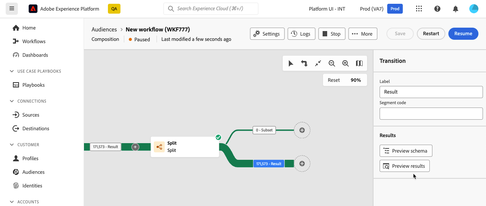

# Información general sobre las actividades

En Federated Audience Composition, puede agregar actividades y transiciones que ayuden a definir la audiencia.

## Actividades {#activities}

Las actividades permiten definir los componentes dentro de la audiencia.

Existen **dos** tipos diferentes de actividades para usar dentro de la Composición de audiencia federada: actividades de segmentación y actividades de control de flujo.

### Actividades de segmentación {#targeting}

Las actividades de segmentación le permiten definir lo que constituye su audiencia para la composición.

#### Generar público

>[!CONTEXTUALHELP]
>id="dc_orchestration_build_audience_audienceselector"
>title="Público"
>abstract="Seleccione el público."

La actividad **Generar audiencia** le permite definir la población objetivo para la composición. Puede seleccionar un público existente o utilizar el generador de reglas para definir su propia consulta.

+++ Detalles de configuración

Después de agregar la actividad **Generar audiencia** al lienzo de composición, asigne un nombre a la audiencia. Ahora puede especificar si desea crear una audiencia o utilizar una existente.

>[!BEGINTABS]

>[!TAB Crear nueva audiencia]

Después de seleccionar **Crear audiencia**, elija el **Esquema** para su audiencia. El esquema permite definir la población objetivo de la operación, como destinatarios, beneficiarios de contratos, operadores o suscriptores. De forma predeterminada, el esquema se selecciona en los destinatarios.

Después de elegir un esquema, seleccione **Continuar**. Ahora puede definir la definición de la audiencia en Query Modeler. Para obtener más información sobre cómo usar Query Modeler, lea la [descripción general de Query Modeler](../query/home.md).

>[!TAB Usar audiencia existente]

Después de seleccionar **Leer audiencia**, elige **Continuar**.

Ahora puede seleccionar la audiencia que desea utilizar para la composición.

>[!ENDTABS]

Una vez seleccionadas las opciones, puede optar por **Generar una transición saliente**. Al seleccionar esta opción, puede añadir una transición saliente que se activa al final de la ejecución de la actividad si la población de la audiencia está vacía.

+++

#### Cambio de la fuente de datos

La actividad **Cambiar fuente de datos** le permite cambiar la fuente de datos que utiliza la composición.

+++ Detalles de configuración

Después de agregar la actividad **Cambiar origen de datos** al lienzo de composición, puede definir el origen de datos que se utilizará para la composición.

{zoomable="yes"}{width="70%"}

| Fuente | Descripción |
| ------ | ----------- |
| Cuenta externa de FDA | Una base de datos de nube externa conectada a la Composición de audiencia federada. |

Después de seleccionar **[!UICONTROL cuenta externa de FDA]**, puede elegir con qué cuenta externa desea conectarse.

{zoomable="yes"}{width="70%"}

+++

#### Cambiar dimensión

>[!CONTEXTUALHELP]
>id="dc_orchestration_dimension_complement"
>title="Generación de un complemento"
>abstract="Puede generar una transición saliente adicional con la población restante, que se excluyó como duplicado. Para ello, active la opción **[!UICONTROL Generar complemento]**"

>[!CONTEXTUALHELP]
>id="dc_orchestration_change_dimension"
>title="Actividad cambiar dimensión"
>abstract="Esta actividad le permite cambiar el esquema, también conocido como dimensión de segmentación, a medida que genera un público. Desplace el eje en función de la plantilla de datos y del esquema de entrada. Por ejemplo, puede cambiar del esquema “contratos” al esquema &quot;clientes&quot;."

La actividad **Cambiar dimensión** le permite cambiar el esquema (también conocido como dimensión de segmentación) de su composición.

+++ Detalles de configuración

Después de agregar la actividad **Cambiar dimensión** al lienzo de composición, puede definir un nuevo esquema para reemplazar el esquema anterior. Durante este cambio de esquema, se guardarán todos los registros.

Después de ejecutar la composición, se actualizarán los resultados.

+++

#### Combinar

>[!CONTEXTUALHELP]
>id="dc_orchestration_combine"
>title="Actividad de combinación"
>abstract="La actividad **Combinar** permite realizar la segmentación de la población entrante. Por lo tanto, puede combinar varias poblaciones, excluir parte de ellas o solo mantener datos comunes para varias poblaciones destinatarias."

>[!CONTEXTUALHELP]
>id="dc_orchestration_intersection_merging_options"
>title="Opciones de combinación de intersección"
>abstract="La **Intersección** le permite mantener solo los elementos comunes a las diferentes poblaciones de entrada de la actividad. En la sección **Conjuntos para unir**, compruebe todas las actividades anteriores que desee unir."

>[!CONTEXTUALHELP]
>id="dc_orchestration_exclusion_merging_options"
>title="Opciones de combinación de exclusión"
>abstract="La **exclusión** le permite excluir elementos de una población según determinados criterios. En la sección **Conjuntos para unir**, compruebe todas las actividades anteriores que desee unir."

>[!CONTEXTUALHELP]
>id="dc_orchestration_combine_options"
>title="Selección del tipo de segmentación"
>abstract="Seleccione cómo combinar audiencias: unión, intersección o exclusión."

>[!CONTEXTUALHELP]
>id="dc_orchestration_intersection_reconciliation_options"
>title="Opciones de reconciliación de intersección"
>abstract="Seleccione el tipo de reconciliación para definir cómo se gestionan los duplicados."

>[!CONTEXTUALHELP]
>id="dc_orchestration_combine_reconciliation"
>title="Opciones de reconciliación"
>abstract="Seleccione el **tipo de reconciliación** para definir cómo gestionar duplicados."

>[!CONTEXTUALHELP]
>id="dc_orchestration_exclusion_options"
>title="Reglas de inclusión"
>abstract="Si es necesario, puede manipular las tablas entrantes. De hecho, para excluir un público destinatario de otro esquema, también conocido como dimensión de segmentación, se debe devolver este público destinatario a la misma dimensión de segmentación que el público destinatario principal. Para ello, seleccione **Agregar una regla** en la sección E **reglas de exclusión** y especifique las condiciones del cambio de esquema. La reconciliación de datos se lleva a cabo mediante un atributo o una unión."

>[!CONTEXTUALHELP]
>id="dc_orchestration_combine_sets"
>title="Selección de conjuntos para combinar"
>abstract="En la sección **Conjuntos que unir**, seleccione el **Conjunto principal** de las transiciones entrantes. Es el conjunto desde el que se excluyen los elementos. Los demás conjuntos coinciden con elementos antes de excluirse del conjunto principal."

>[!CONTEXTUALHELP]
>id="dc_orchestration_combine_exclusion"
>title="Reglas de inclusión"
>abstract="Si es necesario, puede manipular las tablas entrantes. De hecho, para excluir un público destinatario de otro esquema, también conocido como dimensión de segmentación, se debe devolver este público destinatario a la misma dimensión de segmentación que el público destinatario principal. Para ello, seleccione **Agregar una regla** en la sección **Reglas de exclusión** y especifique las condiciones del cambio de esquema. La reconciliación de datos se lleva a cabo mediante un atributo o una unión."

>[!CONTEXTUALHELP]
>id="dc_orchestration_combine_complement"
>title="Complemento de generación de combinación"
>abstract="Active la opción **Generar complemento** para procesar la población restante en una transición adicional."

>[!NOTE]
>
>La actividad **Combinar** **debe** colocarse después de otra actividad y **no se puede** colocar al principio de la composición.

La actividad **Combinar** le permite unir varias audiencias de varias formas: una unión, una intersección o una exclusión.

- **Union**: una unión combina las distintas audiencias en una sola audiencia. Es equivalente a una operación OR.
- **Intersección**: una intersección combina las distintas audiencias en una sola audiencia y solo se conserva el contenido **compartido**. Es equivalente a una operación AND.
- **Exclusión**: una exclusión combina las distintas audiencias en una sola audiencia sin las reglas de exclusión especificadas. Es equivalente a una operación XOR.

+++ Detalles de configuración

Después de agregar varias actividades para formar al menos **dos** ramas diferentes, agrega la actividad **Combinar** al final de una de las ramas. Ahora puede elegir una de las opciones de combinación: Unión, Intersección o Exclusión.

>[!BEGINTABS]

>[!TAB Unión]

Si seleccionas **Union**, tendrás que elegir el **tipo de reconciliación** para la actividad combinada. El tipo de reconciliación permite definir cómo se gestionan las entradas duplicadas.

- **Solo claves**: al seleccionar **Solo claves**, se mantiene **un elemento** cuando varios elementos tienen la misma clave. Solo puede utilizar esta opción si las poblaciones entrantes son homogéneas.
- **Una selección de columnas**: Seleccionar **Una selección de columnas** le permite definir una lista de columnas a las que se aplica la reconciliación de datos. Puede seleccionar el conjunto principal de datos que contiene los datos de origen, seguido de las columnas que se utilizarán para la unión.

>[!TAB Intersección]

Si selecciona **Intersección**, tendrá que elegir el **tipo de reconciliación** para la actividad combinada. El tipo de reconciliación permite definir cómo se gestionan las entradas duplicadas.

- **Solo claves**: al seleccionar **Solo claves**, se mantiene **un elemento** cuando varios elementos tienen la misma clave. Solo puede utilizar esta opción si las poblaciones entrantes son homogéneas.
- **Una selección de columnas**: Seleccionar **Una selección de columnas** le permite definir una lista de columnas a las que se aplica la reconciliación de datos.

Después de configurar el tipo de reconciliación, también puede seleccionar la opción **Generar complemento**. La generación de un complemento procesa la población restante y contiene los datos **no** incluidos como parte de la intersección. Se agregará una transición saliente adicional a la actividad.

>[!TAB Exclusión]

Si selecciona **Exclusión**, tendrá que seleccionar el **conjunto principal** de sus transiciones de entrada. Representa los conjuntos de los que se excluirán los elementos.

Después de elegir el conjunto principal, puedes configurar las **reglas de exclusión**. Puede seleccionar **Coincidencia por atributo** o **Unirse**.

Una vez configuradas las reglas de exclusión, también puede seleccionar la opción **Generar complemento**. La generación de un complemento procesa la población restante y contiene los datos **no** incluidos como parte de la exclusión. Se agregará una transición saliente adicional a la actividad.

+++

#### Deduplicación

>[!CONTEXTUALHELP]
>id="dc_orchestration_deduplication_fields"
>title="Campos para identificar duplicados"
>abstract="En la sección **[!UICONTROL Campos para identificar duplicados]**, seleccione el botón **[!UICONTROL Agregar atributo]** para especificar los campos para los que los valores idénticos permiten identificar los duplicados, como: dirección de correo electrónico, nombre, apellidos, etc. El orden de los campos permite especificar los que se procesarán en primer lugar."

>[!CONTEXTUALHELP]
>id="dc_orchestration_deduplication"
>title="Actividad de deduplicación"
>abstract="La actividad de **deduplicación permite** eliminar duplicados en los resultados de las actividades entrantes. Se utiliza principalmente después de actividades de segmentación y antes de actividades que permiten el uso de datos direccionados."

>[!CONTEXTUALHELP]
>id="dc_orchestration_deduplication_complement"
>title="Generación de un complemento"
>abstract="Puede generar una transición saliente adicional con la población restante, que se excluyó como duplicado. Para ello, active la opción **[!UICONTROL Generar complemento]**"

>[!CONTEXTUALHELP]
>id="dc_orchestration_deduplication_settings"
>title="Configuración de la deduplicación"
>abstract="Para eliminar duplicados en los datos entrantes, defina el método de deduplicación en los campos siguientes. De forma predeterminada, solo se guarda un registro. También debe seleccionar el modo de deduplicación en función de una expresión o un atributo. De forma predeterminada, el registro que se va a excluir de los duplicados se selecciona de forma aleatoria."

La actividad **Deduplication** elimina cualquier resultado duplicado de la audiencia.

+++ Detalles de configuración

>[!NOTE]
>
>Si tiene varias transiciones de entrada, primero tendrá que seleccionar el **conjunto principal** en el menú desplegable.

Después de agregar una actividad **Deduplication**, puede elegir los campos para identificar duplicados. Seleccione **Agregar atributo** para identificar los campos en los que pueden producirse duplicados.

Una vez identificados los campos, puede configurar los ajustes de anulación de duplicación.

| Configuración | Descripción |
| ------- | ----------- |
| Duplicados que mantener | Número de registros duplicados que se van a conservar. Si el valor se establece en 0, se guardarán **todos** los registros duplicados. |
| Método de deduplicación | El método para eliminar los registros duplicados. <ul><li>**Selección aleatoria**: El registro eliminado se elige de forma aleatoria.</li><li>**Usando una expresión**: el registro quitado se basa en la expresión enviada. Puede ordenar en orden ascendente o descendente, según los valores que desee quitar.</li><li>**Valores no vacíos**: el registro quitado se basa en la expresión enviada. Se eliminarán los registros en los que la expresión no tenga un valor.</li><li>**Siguiendo una lista de valores**: el registro quitado se basa en el campo o expresión enviado. Puede ordenar los valores restantes de forma aleatoria, en orden de subida o de bajada.</li></ul> |

Además, puede seleccionar la opción **Generar complemento**. La generación de un complemento procesa la población restante y contiene los datos **no** incluidos como parte de la deduplicación. Se agregará una transición saliente adicional a la actividad.

+++

#### Enriquecimiento

>[!CONTEXTUALHELP]
>id="dc_orchestration_enrichment"
>title="Actividad de enriquecimiento"
>abstract="La actividad de **enriquecimiento** permite mejorar los datos de destino con información adicional de la base de datos. Normalmente, se utiliza en una composición después de las actividades de segmentación."

>[!CONTEXTUALHELP]
>id="dc_orchestration_enrichment_data"
>title="Actividad de enriquecimiento"
>abstract="Una vez añadidos los datos de enriquecimiento a la composición, pueden utilizarse en las actividades añadidas después de la actividad **Enriquecimiento** para segmentar perfiles en grupos distintos según sus comportamientos, preferencias y opciones."

>[!CONTEXTUALHELP]
>id="dc_orchestration_enrichment_simplejoin"
>title="Definición de vínculo"
>abstract="Cree un vínculo entre los datos de la tabla de trabajo y la base de datos federada."

>[!CONTEXTUALHELP]
>id="dc_orchestration_enrichment_reconciliation"
>title="Reconciliación de enriquecimiento"
>abstract="Defina los parámetros de reconciliación."

>[!CONTEXTUALHELP]
>id="dc_targetdata_personalization_enrichmentdata"
>title="Datos de enriquecimiento"
>abstract="Seleccione los datos que desee utilizar para enriquecer la composición. Se pueden seleccionar dos tipos de datos de enriquecimiento: un único atributo de enriquecimiento del esquema, también conocido como dimensión de segmentación, o un vínculo de recopilación, que es un vínculo con una cardinalidad 1-N entre las tablas."

La actividad **Enrichment** le permite mejorar su composición al agregar datos adicionales de su base de datos federada.

Si ha configurado una conexión con el destino de Composición de audiencia federada, puede utilizar la actividad de enriquecimiento para enriquecer los datos que llegan a Adobe Experience Platform con atributos de la base de datos externa. [Aprenda a enriquecer audiencias de Adobe Experience Platform con datos externos](../connections/destinations.md)

+++ Detalles de configuración

>[!NOTE]
>
>Si tiene varias transiciones de entrada, primero tendrá que seleccionar el **conjunto principal** en el menú desplegable.

Después de agregar la actividad **Enrichment** a la composición, puede seleccionar **Agregar datos de enriquecimiento** para elegir qué atributo desea utilizar para enriquecer la composición. Puede seleccionar **Editar expresión** para generar una expresión avanzada y seleccionar el atributo.

+++

#### Reconciliación

>[!CONTEXTUALHELP]
>id="dc_orchestration_reconciliation"
>title="Actividad de reconciliación"
>abstract="La actividad **Reconciliación** le permite definir el vínculo entre los datos de la base de datos y los datos de una tabla de trabajo."

>[!CONTEXTUALHELP]
>id="dc_orchestration_reconciliation_field"
>title="Campo de selección de reconciliación"
>abstract="Campo de selección de reconciliación"

>[!CONTEXTUALHELP]
>id="dc_orchestration_reconciliation_condition"
>title="Condición de creación de reconciliación"
>abstract="Condición de creación de reconciliación"

>[!CONTEXTUALHELP]
>id="dc_orchestration_reconciliation_complement"
>title="Complemento de generación de reconciliación"
>abstract="Complemento de generación de reconciliación"

>[!CONTEXTUALHELP]
>id="dc_orchestration_reconciliation_targeting"
>title="Esquema"
>abstract="Seleccione el nuevo esquema que se aplicará a los datos. Un esquema, también conocido como dimensión de segmentación, permite definir la población segmentada: destinatarios, suscriptores de la aplicación, operadores, suscriptores, etc. De forma predeterminada, está seleccionado el esquema de composición actual."

>[!CONTEXTUALHELP]
>id="dc_orchestration_reconciliation_rules"
>title="Reglas de reconciliación"
>abstract="Seleccione las reglas de reconciliación que desee utilizar para la anulación de duplicación. Para utilizar atributos, seleccione **Atributos simples** y seleccione los campos de origen y destino. Para crear su propia condición de reconciliación utilizando el modelador de consultas, seleccione la opción **Condiciones de reconciliación avanzadas**."

>[!CONTEXTUALHELP]
>id="dc_orchestration_reconciliation_targeting_selection"
>title="Seleccionar la dimensión de segmentación"
>abstract="Seleccione el esquema, también conocido como dimensión de segmentación, con la que se reconciliarán los datos de entrada."

>[!CONTEXTUALHELP]
>id="dc_orchestration_keep_unreconciled_data"
>title="Mantener datos no reconciliados"
>abstract="De forma predeterminada, los datos no reconciliados se mantienen en la transición de salida y están disponibles en la tabla de trabajo para usarlos en el futuro. Para quitar los datos no reconciliados, desactive la opción **Mantener datos no reconciliados**."

>[!CONTEXTUALHELP]
>id="dc_orchestration_reconciliation_attribute"
>title="Atributo de reconciliación"
>abstract="Seleccione el atributo que desee utilizar para reconciliar los datos y confirme."

>[!NOTE]
>
>De forma predeterminada, los datos no reconciliados se mantienen en la transición saliente y están disponibles en la tabla de resultados para su uso futuro. Si **no** desea que se usen los datos reconciliados, desactive la opción **Conservar datos no reconciliados**.

La actividad **Reconciliation** permite definir el vínculo entre los datos de la base de datos federada y los de una tabla de trabajo.

+++ Detalles de configuración

Después de agregar la actividad **Reconciliation** a la composición, puede elegir el esquema que desea utilizar para la reconciliación.

Una vez que haya elegido el esquema, debe configurar las reglas de reconciliación. Puede elegir entre **atributos simples** o **condiciones de reconciliación avanzadas**.

>[!BEGINTABS]

>[!TAB Atributos simples]

Después de elegir **atributos simples**, seleccione **Agregar regla**. Ahora puede configurar la reconciliación agregando los campos **Source** y **Destination**. El campo **Destino** corresponde a los campos del esquema seleccionado.

Los datos se concilian cuando el origen y el destino son iguales. Puede agregar más criterios de reconciliación seleccionando **Agregar regla**. Si se especifican varias condiciones de unión, **todas** deben verificarse para que los datos se puedan vincular.

>[!TAB Condiciones de reconciliación avanzadas]

Después de elegir **condiciones de reconciliación avanzadas**, seleccione **Crear condiciones**. Ahora puede crear su propia condición de reconciliación utilizando el modelador de consultas. Para obtener más información sobre cómo usar Query Modeler, lea la [descripción general de Query Modeler](../query/home.md)

>[!ENDTABS]

También puede filtrar los datos reconciliados. Seleccione **Crear filtro** para crear una condición personalizada mediante Query Modeler. Para obtener más información sobre cómo usar Query Modeler, lea la [descripción general de Query Modeler](../query/home.md)

+++

#### Guardar público

>[!CONTEXTUALHELP]
>id="dc_orchestration_save_audience"
>title="Guardar un público"
>abstract="Utilice esta actividad para crear un público nuevo a partir de la población calculada en sentido ascendente en la composición. Los públicos creados se añaden a la lista de públicos y están disponibles en el menú **Públicos**."

>[!CONTEXTUALHELP]
>id="dc_orchestration_saveaudience_outbound"
>title="Generar transición de salida"
>abstract="Utilice esta opción si desea añadir una transición después de la actividad **Guardado de público**."

>[!CONTEXTUALHELP]
>id="dc_orchestration_save_audience_primary_identity"
>title="Campo de identidad principal"
>abstract="Seleccione la identidad principal que se utilizará para los perfiles."
>additional-url="https://experienceleague.adobe.com/es/docs/experience-platform/xdm/ui/fields/identity#define-a-identity-field" text="Más información en la Documentación de Experience Platform"

>[!CONTEXTUALHELP]
>id="dc_orchestration_saveaudience_namespace"
>title="Espacio de nombres de identidad"
>abstract="Seleccione el espacio de nombres que se utilizará para los perfiles."
>additional-url="https://experienceleague.adobe.com/es/docs/experience-platform/identity/features/namespaces" text="Más información en la Documentación de Experience Platform"

>[!IMPORTANT]
>
>Si su zona protegida utiliza una política de combinación de **prioridad del conjunto de datos**, póngase en contacto con el Servicio de atención al cliente de Adobe para añadir el conjunto de datos `Halos UPS` a su política de combinación.
>
>Para obtener más información sobre las políticas de combinación, consulte la [información general sobre políticas de combinación](https://experienceleague.adobe.com/es/docs/experience-platform/profile/merge-policies/overview).

La actividad **Guardar audiencia** le permite crear una audiencia basada en la composición. Una vez creada la audiencia, puede utilizarla en Audience Portal en Adobe Experience Platform. Para obtener más información sobre cómo usar audiencias con Federated Audience Composition, lea la [descripción general de audiencias](../start/audiences.md). Para obtener más información sobre las audiencias en Experience Platform, lea la [descripción general del portal de audiencias](https://experienceleague.adobe.com/es/docs/experience-platform/segmentation/ui/audience-portal){target="_blank"}.

+++ Detalles de configuración

>[!IMPORTANT]
>
>El nombre de la audiencia **debe** ser único dentro de la zona protegida actual y no puede tener el mismo nombre que ninguna audiencia existente.

Después de agregar la actividad **Guardar audiencia** a la composición, puede especificar el nombre de la audiencia recién creada.

Ahora puede especificar las asignaciones para seleccionar qué campos desea transferir a la audiencia recién creada. Seleccione **Agregar asignación de audiencia** y elija los campos de audiencia de origen y destino, repitiéndolos tantas veces como sea necesario.

Después de agregar las asignaciones, puede seleccionar la identidad principal y el área de nombres para identificar los perfiles de destino en la base de datos. El campo de identidad principal se utiliza para identificar los perfiles, mientras que el área de nombres de identidad actúa como una clave para identificar la identidad.

Además, puede establecer la caducidad de los datos de la audiencia. La caducidad de los datos determina el número de días después de los cuales caducará la pertenencia a la audiencia. La caducidad de los datos puede oscilar entre 1 y 90 días. De forma predeterminada, este valor se establece en 30.

+++

#### División

>[!CONTEXTUALHELP]
>id="dc_orchestration_split"
>title="Actividad de división"
>abstract="La actividad **División** permite segmentar las poblaciones entrantes en varios subconjuntos en función de diferentes criterios de selección, como las reglas de filtrado o el tamaño de la población."

>[!CONTEXTUALHELP]
>id="dc_orchestration_split_segments"
>title="Segmentos para la actividad división"
>abstract="Añada todos los subconjuntos que quiera para segmentar la población entrante.  Cuando se ejecuta la actividad **División**, la población se segmenta en los diferentes subconjuntos en el orden en el que se añaden a la actividad. Antes de iniciar la composición, asegúrese de haber ordenado los subconjuntos en el orden que mejor se adapte a sus necesidades mediante los botones de flecha."

>[!CONTEXTUALHELP]
>id="dc_orchestration_split_filter"
>title="Filtro de la actividad de división"
>abstract="Para aplicar una condición de filtrado al subconjunto, seleccione **[!UICONTROL Crear filtro]** y configure la regla de filtrado que desee con el modelador de consultas. Por ejemplo, incluya perfiles de la población entrante cuya dirección de correo electrónico existe en la base de datos."

>[!CONTEXTUALHELP]
>id="dc_orchestration_split_limit"
>title="Límite de la actividad división"
>abstract="Para limitar el número de perfiles seleccionados por el subconjunto, active la opción **[!UICONTROL Habilitar límite]** y especifique el número o los porcentajes de la población que desea incluir."

>[!CONTEXTUALHELP]
>id="dc_orchestration_split_sorting"
>title="Ordenación de la actividad división"
>abstract="Al establecer un límite de población para un subconjunto, puede clasificar los perfiles seleccionados en función de un atributo de perfil específico, en orden ascendente o descendente. Para ello, active la opción **Habilitar ordenación**. Por ejemplo, puede restringir un subconjunto para incluir solo los 50 perfiles con la cantidad de compra más alta."

>[!CONTEXTUALHELP]
>id="dc_orchestration_split_complement"
>title="Complemento de generación de división"
>abstract="Una vez configurados todos los subconjuntos, puede seleccionar la población restante que no coincide con ninguno de los subconjuntos e incluirlos en una transición saliente adicional. Para ello, active la opción **Generar complemento.**"

>[!CONTEXTUALHELP]
>id="dc_orchestration_split_generatesubsets"
>title="Generar todos los subconjuntos en la misma tabla"
>abstract="Active esta opción para agrupar todos los subconjuntos en una sola transición de salida."

>[!CONTEXTUALHELP]
>id="dc_orchestration_split_emptytransition"
>title="Omitir transición vacía"
>abstract="Active la opción **[!UICONTROL Omitir transición vacía]** para deshabilitar la transición de salida para este subconjunto si la población entrante está vacía."

>[!CONTEXTUALHELP]
>id="dc_orchestration_split_enable_overlapping"
>title="Habilitar superposición de poblaciones de salida"
>abstract="La opción **[!UICONTROL Habilitar superposición de poblaciones de salida]** permite administrar poblaciones que pertenecen a varios subconjuntos. Cuando el cuadro no está marcado, la actividad de división garantiza que los destinatarios no puedan estar presentes en varias transiciones de salida, aunque cumplan los criterios de varios subconjuntos. Los destinatarios se encuentran en el destino de la primera pestaña con criterios coincidentes. Cuando se selecciona el cuadro, los destinatarios se pueden encontrar en varios subconjuntos si cumplen con sus criterios de filtro. "

La actividad **Split** separa la población entrante en varias partes, según los criterios determinados.

+++ Detalles de configuración

>[!IMPORTANT]
>
>Cuando se ejecuta la actividad **Split**, la población se separa en los diferentes subconjuntos en el **orden en que se agregan**. Por ejemplo, si el primer subconjunto divide el 70 % de la población inicial, el siguiente subconjunto aplicará sus criterios de selección al 30 % restante.
>
>Antes de ejecutar la composición, asegúrese de haber ordenado los subconjuntos en el orden en que desea que se ejecuten las divisiones.

Después de agregar la actividad **Split** a la composición, ahora puede determinar cómo subestablecer la audiencia. Seleccione **Agregar segmento** para crear sus diferentes rutas de ramificación.

Ahora puede proporcionar detalles para cada una de estas subrutas. Puede asignar un nombre a la subruta y especificar las condiciones de filtro. Para crear una condición de filtrado, seleccione **Crear filtro** y configure la regla de filtrado con Query Modeler. Para obtener más información sobre cómo usar Query Modeler, lea la [descripción general de Query Modeler](../query/home.md).

Una vez creada la condición de filtrado, puede aplicar las siguientes reglas adicionales:

- **Habilitar límite**: limita el número de perfiles que se pueden dividir en el subconjunto. Puede establecerlo como un número o como un porcentaje de la población.
   - Si activa un límite, también puede clasificar los perfiles seleccionados según un atributo de perfil específico. Active **Habilitar ordenación** y podrá ordenar los atributos en orden de subida o de bajada.
- **Omitir transición vacía**: deshabilita la transición si la población entrante está vacía.

Ahora que se han configurado los subconjuntos, puede definir algunas opciones adicionales.

| Opciones | Descripción |
| ------- | ----------- |
| **Generar complemento** | Crea una transición saliente que contiene la población restante. |
| **Habilitar superposición de poblaciones de salida** | Si se habilita, el destinatario **no puede** estar presente en varias transiciones salientes y **solo** estará presente en la primera transición saliente. Si está deshabilitado, el destinatario **puede** aparece en varias transiciones salientes. |
| **Generar todos los subconjuntos de la misma tabla** | Agrupa todos los subconjuntos en una sola transición saliente. |

+++

### Actividades de control de flujo {#flow-control}

Las actividades de control de flujo permiten definir la organización y la coordinación de la composición.

#### Y únase

>[!CONTEXTUALHELP]
>id="dc_orchestration_and-join"
>title="Actividad AND-join"
>abstract="La actividad **And-join** le permite sincronizar varias ramas de ejecución de una composición. Se activa una vez que han finalizado todas las actividades anteriores. Esto le permite asegurarse de que ciertas actividades hayan finalizado antes de continuar con la ejecución de la composición."

La actividad **AND-join** le permite combinar varias ramas de una composición. Esta actividad solo se activa una vez que se activan **todas** las transiciones de entrada.

+++ Detalles de configuración

Después de agregar varias actividades para formar al menos dos ramas diferentes, puede agregar la actividad **AND-join** al final de cualquiera de las ramas.

En la sección **Combinando opciones**, puede seleccionar todas las actividades que desee sincronizar. Además, puede elegir qué transición entrante mantener dentro del menú desplegable **Conjunto principal**.

+++

#### Fin

La actividad **End** marca gráficamente el final de la composición y no tiene ningún impacto funcional.

#### Bifurcación

>[!CONTEXTUALHELP]
>id="dc_orchestration_fork"
>title="Actividad de bifurcación"
>abstract="La actividad de **bifurcación** permite crear transiciones salientes para iniciar varias actividades al mismo tiempo."

>[!CONTEXTUALHELP]
>id="dc_orchestration_fork_transitions"
>title="Transiciones de la actividad de bifurcación"
>abstract="De forma predeterminada, se crean dos transiciones con una actividad de **bifurcación**. Seleccione el botón **Agregar transición** para definir una transición saliente adicional e introduzca su etiqueta."

La actividad **Fork** le permite crear varias transiciones salientes que inician simultáneamente varias actividades.

+++ Detalles de configuración

Una vez que haya agregado la actividad **Fork** a la composición, se generarán automáticamente dos transiciones salientes. Puede asignar un nombre a estas transiciones salientes. Además, puede seleccionar **Agregar transición** para agregar otra transición saliente.

+++

#### Planificador

>[!CONTEXTUALHELP]
>id="dc_orchestration_scheduler"
>title="Actividad planificador"
>abstract="La actividad **Planificador** permite programar cuándo se inicia la composición de público. La actividad debe considerarse como un inicio programado. Solo se puede utilizar como primera actividad de una composición."

>[!CONTEXTUALHELP]
>id="dc_orchestration_schedule_validity"
>title="Validez del planificador"
>abstract="Puede definir un período de validez para el planificador. Puede ser permanente (predeterminado) o válido hasta una fecha específica."

>[!CONTEXTUALHELP]
>id="dc_orchestration_schedule_options"
>title="Opciones del planificador"
>abstract="Defina la frecuencia del planificador. Se puede ejecutar en un momento específico, una o varias veces al día, a la semana o al mes."

La actividad **Scheduler** le permite programar cuándo iniciar la ejecución de la composición. Usted **debe** utilizarlo como la primera actividad de la composición.

+++ Detalles de configuración

Después de agregar la actividad **Planificador** a la composición, puede establecer la **Frecuencia de ejecución** para la composición. Las opciones incluyen **Una vez**, **Diario**, **Varias veces al día**, **Semanal** y **Mensual**.

>[!BEGINTABS]

>[!TAB Una vez]

>[!NOTE]
>
>La hora se establece en UTC.

Si selecciona **Una vez**, la composición solo se ejecutará una vez. Puede seleccionar la fecha y la hora de ejecución de la composición.

>[!TAB Diario]

Si selecciona **Diario**, la composición se ejecutará una vez al día. Sin embargo, puede determinar qué día del mes se ejecuta la composición en la sección **Día del mes**. Los valores posibles incluyen **Todos los días**, **En días de la semana**, **Durante un período seleccionado** y **Días seleccionados de la semana**.

| Día del mes | Descripción |
| ---------------- | ----------- |
| Cada día | La composición se ejecuta todos los días. |
| En días de semana | La composición se ejecuta cada día entre semana. |
| Durante un período seleccionado | La composición se ejecuta todos los días a lo largo del período seleccionado. Puede establecer la duración del período de periodicidad y la fecha de inicio del período. |
| Días de la semana seleccionados | La composición se ejecuta todos los días de la semana seleccionados. |

Después de elegir qué día del mes se ejecutará la programación, puede seleccionar **Previsualizar horas de inicio** para comprobar la programación de las siguientes diez ejecuciones de su composición.

>[!TAB Varias veces al día]

Si selecciona **Varias veces al día**, la composición se ejecutará varias veces al día. Puede elegir si la composición se ejecuta a horas específicas por día o periódicamente a horas establecidas.

Si selecciona **Horas seleccionadas**, puede elegir las horas específicas en que se ejecutará la composición. Si selecciona **Periódica**, puede elegir la frecuencia con la que se ejecutará la composición en horas o minutos y entre las horas en que se ejecutará. Todos los horarios están en UTC.

Después de seleccionar las horas, puede elegir la frecuencia con la que se ejecuta la ejecución en la sección **Día del mes**.

| Día del mes | Descripción |
| ---------------- | ----------- |
| Todos los días de la semana | La composición se ejecuta todos los días. |
| En determinados días de la semana | La composición se ejecuta todos los días de la semana seleccionados. |

Después de elegir qué día del mes se ejecutará la programación, puede seleccionar **Previsualizar horas de inicio** para comprobar la programación de las siguientes diez ejecuciones de su composición.

>[!TAB Semanalmente]

Si selecciona **Semanalmente**, la composición se ejecutará con la frecuencia semanal establecida. Si establece la frecuencia semanal como un número mayor que 1, también puede elegir la fecha desde la que comienza la ejecución.

Después de elegir la frecuencia de evaluación, puede elegir la frecuencia con la que se ejecuta la ejecución en la sección **Día del mes**.

| Día del mes | Descripción |
| ---------------- | ----------- |
| Todos los días de la semana | La composición se ejecuta todos los días. |
| En determinados días de la semana | La composición se ejecuta todos los días de la semana seleccionados. |

Después de elegir qué día del mes se ejecutará la programación, puede seleccionar **Previsualizar horas de inicio** para comprobar la programación de las siguientes diez ejecuciones de su composición.

>[!TAB Mensual]

Si selecciona **Mensual**, la composición se ejecutará con la frecuencia mensual establecida. Puede configurarlo para que sea cada mes o en determinados meses.

Después de elegir la frecuencia mensual, puede elegir el **día del mes** en que se ejecuta la ejecución.

| Día del mes | Descripción |
| ---------------- | ----------- |
| Cada día | La composición se ejecuta todos los días. |
| En días de semana | La composición se ejecuta cada día entre semana. |
| Durante un período seleccionado | La composición se ejecuta todos los días a lo largo del período seleccionado. Puede establecer la duración del período de periodicidad y la fecha de inicio del período. |
| Días de la semana seleccionados | La composición se ejecuta todos los días de la semana seleccionados. |

Una vez que hayas establecido el **Día del mes**, puedes elegir la hora de inicio. Todos los horarios están en UTC.

>[!ENDTABS]

Después de seleccionar la frecuencia de ejecución, puede elegir el **Período de validez** de la programación.

| Período de validez | Descripción |
| --------------- | ----------- |
| **Permanente (nunca caduca)** | La composición nunca caducará. |
| **Período de validez** | La composición se ejecutará entre las fechas dadas. |

+++

#### Esperar

>[!CONTEXTUALHELP]
>id="dc_orchestration_wait"
>title="Actividad Esperar"
>abstract="La actividad **Esperar** se utiliza para retrasar la transición de una actividad a otra."

La actividad **Wait** pone en pausa la ejecución de la composición durante el tiempo especificado.

+++ Detalles de configuración

Después de agregar la actividad **Wait** a la composición, puede convertirla en una espera de **Duration** o de **Fixed time**.

Si selecciona Duración, puede establecer el período de tiempo de espera. Este período de tiempo puede ser en segundos, minutos, horas o días.

Si selecciona tiempo fijo, puede definir la composición para que espere hasta la fecha y hora determinadas. La hora está establecida en su **zona horaria local**.

+++

## Transiciones {#transitions}

En las composiciones, las transiciones muestran cómo se transportan los datos de una actividad a otra. Las transiciones almacenan los datos en una tabla de trabajo temporal. Si selecciona la transición, puede ver la siguiente información:

- **Vista previa del esquema**: puede seleccionar esta opción para ver el esquema de la tabla de trabajo.
- **Previsualizar resultados**: puede seleccionarlo para visualizar los datos que se transportan en la transición seleccionada. Esta opción solo está disponible si **Mantener habilitado el resultado de poblaciones provisionales entre dos ejecuciones**.

## Próximos pasos {#next-steps}

Después de leer esta guía, tendrá una mejor comprensión de las actividades y transiciones que puede utilizar dentro de una composición. Para obtener más información sobre composiciones en general, lea [descripción general de la composición](./create-composition.md).
