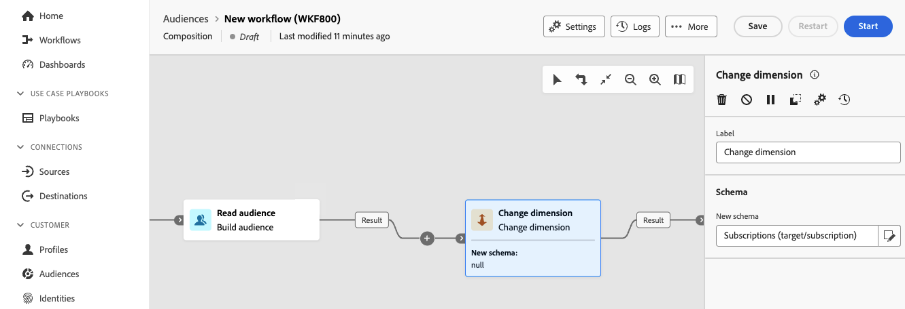

# Cambio de dimensión {#change-dimension}

>[!CONTEXTUALHELP]
>id="dc_orchestration_dimension_complement"
>title="Generación de un complemento"
>abstract="Puede generar una transición saliente adicional con la población restante, que se excluyó como duplicado. Para ello, active la opción **Generar complemento**"

>[!CONTEXTUALHELP]
>id="dc_orchestration_change_dimension"
>title="Actividad cambiar dimensión"
>abstract="Esta actividad le permite cambiar la dimensión de segmentación, es decir, el esquema, a medida que crea una audiencia. Desplace el eje en función de la plantilla de datos y la dimensión de entrada. Por ejemplo, puede cambiar de la dimensión “contratos” a la dimensión “clientes."

El **Cambiar dimensión** La actividad de le permite cambiar la dimensión de segmentación, es decir, el esquema, a medida que crea la audiencia. Desplaza el eje en función de la plantilla de datos y la dimensión de entrada. <!--[Learn more on targeting dimensions](../../audience/about-recipients.md#targeting-dimensions)-->

## Configuración de la actividad Change dimension {#configure}

Siga estos pasos para configurar el **Cambiar dimensión** actividad:

1. Añadir un **Cambiar dimensión** actividad a su composición.

   

1. Defina el **Nuevo esquema**. Durante el cambio de esquema, se guardan todos los registros.

1. Ejecute la composición para ver el resultado. Compare los datos de las tablas antes y después de la actividad de dimensión cambiante y compare la estructura de las tablas de composición.

<!--
## Example {#example}

In this example, we want to send an SMS delivery to all the profiles who have made a purchase. To do this, we first use a **[!UICONTROL Build audience]** activity linked to a custom "Purchase" targeting dimension to target all purchases that occurred.

We then use a **[!UICONTROL Change dimension]** activity to switch the workflow targeting dimension to "Recipients". This allows us to be able to target the recipients who match the query.
-->

<!-- on parle de dimension, mais dans UI "schema", va rester comme ça ?-->