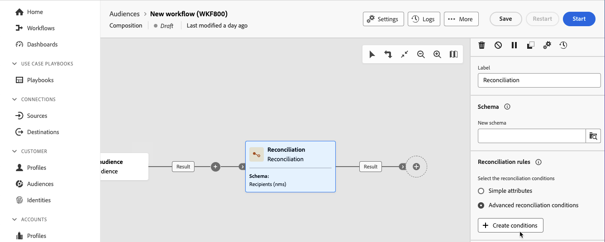

# Reconciliación {#reconciliation}

>[!CONTEXTUALHELP]
>id="dc_orchestration_reconciliation"
>title="Actividad de reconciliación"
>abstract="La actividad **Reconciliación** le permite definir el vínculo entre los datos de la base de datos y los datos de una tabla de trabajo."

>[!CONTEXTUALHELP]
>id="dc_orchestration_reconciliation_field"
>title="Campo de selección de reconciliación"
>abstract="Campo de selección de reconciliación"

>[!CONTEXTUALHELP]
>id="dc_orchestration_reconciliation_condition"
>title="Condición de creación de reconciliación"
>abstract="Condición de creación de reconciliación"

>[!CONTEXTUALHELP]
>id="dc_orchestration_reconciliation_complement"
>title="Complemento de generación de reconciliación"
>abstract="Complemento de generación de reconciliación"

La actividad **Reconciliation** permite definir el vínculo entre los datos de la base de datos y los de una tabla de trabajo; por ejemplo, los datos cargados desde un sistema externo.

<!--For example, the **Reconciliation** activity can be placed after a **Load file** activity to import non-standard data into the database. In this case, the **Reconciliation** activity lets you define the link between the data in the Adobe Campaign database and the data in the work table.-->

La actividad **Reconciliación** le permite vincular datos no identificados a recursos existentes. La operación de reconciliación implica que los datos a los que se une ya están en la base de datos. Por ejemplo, si desea reconciliar la información de compras que muestra qué producto se compró, a qué hora, por qué cliente, etc., el producto y el cliente ya deben existir en la base de datos.

## Configuración de la actividad Reconciliación {#reconciliation-configuration}

>[!CONTEXTUALHELP]
>id="dc_orchestration_reconciliation_targeting"
>title="Esquema"
>abstract="Seleccione el nuevo esquema que se aplicará a los datos. Un esquema, también conocido como dimensión de segmentación, permite definir la población segmentada: destinatarios, suscriptores de la aplicación, operadores, suscriptores, etc. De forma predeterminada, está seleccionado el esquema de composición actual."

>[!CONTEXTUALHELP]
>id="dc_orchestration_reconciliation_rules"
>title="Reglas de reconciliación"
>abstract="Seleccione las reglas de reconciliación que desee utilizar para la anulación de duplicación. Para utilizar atributos, seleccione **Atributos simples** y seleccione los campos de origen y destino. Para crear su propia condición de reconciliación utilizando el modelador de consultas, seleccione la opción **Condiciones de reconciliación avanzadas**."

>[!CONTEXTUALHELP]
>id="dc_orchestration_reconciliation_targeting_selection"
>title="Seleccionar la dimensión de segmentación"
>abstract="Seleccione el esquema, también conocido como dimensión de segmentación, con la que se reconciliarán los datos de entrada."

>[!CONTEXTUALHELP]
>id="dc_orchestration_keep_unreconciled_data"
>title="Mantener datos no reconciliados"
>abstract="De forma predeterminada, los datos no reconciliados se mantienen en la transición de salida y están disponibles en la tabla de trabajo para usarlos en el futuro. Para quitar los datos no reconciliados, desactive la opción **Mantener datos no reconciliados**."

>[!CONTEXTUALHELP]
>id="dc_orchestration_reconciliation_attribute"
>title="Atributo de reconciliación"
>abstract="Seleccione el atributo que desee utilizar para reconciliar los datos y confirme."

Siga estos pasos para configurar la actividad **Reconciliation**:

1. Agregue una actividad **Reconciliation** a su composición.

1. Seleccione **Nuevo esquema**. Un esquema, también conocido como dimensión de segmentación, permite definir la población objetivo: destinatarios, suscriptores de la aplicación, operadores, suscriptores, etc.

1. Seleccione los campos que se utilizarán para la reconciliación. Se pueden utilizar uno o más criterios de reconciliación.

   1. Para usar atributos para reconciliar datos, selecciona la opción **Atributos simples** y luego haz clic en el botón **Agregar regla**.
   1. Seleccione los campos **Source** y **Destination** para la reconciliación. El campo **Source**. El campo **Destino** corresponde a los campos del esquema seleccionado.

      Los datos se concilian cuando el origen y el destino son iguales. Por ejemplo, seleccione los campos **Correo electrónico** para anular la duplicación de perfiles según su dirección de correo electrónico.

      Para agregar otros criterios de reconciliación, haga clic en el botón **Agregar regla**. Si se especifican varias condiciones de vínculo, todas deben verificarse para que los datos puedan vincularse.

      

   1. Para usar otros atributos para reconciliar datos, selecciona la opción **Condiciones de reconciliación avanzadas** y luego haz clic en el botón **Crear condiciones**. A continuación, puede crear su propia condición de reconciliación utilizando el modelador de consultas. [Aprenda a trabajar con el modelador de consultas](../../query/query-modeler-overview.md)

      

1. Puede filtrar los datos para conciliarlos usando el botón **Crear filtro**. Esto permite crear una condición personalizada mediante el modelador de consultas.

De forma predeterminada, los datos no conciliados se mantienen en la transición saliente y están disponibles en la tabla de trabajo para su uso futuro. Para quitar los datos no reconciliados, desactive la opción **Mantener datos no reconciliados**.

<!--
## Example {#reconciliation-example}

The following example demonstrates a workflow that creates an audience of profiles directly from an imported file containing new clients. It is made up of the following activities:

The workflow is designed as follows:


 
It is built with the following activities:

* A [Load file](load-file.md) activity uploads a file containing profiles data that were extracted from an external tool.

    For example:

    ```
    lastname;firstname;email;birthdate;
    JACKMAN;Megan;megan.jackman@testmail.com;07/08/1975;
    PHILLIPS;Edward;phillips@testmail.com;09/03/1986;
    WEAVER;Justin;justin_w@testmail.com;11/15/1990;
    MARTIN;Babe;babeth_martin@testmail.net;11/25/1964;
    REESE;Richard;rreese@testmail.com;02/08/1987;
    ```

* A **Reconciliation** activity which identifies the incoming data as profiles, by using the **email** and **Date of birth** fields as reconciliation criteria.

    

* A [Save audience](save-audience.md) activity to create a new audience based on these updates. You can also replace the **Save audience** activity by an **End** activity if no specific audience needs to be created or updated. Recipient profiles are updated in any case when you run the workflow.


## Compatibility {#reconciliation-compat}

The **Reconciliation** activity does not exist in the Client console. All **Enrichments** activities created in the Client console with the reconciliation options enabled are displayed as **Reconciliation** activities in Campaign Web user interface.
-->
