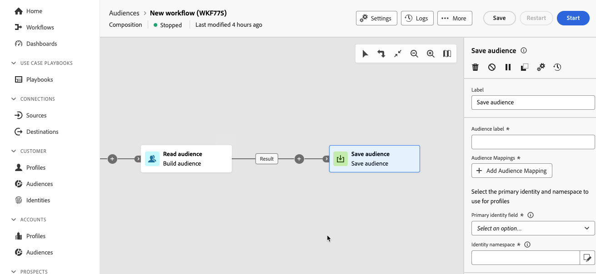

# Guardar público {#save-audience}

>[!CONTEXTUALHELP]
>id="dc_orchestration_save_audience"
>title="Guardar un público"
>abstract="Utilice esta actividad para crear un público nuevo a partir de la población calculada en sentido ascendente en la composición. Los públicos creados se añaden a la lista de públicos y están disponibles en el menú **Públicos**."

>[!CONTEXTUALHELP]
>id="dc_orchestration_saveaudience_outbound"
>title="Generar transición de salida"
>abstract="Utilice esta opción si desea añadir una transición después de la actividad **Guardado de público**."

>[!CONTEXTUALHELP]
>id="dc_orchestration_save_audience_primary_identity"
>title="Campo de identidad principal"
>abstract="Seleccione la identidad principal que se utilizará para los perfiles."
>additional-url="https://experienceleague.adobe.com/es/docs/experience-platform/xdm/ui/fields/identity#define-a-identity-field" text="Más información en la Documentación de Experience Platform"

>[!CONTEXTUALHELP]
>id="dc_orchestration_saveaudience_namespace"
>title="Espacio de nombres de identidad"
>abstract="Seleccione el área de nombres que se utilizará para los perfiles."
>additional-url="https://experienceleague.adobe.com/es/docs/experience-platform/identity/features/namespaces" text="Más información en la Documentación de Experience Platform"

>[!IMPORTANT]
>
>Si su audiencia utiliza una política de combinación de **prioridad del conjunto de datos**, póngase en contacto con el Servicio de atención al cliente de Adobe para agregar el conjunto de datos `Halos UPS` a su política de combinación.
>
>Para obtener más información sobre las políticas de combinación, lea la [descripción general de las políticas de combinación](https://experienceleague.adobe.com/es/docs/experience-platform/profile/merge-policies/overview).

La actividad **[!UICONTROL Guardar audiencia]** le permite crear una audiencia nueva a partir de la población calculada en sentido ascendente en una composición. Las audiencias creadas se agregan a la lista de audiencias de Adobe Experience Platform y están disponibles a través del menú **Audiencias**. [Descubra cómo trabajar con públicos](../../start/audiences.md)

Esta actividad se utiliza esencialmente para mantener los grupos de población calculados en la misma composición, convirtiéndolos en audiencias reutilizables. Conéctelo a otras actividades de segmentación, como una **audiencia de compilación** o una actividad **Combinar**.

La actividad **[!UICONTROL Guardar audiencia]** genera un nuevo esquema de audiencia y un conjunto de datos asociado, que pueden contener información de identificación personal (PII) o información médica protegida (PHI). Una vez creada la audiencia, póngase en contacto con el administrador para asegurarse de que se aplican las etiquetas de control de datos adecuadas de acuerdo con las políticas de datos de su organización. Para obtener más información sobre cómo aplicar etiquetas de uso de datos, lea la [guía del usuario sobre etiquetas de uso de datos](https://experienceleague.adobe.com/es/docs/experience-platform/data-governance/labels/user-guide).

## Configuración de la actividad Guardar público {#save-audience-configuration}

Siga estos pasos para configurar la actividad **Guardar público**:

1. Agregue una actividad **Guardar audiencia** a su composición.

   

1. Especifique la etiqueta de la audiencia que desea crear.

   >[!IMPORTANT]
   >
   >La etiqueta de audiencia debe ser única dentro de la zona protegida actual. No puede ser la misma etiqueta que cualquier audiencia existente.

1. Utilice la sección Asignaciones de audiencias para seleccionar los campos que desea traer con la audiencia recién creada. Para ello, haga clic en **Agregar asignación de audiencia** y elija los campos de audiencia de origen y destino.

   Repita la operación para agregar tantas asignaciones de audiencia como sea necesario.

1. Seleccione la identidad y el área de nombres principales que se utilizarán para identificar los perfiles de destino en la base de datos:

   * **Campo de identidad principal**: seleccione el campo que se usará para identificar los perfiles. Por ejemplo, su dirección de correo electrónico o número de teléfono.
   * **Área de nombres de identidad**: seleccione el área de nombres que se utilizará para identificar los perfiles, es decir, el tipo de datos que se utilizará como clave de identificación. Por ejemplo, si la dirección de correo electrónico se ha seleccionado como campo de identidad principal, se debe seleccionar el área de nombres de identidad **Correo electrónico**. Si el identificador único es el número de teléfono, se debe seleccionar el área de nombres de identidad **Teléfono**.

## Acceso al público en Adobe Experience Platform {#access-audience}

Después de ejecutar la maquetación, la audiencia resultante se guarda en Adobe Experience Platform como audiencia externa y está disponible en Adobe Real-Time CDP o Adobe Journey Optimizer en Audience Portal. Para obtener más información sobre Audience Portal, lea la [descripción general de Audience Portal](https://experienceleague.adobe.com/es/docs/experience-platform/segmentation/ui/audience-portal){target="_blank"}.

La audiencia creada incluye todos los campos seleccionados en la sección Asignaciones de audiencias. Puede segmentar esta audiencia en Journey Optimizer o activarla en cualquier destino admitido por Adobe Experience Platform.

[Más información en la documentación de Adobe Experience Platform](https://experienceleague.adobe.com/es/docs/experience-platform/segmentation/ui/audience-portal){target="_blank"}.

<!--

## Example{#save-audience-example}

The following example illustrates a simple audience update from targeting. A scheduler is added to run the workflow once a month. A query recovers all the profiles subscribed to the different application services available. The **Save audience** activity updates the audience by deleting profiles that have unsubscribed from the service since the last workflow execution and by adding the newly subscribed profiles.
-->
