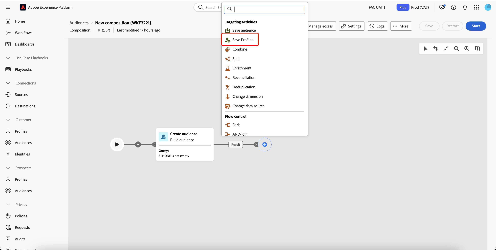
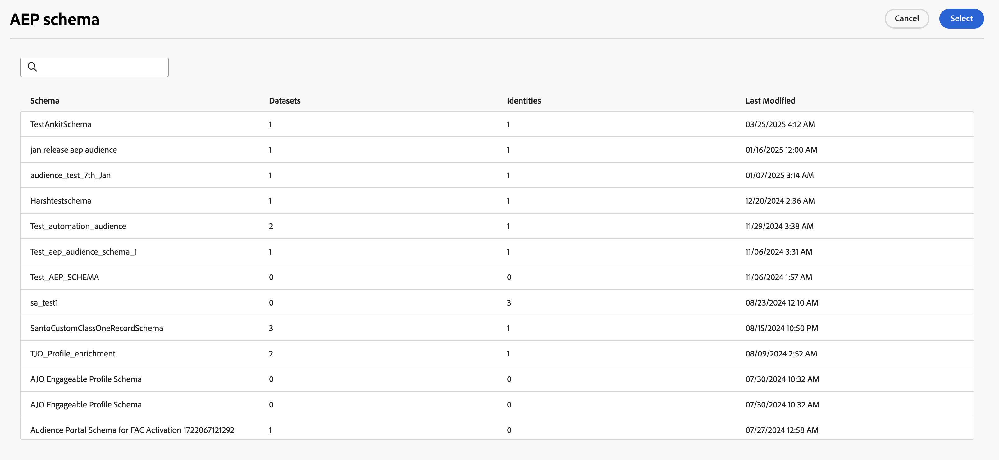

# Guardar perfiles {#save-profile}

>[!CONTEXTUALHELP]
>id="dc_orchestration_saveprofile"
>title="Guardar perfiles"
>abstract="La actividad Guardar perfiles permite enriquecer perfiles de Experience Platform federando datos de data warehouses externos, lo que permite mejorar los perfiles de los clientes con atributos adicionales. "

>[!CONTEXTUALHELP]
>id="dc_orchestration_saveprofile_aepschemalist"
>title="Seleccionar esquema de Experience Platform"
>abstract="Elija el esquema de Experience Platform para los perfiles."

>[!CONTEXTUALHELP]
>id="dc_orchestration_saveprofile_primaryidentitynamespace"
>title="Seleccionar el campo de identidad principal"
>abstract="Seleccione la identidad principal que se utilizará para identificar los perfiles segmentados en la base de datos."

>[!CONTEXTUALHELP]
>id="dc_orchestration_saveprofile_selectaepschema"
>title="Seleccionar esquema de Experience Platform"
>abstract="Elija el esquema de Experience Platform para los perfiles."

>[!CONTEXTUALHELP]
>id="dc_orchestration_saveprofile_updatemode"
>title="Guardar modo de actualización de perfil"
>abstract="Los modos de actualización disponibles para la actividad Guardar perfil incluyen actualización completa e incremental."

>[!CONTEXTUALHELP]
>id="dc_orchestration_saveprofile_updatemode_full"
>title="Actualización completa"
>abstract="El modo de actualización completa actualiza el conjunto completo de perfiles para el enriquecimiento."

>[!CONTEXTUALHELP]
>id="dc_orchestration_saveprofile_updatemode_incremental"
>title="Actualización incremental"
>abstract="El modo de actualización incremental actualiza los perfiles que se han modificado desde que se ejecutó el último enriquecimiento."

>[!CONTEXTUALHELP]
>id="dc_orchestration_saveprofile_primaryidentityfield"
>title="Campo de identidad principal"
>abstract="El campo de identidad principal indica la fuente de verdad al combinar perfiles para el enriquecimiento."

>[!CONTEXTUALHELP]
>id="dc_orchestration_saveprofile_requiredfieldscheck"
>title="Criterios de campos obligatorios"
>abstract="Un campo obligatorio es un atributo que debe rellenarse para cada perfil o registro al exportar datos. Si falta un campo obligatorio, la exportación no es completa ni válida."

>[!CONTEXTUALHELP]
>id="dc_orchestration_saveprofile_primaryidentitycheck"
>title="Criterios del campo de identidad principal"
>abstract="El identificador único de cada perfil o registro. Esto garantiza que cada registro se pueda reconocer y hacer coincidir de forma distintiva, lo que evita la duplicación de datos."

La actividad **[!UICONTROL Guardar perfiles]** le permite enriquecer perfiles de Adobe Experience Platform con datos federados desde almacenes externos.

Esta actividad se utiliza generalmente para mejorar los perfiles de los clientes mediante la introducción de atributos y perspectivas adicionales sin mover físicamente o duplicar los datos en la plataforma.

## Configure la actividad [!UICONTROL Guardar perfiles] {#save-profile-configuration}

>[!IMPORTANT]
>
>La actividad **Guardar perfiles** requiere un esquema y un conjunto de datos con perfil habilitado. Para obtener información sobre cómo habilitar el conjunto de datos para perfiles, lea la [guía del usuario del conjunto de datos](https://experienceleague.adobe.com/es/docs/experience-platform/catalog/datasets/user-guide#enable-profile){target="_blank"}.
>
>Además, si el conjunto de datos seleccionado **no** tiene habilitada la actualización, los datos de los perfiles serán **reemplazados**. Para obtener información sobre cómo habilitar la actualización para los conjuntos de datos, lea la [guía de actualización de habilitación](https://experienceleague.adobe.com/es/docs/experience-platform/catalog/datasets/enable-upsert).

Siga estos pasos para configurar la actividad **[!UICONTROL Guardar perfiles]**:

1. Agregue una actividad **[!UICONTROL Guardar perfiles]** a su composición.

   {width="1500" zoomable="yes"}

1. Especifique la etiqueta de los perfiles que desea crear.

   >[!IMPORTANT]
   >
   >La etiqueta de audiencia debe ser única dentro de la zona protegida actual. No puede ser la misma etiqueta que cualquier audiencia existente.

1. Seleccione el esquema de Adobe Experience Platform que desee utilizar.

   {width="1500" zoomable="yes"}

1. Seleccione el conjunto de datos en el que desea guardar el enriquecimiento.

   {width="300" zoomable="yes"}

1. Después de seleccionar el conjunto de datos, puede ver el campo de identidad principal que se utilizará para identificar perfiles en la base de datos.

1. Seleccione **[!UICONTROL Agregar campos]** para agregar los campos de identidad principal y obligatorios.

   {width="300" zoomable="yes"}

   Puede especificar el campo **Source** (datos externos) y el campo **Destination** (campo de esquema) para cada atributo que desee asignar.

   {width="300" zoomable="yes"}

1. También puede especificar el modo de actualización para el enriquecimiento.

   {width="300" zoomable="yes"}

   | Modo de actualización | Descripción |
   | ----------- | ----------- |
   | Actualizaciones completas | El conjunto completo de perfiles se actualiza para su enriquecimiento. |
   | Actualizaciones incrementales | Solo se actualizan para el enriquecimiento los perfiles que se han modificado desde que se ejecutó el último enriquecimiento. |

   Si selecciona [!UICONTROL Actualizaciones incrementales], también deberá elegir la fecha de la última modificación para determinar qué datos se enviarán.

1. Una vez configurada, seleccione **Iniciar**.
