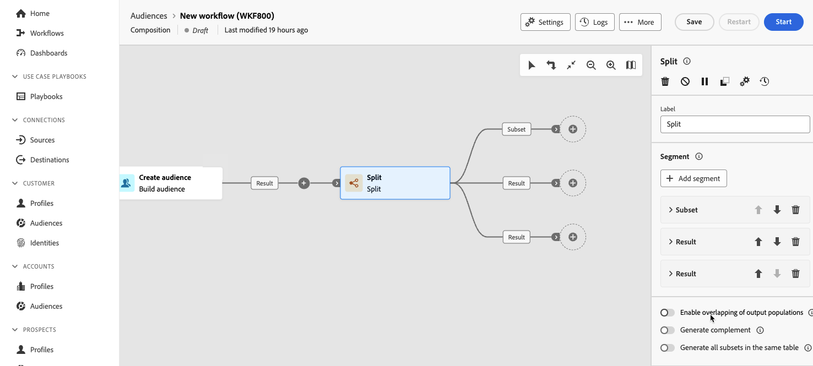

# División {#split}

>[!CONTEXTUALHELP]
>id="dc_orchestration_split"
>title="Actividad de división"
>abstract="La actividad **División** permite segmentar las poblaciones entrantes en varios subconjuntos en función de diferentes criterios de selección, como las reglas de filtrado o el tamaño de la población."

La actividad **División** permite segmentar las poblaciones entrantes en varios subconjuntos en función de diferentes criterios de selección, como las reglas de filtrado o el tamaño de la población.

## Configuración de la actividad División {#split-configuration}

>[!CONTEXTUALHELP]
>id="dc_orchestration_split_segments"
>title="Segmentos para actividad de división"
>abstract="Añada todos los subconjuntos que quiera para segmentar la población entrante.  Cuando se ejecuta la actividad **División**, la población se segmenta en los diferentes subconjuntos en el orden en el que se añaden a la actividad. Antes de iniciar la composición, asegúrese de haber ordenado los subconjuntos en el orden que mejor se adapte a sus necesidades mediante los botones de flecha."

>[!CONTEXTUALHELP]
>id="dc_orchestration_split_filter"
>title="Filtro de la actividad de división"
>abstract="Para aplicar una condición de filtrado al subconjunto, haga clic en **[!UICONTROL Crear filtro]** y configure la regla de filtrado que desee mediante el modelador de consultas. Por ejemplo, incluya perfiles de la población entrante cuya dirección de correo electrónico existe en la base de datos."

>[!CONTEXTUALHELP]
>id="dc_orchestration_split_limit"
>title="Límite de la actividad de división"
>abstract="Para limitar el número de perfiles seleccionados por el subconjunto, active la opción **[!UICONTROL Habilitar límite]** y especifique el número o los porcentajes de la población que desea incluir."

>[!CONTEXTUALHELP]
>id="dc_orchestration_split_sorting"
>title="Ordenación de la actividad de división"
>abstract="Al establecer un límite de población para un subconjunto, puede clasificar los perfiles seleccionados en función de un atributo de perfil específico, en orden ascendente o descendente. Para ello, active la opción **Habilitar ordenación**. Por ejemplo, puede restringir un subconjunto para incluir solo los 50 perfiles con la cantidad de compra más alta."

>[!CONTEXTUALHELP]
>id="dc_orchestration_split_complement"
>title="Complemento de generación de división"
>abstract="Una vez configurados todos los subconjuntos, puede seleccionar la población restante que no coincide con ninguno de los subconjuntos e incluirlos en una transición saliente adicional. Para ello, active la opción **Generar complemento.**"

>[!CONTEXTUALHELP]
>id="dc_orchestration_split_generatesubsets"
>title="Generar todos los subconjuntos de la misma tabla"
>abstract="Active esta opción para agrupar todos los subconjuntos en una sola transición de salida."

>[!CONTEXTUALHELP]
>id="dc_orchestration_split_emptytransition"
>title="Omitir transición vacía"
>abstract="Active la opción **[!UICONTROL Omitir transición vacía]** para deshabilitar la transición de salida para este subconjunto si la población entrante está vacía."

>[!CONTEXTUALHELP]
>id="dc_orchestration_split_enable_overlapping"
>title="Habilitar la superposición de poblaciones de salida"
>abstract="La opción **[!UICONTROL Habilitar la superposición de poblaciones de salida]** permite administrar poblaciones que pertenecen a varios subconjuntos. Cuando el cuadro no está marcado, la actividad de división garantiza que un destinatario no pueda estar presente en varias transiciones de salida, aunque cumpla los criterios de varios subconjuntos. Se encuentran en el destino de la primera pestaña con criterios coincidentes. Cuando se selecciona el cuadro, los destinatarios se pueden encontrar en varios subconjuntos si cumplen con sus criterios de filtro. Adobe Campaign recomienda utilizar criterios exclusivos."

Siga estos pasos para configurar la actividad **División**:

1. Agregue una actividad **Split** a su composición.

1. El panel de configuración de actividad se abre con un subconjunto predeterminado. Haga clic en el botón **Añadir segmento** para añadir tantos subconjuntos como desee para segmentar la población entrante.

   >[!IMPORTANT]
   >
   >Cuando se ejecuta la actividad **Split**, la población se segmenta en los diferentes subconjuntos en el orden en que se agregan a la actividad. Por ejemplo, si el primer subconjunto recupera el 70 % de la población inicial, el siguiente subconjunto añadido aplicará sus criterios de selección solo al 30 % restante, y así sucesivamente.
   >
   >Antes de iniciar la composición, asegúrese de haber ordenado los subconjuntos en el orden que mejor se adapte a sus necesidades. Para ello, utilice los botones de flecha para cambiar la posición de un subconjunto.

1. Una vez creados los subconjuntos, la actividad muestra de forma predeterminada tantas transiciones de salida como subconjuntos. Se recomienda encarecidamente cambiar la etiqueta de cada subconjunto para identificarlo fácilmente en el lienzo de composición.

   

1. Configure cómo debe filtrar cada subconjunto la población entrante. Para ello, siga estos pasos:

   1. Expanda el subconjunto para mostrar sus propiedades.

      

   1. Para aplicar una condición de filtrado al subconjunto, haga clic en **[!UICONTROL Crear filtro]** y configure la regla de filtrado que desee mediante el modelador de consultas. Por ejemplo, incluya perfiles de la población entrante cuya dirección de correo electrónico existe en la base de datos. [Aprenda a trabajar con el modelador de consultas](../../query/query-modeler-overview.md)

   1. Para limitar el número de perfiles seleccionados por el subconjunto, active la opción **[!UICONTROL Habilitar límite]** y especifique el número o los porcentajes de la población que desea incluir.

   1. Para deshabilitar una transición si la población entrante está vacía, active la opción **[!UICONTROL Omitir transición vacía]**. Si ningún perfil coincide con el subconjunto, la composición no pasará a la siguiente actividad.

   >[!NOTE]
   >
   >Al establecer un límite de población para un subconjunto, puede clasificar los perfiles seleccionados en función de un atributo de perfil específico, en orden ascendente o descendente. Para ello, active la opción **[!UICONTROL Habilitar ordenación]**. Por ejemplo, puede restringir un subconjunto para incluir solo los 50 perfiles con la cantidad de compra más alta.

1. Una vez configurados todos los subconjuntos, puede seleccionar la población restante que no coincide con ninguno de los subconjuntos e incluirlos en una transición saliente adicional. Para ello, active la opción **[!UICONTROL Generar complemento.]**

   >[!NOTE]
   >
   >La opción **[!UICONTROL Generate all subsets in the same table]** permite agrupar todos los subconjuntos en una sola transición de salida.

1. La opción **[!UICONTROL Enable overlapping of output populations]** permite administrar poblaciones que pertenecen a varios subconjuntos:

   * Cuando el cuadro no está marcado, la actividad de división garantiza que un destinatario no pueda estar presente en varias transiciones de salida, aunque cumpla los criterios de varios subconjuntos. Se encuentran en el destino de la primera pestaña con criterios coincidentes.
   * Cuando se selecciona el cuadro, los destinatarios se pueden encontrar en varios subconjuntos si cumplen con sus criterios de filtro. Adobe Campaign recomienda utilizar criterios exclusivos.

La actividad está configurada. En la ejecución, la población se segmenta en los diferentes subconjuntos, en el orden en que se hayan agregado a la actividad.

<!--
## Example{#split-example}

In the following example, the **[!UICONTROL Split]** activity is used to segment an audience into distinct subsets based on the communication channel that we want to use :

* **Subset 1 "push"**: This subset comprises all profiles who have installed our mobile application.
* **Subset 2 "sms"**: Mobile phone users: For the remaining population that did not fall into Subset 1, subset 2 applies a filtering rule to select profiles with mobile phones in the database.
* **Complement transition**: This transition captures all the remaining profiles that did not match Subset 1 or Subset 2. Specifically, it includes profiles who neither installed the mobile application nor have a mobile phone, such as users who haven't installed the mobile app or lack a registered mobile number.

-->
