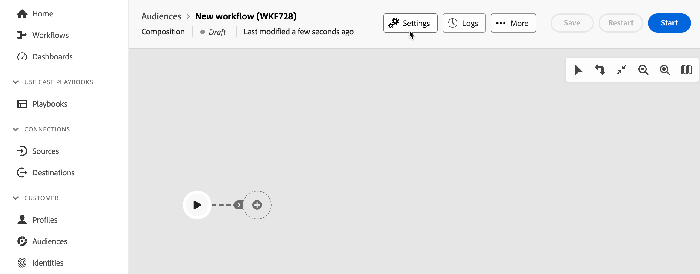

# Crear una composición

La composición de público federado le permite crear composiciones, donde puede aprovechar diversas actividades en un lienzo visual para crear públicos. Después de crear la composición, los públicos resultantes se guardan en Adobe Experience Platform y se pueden aprovechar en destinos de Experience Platform y Adobe Journey Optimizer para dirigirse a los clientes.

## Definición de la composición {#create}

>[!CONTEXTUALHELP]
>id="dc_composition_creation_properties"
>title="Propiedades de la composición"
>abstract="En esta pantalla, elija la plantilla que desea utilizar para crear la composición y especifique una etiqueta. Expanda la sección OPCIONES ADICIONALES para configurar más opciones, como el nombre interno de la composición, su carpeta, zona horaria y grupo de supervisores. Se recomienda encarecidamente seleccionar un grupo de supervisores para que los operadores sean alertados si se produce un error."

Para crear una composición, primero deberá definir su etiqueta y, opcionalmente, configurar ajustes adicionales.

Para crear una composición, selecciona **[!UICONTROL Audiencias]** en la sección **[!UICONTROL Cliente]**, seguido de la pestaña **[!UICONTROL Composiciones federadas]**.

Aparecerá la página de exploración de composiciones federadas. Seleccione **[!UICONTROL Crear composición]** para continuar con el proceso de creación de la composición.

En la sección **[!UICONTROL Propiedades]**, especifique una etiqueta para la composición y seleccione un modelo de datos. Solo los esquemas asociados a este modelo de datos estarán disponibles en las actividades de la composición.

Seleccione **[!UICONTROL Crear]**. Se muestra el lienzo de composición. Ahora puede configurar la composición añadiendo actividades y transiciones al lienzo.

## Lienzo de composición {#canvas}

En la parte superior del lienzo, puede acceder a una barra de herramientas que proporciona opciones para administrar y navegar por las actividades.

Las opciones disponibles incluyen:

* **[!UICONTROL Selección múltiple]**: seleccione varias actividades para eliminarlas todas a la vez o cópielas y péguelas.
* **[!UICONTROL Rotar]**: cambia el lienzo para que se muestre verticalmente.
* **[!UICONTROL Ajustar a la pantalla]**: ajusta el nivel de zoom del lienzo a la pantalla.
* **[!UICONTROL Acercar]** / **[!UICONTROL Alejar]**: Acercar o alejar el lienzo.
* **[!UICONTROL Mostrar mapa]**: abre una instantánea del lienzo en el que se muestra que se encuentra.

## Añadir actividades {#add-activities}

En el lienzo de composición, puede añadir actividades y transiciones que ayuden a definir la audiencia. Las actividades permiten *definir* los componentes de la audiencia, mientras que las transiciones permiten *organizar* el flujo de la composición.

Para obtener más información acerca de las actividades y transiciones disponibles para usar, lea [información general sobre actividades](./activities.md).

## Administrar actividades {#manage-activities}

Puede realizar operaciones en las actividades agregadas dentro del panel de propiedades.

Las opciones incluyen:

* **[!UICONTROL Eliminar]**: elimine la actividad del lienzo.
* **[!UICONTROL Deshabilitar]/[!UICONTROL Habilitar]**: deshabilitar o habilitar la actividad. Cuando se ejecuta la composición, las actividades desactivadas y las siguientes actividades en la misma ruta no se ejecutan y la composición se detiene.
* **[!UICONTROL Pausar]/[!UICONTROL Reanudar]**: Pausar o reanudar la actividad. Cuando se ejecuta la composición, esta se pausa en la actividad pausada. No se ejecutará la tarea correspondiente ni las que la siguen en la misma ruta.
* **[!UICONTROL Copiar]**: copia la actividad para pegarla en otra ubicación de la composición. Para ello, seleccione el botón **+** en una transición y seleccione **[!UICONTROL Pegar actividad X]**. <!-- cannot copy multiple activities ? cannot paste in another composition?-->
* Configure **[!UICONTROL Opciones de ejecución]** para la actividad seleccionada. Las opciones de ejecución disponibles son las siguientes:
  +++Opciones de ejecución disponibles

  La sección **[!UICONTROL Properties]** le permite configurar opciones genéricas con respecto a la ejecución de la actividad:

   * **[!UICONTROL Ejecución]**: defina la acción que se va a llevar a cabo cuando se inicie.
   * **[!UICONTROL Duración máxima de la ejecución]**: especifique una duración como &quot;30 s&quot; o &quot;1h&quot;. Si la actividad no termina después de que haya transcurrido la duración especificada, se activa una alerta. Esto no afecta al funcionamiento de la composición.
   * **[!UICONTROL Zona horaria]**: seleccione la zona horaria de la actividad. La Composición de audiencia federada permite administrar las diferencias horarias entre varios países en la misma instancia. La configuración aplicada se configura cuando se crea la instancia.
   * **[!UICONTROL Afinidad]**: fuerza la ejecución de la actividad de composición en un equipo concreto. Para ello, debe especificar una o varias afinidades para la actividad en cuestión.
   * **[!UICONTROL Comportamiento]**: defina el procedimiento a seguir si se utilizan tareas asincrónicas.

  La sección **[!UICONTROL Administración de errores]** le permite especificar la acción que se debe llevar a cabo si la actividad encuentra un error.

  La sección **[!UICONTROL Secuencia de comandos de inicialización]** le permite inicializar variables o modificar propiedades de actividad. Seleccione el botón **[!UICONTROL Editar código]** y escriba el fragmento de código que desea ejecutar. Se llama al script cuando se ejecuta la actividad.

  +++
* **Registros y tareas**: vea los registros y tareas de la actividad seleccionada.

## Inicie y monitorice su composición {#start-and-monitor}

Cuando haya terminado de agregar las actividades a la composición, puede iniciar la ejecución de la composición. Para iniciar una composición, seleccione el botón **[!UICONTROL Iniciar]** en la esquina superior derecha de la pantalla.

| Acción | Descripción |
| ------ | ----------- |
| **Start** | Inicia la ejecución de la composición y la mueve al estado **En curso**. |
| **Pause** | Pausa la ejecución de la composición y la establece en el estado **Paused**. No se activarán nuevas actividades hasta que se reanude la composición, pero las operaciones en curso **no** se suspenderán. |
| **Reanudar** | Reanuda la ejecución de la composición en pausa y la establece en el estado **En curso**. |
| **Stop** | Detiene la ejecución de la composición y la establece en el estado **Finalizado**. Usted **no puede** reanudar la composición desde el mismo lugar desde el que se detuvo. |
| **Restart** | Detiene y reinicia la ejecución de la composición. |

Cuando se está ejecutando la composición, cada actividad del lienzo se ejecuta en un orden secuencial, hasta que se llega al final de la composición. Puede realizar un seguimiento del progreso de los perfiles de destino en tiempo real mediante un flujo visual. Esto le permite identificar rápidamente el estado de cada actividad y el número de perfiles en transición entre ellas.

Los indicadores visuales de la esquina superior derecha de cada actividad muestran el estado de la ejecución:

| Indicador visual | Descripción |
| ---------------- | ------------|
| {zoomable="yes"}{width="70%"} | La actividad se está ejecutando actualmente. |
| {zoomable="yes"}{width="70%"} | La actividad requiere su atención. Esto puede implicar confirmar el envío de una entrega o tomar las medidas necesarias. |
| {zoomable="yes"}{width="70%"} | La actividad ha encontrado un error. Para resolver el problema, abra los registros de composición para obtener más información. |
| {zoomable="yes"}{width="70%"} | La actividad se ha ejecutado correctamente. |

### Monitorización de registros y tareas {#monitor-logs}

Además, puede ver los registros de composición para asegurarse de que se ejecutan correctamente. Seleccione **[!UICONTROL Registros]** en la barra de herramientas de acciones para ver esta información.

Aparecerá la pantalla **[!UICONTROL Registros de composición y tareas]**. Esto proporciona un historial de la ejecución de la maquetación, registrando todas las acciones del usuario y los errores encontrados.

El historial se organiza en varias pestañas, que se detallan a continuación:

* La pestaña **[!UICONTROL Log]** contiene el historial de ejecución de todas las actividades de composición. Indexa las operaciones realizadas y los errores de ejecución por orden cronológico.
* La ficha **[!UICONTROL Tareas]** detalla la secuencia de ejecución de las actividades. El botón situado al final de cada tarea le permite enumerar las variables de evento que pasan a través de la actividad.
* La ficha **[!UICONTROL Variables]** enumera todas las variables pasadas en la composición. Está disponible al acceder a los registros y tareas solo desde el lienzo de composición. Ahora está disponible al acceder a los registros desde el panel de propiedades de una actividad.

En todas las pestañas, puede elegir las columnas mostradas y su orden, aplicar filtros y utilizar el campo de búsqueda para encontrar rápidamente la información deseada.

### Suscribirse a alertas {#alerts}

También puede suscribirse a alertas para recibir notificaciones si las ejecuciones de composición federada se han realizado correctamente o no.

Para suscribirse a las alertas, seleccione el , seguido del .

{zoomable="yes"}{width="70%"}

Se muestra la página de configuración de notificaciones. En esta página, seleccione **[!UICONTROL Experience Platform]** y elija los canales de alertas que desee. Para ver las notificaciones dentro de la interfaz de usuario, selecciona **[!UICONTROL En la aplicación]**.

{zoomable="yes"}{width="50%"}

Con **[!UICONTROL En la aplicación]** seleccionada, se le notificará de los errores y las ejecuciones de composición.

{zoomable="yes"}{width="70%"}

## Configuración de los ajustes de la composición {#settings}

>[!CONTEXTUALHELP]
>id="dc_composition_settings_properties"
>title="Propiedades de la composición"
>abstract="En esta sección se proporcionan propiedades genéricas de composición a las que también se puede acceder al crear la composición."

>[!CONTEXTUALHELP]
>id="dc_composition_settings_segmentation"
>title="Segmentación de composición"
>abstract="De forma predeterminada, solo se conservan las tablas de trabajo de la última ejecución de la composición. Puede habilitar esta opción para conservar las tablas de trabajo con fines de prueba. Debe usarse **solamente** en entornos de ensayo o de desarrollo. Nunca se debe marcar en un entorno de producción."

>[!CONTEXTUALHELP]
>id="dc_composition_settings_error"
>title="Configuración de la administración de errores"
>abstract="En esta sección, puede definir cómo administrar los errores durante la ejecución. Puede optar por poner en pausa el proceso, ignorar un determinado número de errores o detener la ejecución de la composición."

Al acceder a una composición, puede acceder a ajustes avanzados que le permiten, por ejemplo, definir cómo debe comportarse la composición en caso de error.

Para acceder a estas opciones adicionales, seleccione **[!UICONTROL Configuración]** en la sección superior de la pantalla de creación de la composición.

| Configuración | Descripción |
| -------- | ----------- |
| **[!UICONTROL Etiqueta]** | Actualice el nombre dado a la composición. |
| **[!UICONTROL Mantener el resultado de las poblaciones provisionales entre dos ejecuciones]** | Si esta opción está activada, las tablas de trabajo se conservarán incluso después de ejecutar la composición. De forma predeterminada, solo se conservan las tablas de trabajo de la última ejecución de la composición. Las tablas de trabajo de ejecuciones anteriores se eliminan a diario. Solo debe habilitar esta configuración en un entorno de ensayo o desarrollo. **nunca** debe habilitar esta configuración en un entorno de producción. |
| **[!UICONTROL Administración de errores]** | Define las acciones realizadas si la composición tiene un error. Hay tres opciones posibles: <ul><li>**[!UICONTROL Suspender el proceso]**: la composición se pone en pausa automáticamente y su estado cambia a **[!UICONTROL Error]**. Una vez resuelto el problema, reanude la composición con los botones **[!UICONTROL Reanudar]**.</li><li>**[!UICONTROL Ignorar]**: El estado de la tarea que activó el error cambia a **[!UICONTROL Fallido]**, pero la composición mantiene el estado **[!UICONTROL Iniciado]**.</li><li>**[!UICONTROL Anular el proceso]**: la composición se detiene automáticamente y su estado cambia a **[!UICONTROL Error]**. Una vez resuelto el problema, reinicie la composición con el botón **[!UICONTROL Iniciar]**.</li></ul> |
| **[!UICONTROL Consecutive errors]** | Especifique el número de errores que se pueden omitir antes de que se detenga el proceso. Una vez alcanzado este número, el estado de la composición cambia a **[!UICONTROL Failed]**. Si el valor de este campo es 0, la composición nunca se detendrá, independientemente del número de errores. |
