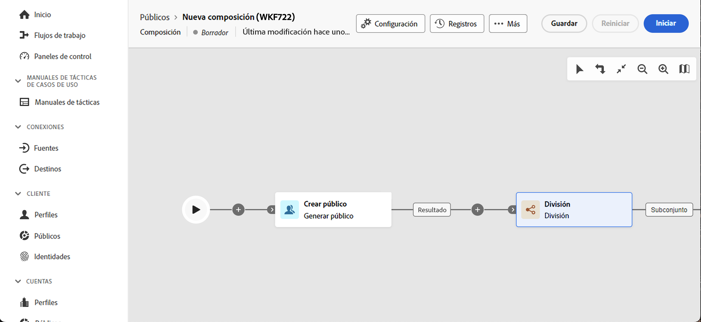
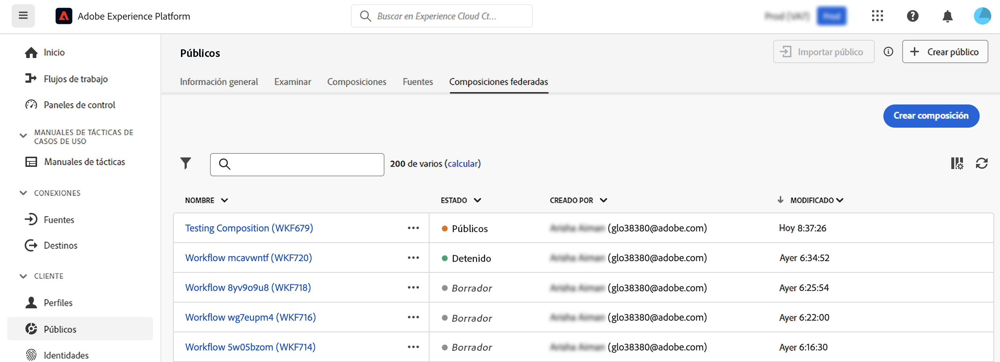
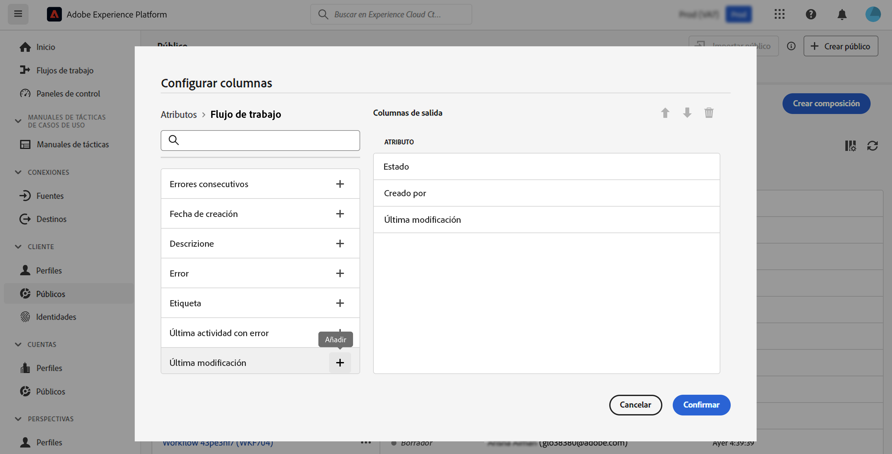

# Introducción a las composiciones {#compositions}

## ¿Qué es una composición? {#what}

La composición de datos de Adobe le permite crear composiciones, donde puede aprovechar varias actividades (dividir, excluir...) en un lienzo visual para crear audiencias. Una vez hecho, las audiencias resultantes se guardan en Adobe Experience Platform junto con las audiencias existentes y se pueden aprovechar en destinos como Journey Optimizer para clientes de destino.

## Acceso y administración de composiciones {#access}

>[!CONTEXTUALHELP]
>id="dc_composition_list"
>title="Composiciones"
>abstract="En esta pantalla, puede acceder a la lista completa de composiciones, comprobar su estado actual, las fechas de última/siguiente ejecución y crear una nueva composición."

Se puede acceder a las composiciones desde Adobe Experience Platform **[!UICONTROL Audiencias]** menú, en el **Composiciones federadas** pestaña.

Desde esta pantalla, puede crear nuevas composiciones y acceder a las existentes. También puede duplicar o eliminar una composición existente haciendo clic en el botón de puntos suspensivos situado junto a su nombre.

Para refinar la lista y encontrar fácilmente la composición que está buscando, puede buscar en la lista y filtrar composiciones por sus estados o fechas de último procesamiento.

También puede personalizar la lista añadiendo o quitando columnas. Para ello, haga clic en el **Configurar columna** s y añada o elimine las columnas de salida deseadas.

## Estados de las composiciones {#status}

Las composiciones pueden tener varios estados:

* **[!UICONTROL Borrador]**: la composición se ha creado y guardado.
* **[!UICONTROL En curso]**: la composición se ha ejecutado y se está ejecutando.
* **[!UICONTROL Detenido]**: se ha detenido la ejecución de la composición.
* **[!UICONTROL Pausado]**: la ejecución de la composición se ha pausado.
* **[!UICONTROL Erróneo]**: la ejecución de la composición ha encontrado un error. Abra la composición y acceda a los registros y tareas para identificar el error y resolverlo.

Encontrará información detallada sobre cómo iniciar y controlar una composición en [esta sección](../compositions/start-monitor-composition.md).