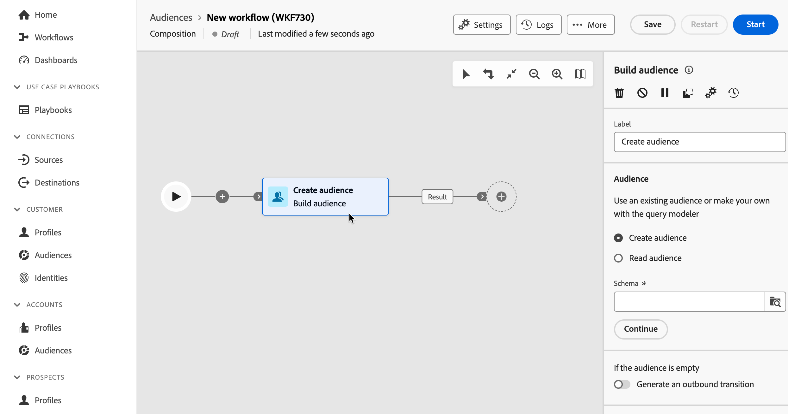

# Organización de actividades de composición {#activities}

Una vez creada una composición, puede empezar a organizar las diferentes tareas que va a realizar. Para ello, se proporciona un lienzo visual, que le permite crear el diagrama de composición. Dentro de este diagrama, puede añadir varias actividades y conectarlas en un orden secuencial.

## Añadir actividades {#add}

En esta fase de la configuración, el diagrama se muestra con un icono de inicio que representa el principio del flujo de trabajo. Para añadir su primera actividad, haga clic en **+** botón conectado al icono de inicio.

Aparecerá una lista de actividades que se pueden agregar al diagrama. Las actividades disponibles dependen de su posición dentro del diagrama de composición. Por ejemplo, al añadir la primera actividad de, puede iniciar la composición dirigiéndose a una audiencia, dividiendo la ruta del flujo de trabajo, configurando un planificador para retrasar la ejecución del flujo de trabajo o estableciendo un **Esperar** para retrasar la ejecución del flujo de trabajo. Por otro lado, después de un **Crear audiencia** actividad, puede refinar el segmento con actividades de segmentación u organizar el proceso de composición con actividades de control de flujo.

Una vez que se ha agregado una actividad al diagrama, aparece un panel derecho que le permite configurar la actividad recién agregada con ajustes específicos. Encontrará información detallada sobre cómo configurar cada actividad en [esta sección](activities/about-activities.md).

Repita este proceso para agregar tantas actividades como desee según las tareas que desee que realice la composición. Tenga en cuenta que también puede insertar una nueva actividad entre dos actividades. Para ello, haga clic en el **+** en la transición entre las actividades, seleccione la actividad deseada y configúrela en el panel derecho.

>[!TIP]
>
>Tiene la opción de personalizar el nombre de las transiciones entre cada actividad. Para ello, seleccione la transición y cambie su etiqueta en el panel derecho.

## La barra de herramientas de lienzo {#toolbar}

La barra de herramientas situada en la esquina superior derecha del lienzo proporciona opciones para manipular fácilmente las actividades y navegar en el lienzo.

Las acciones disponibles son:

* **Selección múltiple**: seleccione varias actividades para eliminarlas todas a la vez o cópielas y péguelas. Consulte [esta sección](#copy).
* **Rotar**: cambie el lienzo verticalmente.
* **Ajustar a pantalla**: adapte el nivel de zoom del lienzo a la pantalla.
* **Alejar** / **Ampliar**: Aleje o en el lienzo.
* **Mostrar mapa**: abre una instantánea del lienzo en el que se muestra que se encuentra.

## Administrar actividades {#manage}

Al agregar actividades, los botones de acción están disponibles en el panel de propiedades, lo que le permite realizar varias operaciones.

Puede hacer lo siguiente:

* **Eliminar** la actividad del lienzo.
* **Deshabilitar/habilitar** la actividad. Cuando se ejecuta el flujo de trabajo, las actividades desactivadas y las siguientes actividades en la misma ruta no se ejecutan y el flujo de trabajo se detiene.
* **Pausar/reanudar** la actividad. Cuando se ejecuta el flujo de trabajo, se detiene en la actividad pausada. No se ejecutan la tarea correspondiente ni todas las que la siguen en la misma ruta.
* **Copiar** Seleccione la actividad para pegarla en otra ubicación de la composición. Para ello, haga clic en el **+** en una transición y seleccione Pegar actividad X. <!-- cannot copy multiple activities ? cannot paste in another composition?-->
* Configurar **Opciones de ejecución** para la actividad seleccionada. Expanda la sección siguiente para obtener más información sobre las opciones disponibles.

  +++Opciones de ejecución disponibles

  El **Propiedades** permite configurar ajustes genéricos relacionados con la ejecución de la actividad:

   * **Ejecución**: defina la acción que se realizará cuando se inicie el.
   * **Duración máxima de la ejecución**: especifique una duración como &quot;30 segundos&quot; o &quot;1h&quot;. Si la actividad no termina después de que haya transcurrido la duración especificada, se activa una alerta. Esto no afecta al funcionamiento del flujo de trabajo.
   * **Zona horaria**: seleccione la zona horaria de la actividad. La Composición de audiencia federada permite administrar las diferencias horarias entre varios países en la misma instancia. La configuración aplicada se configura cuando se crea la instancia.
   * **Afinidad**: fuerza la actividad de composición para que se ejecute en un equipo concreto. Para ello, debe especificar una o varias afinidades para la actividad en cuestión.
   * **Comportamiento**: Defina el procedimiento a seguir si se utilizan tareas asincrónicas.

  El **Administración de errores** Esta sección le permite especificar la acción que se realizará si la actividad experimenta un error.

  El **Script de inicialización** Esta sección permite inicializar las variables o modificar las propiedades de la actividad. Haga clic en **Editar código** y escriba el fragmento de código que desea ejecutar. Se llama al script cuando se ejecuta la actividad.

+++

* Acceda a los **Registros y tareas**.
