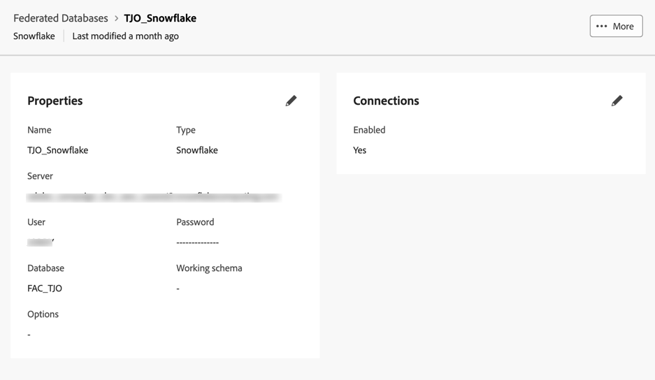

# Creación de conexiones {#connections-fdb}

La composición de público federado de Experience Platform permite al cliente generar y enriquecer los públicos de los almacenes de datos de terceros e importarlos a Adobe Experience Platform.

Para trabajar con la base de datos federada y Adobe Experience Platform, primero debe establecer una conexión. Esta conexión se configura en una interfaz de usuario dedicada disponible en la interfaz de usuario de Adobe Experience Platform, como se detalla en esta página.

Para configurar una conexión con la base de datos, siga estos pasos:

1. Vaya a la sección **[!UICONTROL DATOS FEDERADOS]** en el carril izquierdo.

1. En el vínculo **[!UICONTROL Bases de datos federadas]**, haga clic en el botón **[!UICONTROL Agregar base de datos federada]**.

   {zoomable="yes"}

1. Establezca la conexión **[!UICONTROL Properties]**, con el nombre y el tipo de su base de datos.

   {zoomable="yes"}

   Al seleccionar su tipo, puede acceder a otras propiedades para rellenarlas. Obtenga más información aquí acerca de las bases de datos compatibles en [esta página](federated-db.md).

   {zoomable="yes"}

   Los ajustes de configuración dependen del tipo de base de datos. Examine los vínculos siguientes para acceder a los detalles que necesita para configurar la conexión:

   * [Amazon Redshift](federated-db.md#amazon-redshift)
   * [Azure Synapse](federated-db.md#azure-synapse-redshift)
   * [Google Big Query](federated-db.md#google-big-query)
   * [Snowflake](federated-db.md#snowflake)
   * [Vertica Analytics](federated-db.md#vertica-analytics)

1. Después de completar los detalles, haga clic en el botón **[!UICONTROL Probar conexión]** y en el botón **[!UICONTROL Implementar funciones]**.

1. Finalice la creación de la conexión haciendo clic en el botón **[!UICONTROL Guardar]**.

   {zoomable="yes"}

   A continuación, se muestra una descripción general de la conexión a base de datos federada:

   {zoomable="yes"}
