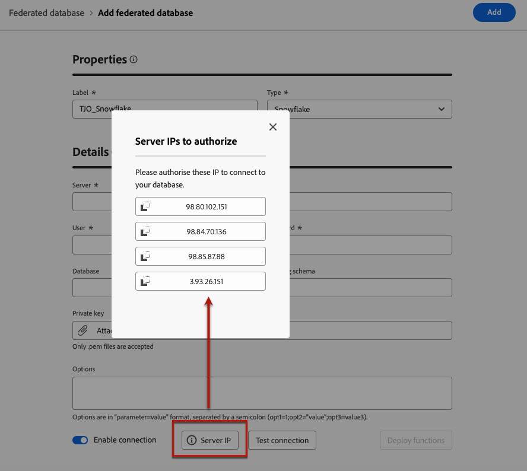

# Creación de conexiones {#connections-fdb}

>[!AVAILABILITY]
>
>Para acceder a las conexiones, necesita uno de los siguientes permisos:
>
>-**Administrar base de datos federada**
>&#x200B;>-**Ver base de datos federada**
>
>Para obtener más información sobre los permisos necesarios, consulte [Guía de acceso de la composición de público federado](/help/start/feature-access.md).

La composición de audiencias federada de Experience Platform permite al cliente crear y enriquecer audiencias de los almacenes de datos de terceros e importarlas a Adobe Experience Platform. Los almacenes de datos admitidos se enumeran en [esta sección](../start/access-prerequisites.md#supported-systems).

Para trabajar con la base de datos federada y Adobe Experience Platform, primero debe establecer una conexión. Esta conexión se configura en una interfaz de usuario dedicada disponible en la interfaz de usuario de Adobe Experience Platform, tal como se detalla en esta página.

Para configurar una conexión con la base de datos, siga estos pasos:

1. Vaya a la sección **[!UICONTROL DATOS FEDERADOS]** en el carril izquierdo.

1. En el vínculo **[!UICONTROL Bases de datos federadas]**, haga clic en el botón **[!UICONTROL Agregar base de datos federada]**.

   {zoomable="yes"}

1. Establezca la conexión **[!UICONTROL Properties]**, con el nombre y el tipo de su base de datos.

   {zoomable="yes"}

   Al seleccionar su tipo, puede acceder a otras propiedades para rellenarlas. Obtenga más información aquí acerca de las bases de datos compatibles con [esta página](federated-db.md).

   {zoomable="yes"}

   Los ajustes de configuración dependen del tipo de base de datos. Examine los vínculos siguientes para acceder a los detalles que necesita para configurar la conexión:

   * [Amazon Redshift](federated-db.md#amazon-redshift)
   * [Azure Synapse](federated-db.md#azure-synapse-redshift)
   * [Databricks](federated-db.md#databricks)
   * [Google BigQuery](federated-db.md#google-bigquery)
   * [Snowflake](federated-db.md#snowflake)
   * [Vertica Analytics](federated-db.md#vertica-analytics)
   * [Microsoft Fabric](federated-db.md#microsoft-fabric)

1. Para cada base de datos compatible, seleccione el botón **[!UICONTROL IP del servidor]**. Se muestra la lista de todas las direcciones IP asociadas con las instancias de Composición de audiencia federada.

   {zoomable="yes"}

   Haga clic en una IP de la lista para copiarla en el sistema y autorizar esta IP para conectarse a la base de datos.

   >[!NOTE]
   >
   >Para utilizar Federated Audience Composition para una base de datos determinada, debe lista de permitidos todas las direcciones IP asociadas con esa base de datos.

1. Después de completar los detalles, haga clic en el botón **[!UICONTROL Probar conexión]** y en el botón **[!UICONTROL Implementar funciones]**.

   {zoomable="yes"}

1. Finalice la creación de la conexión haciendo clic en el botón **[!UICONTROL Guardar]**.

   A continuación, se muestra una descripción general de la conexión a base de datos federada:

   {zoomable="yes"}
