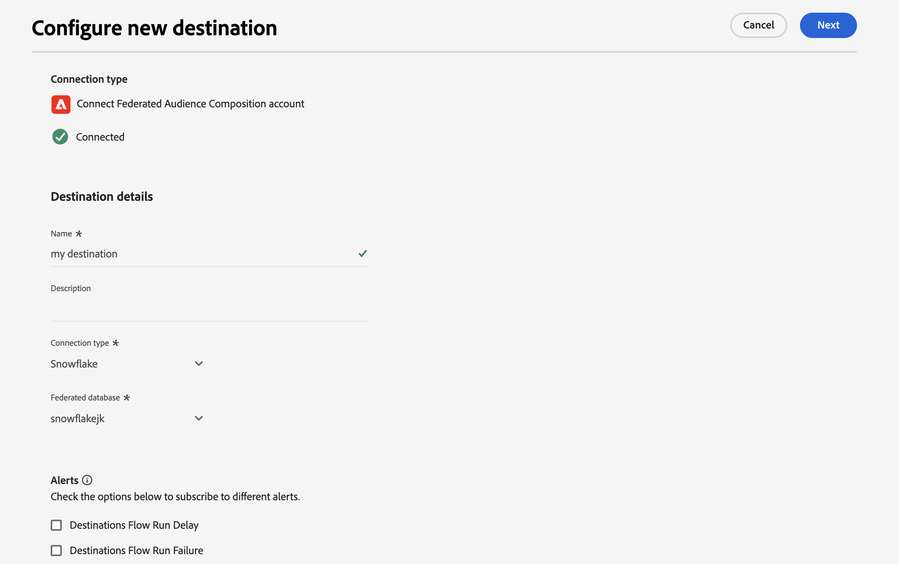
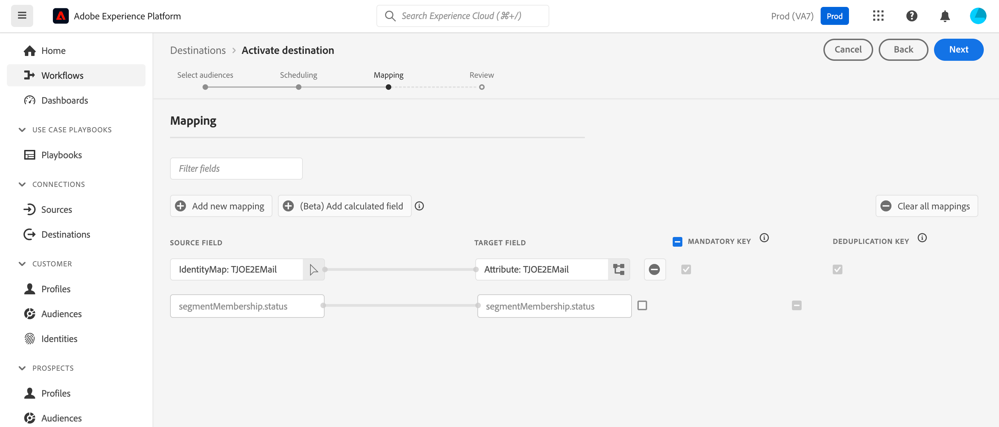

# Enriquecimiento de públicos de Adobe Experience Platform con datos externos {#connect-aep-fac}

>[!CONTEXTUALHELP]
>id="dc_new_destination"
>title="Crear un destino"
>abstract="Introduce la configuración para conectarte a la nueva base de datos federada. Utilice el botón **[!UICONTROL Conectar con destino]** para validar la configuración."

Adobe Experience Platform permite la integración perfecta de audiencias desde Audience Portal con sus bases de datos externas mediante **Adobe Federated Audience Composition destination**. Con esta integración, puede aprovechar las audiencias existentes en las composiciones y enriquecerlas o refinarlas con datos de bases de datos externas para crear nuevas audiencias.

Para ello, debe configurar una nueva conexión en Adobe Experience Platform al destino de composición de audiencia federada de Adobe. Puede utilizar un planificador para enviar una audiencia determinada a frecuencias regulares y seleccionar los atributos específicos que desea incluir, como los ID para la reconciliación de datos. Si ha aplicado políticas de gobernanza y privacidad a su audiencia, se conservarán y se devolverán al portal de audiencia una vez que se haya actualizado la audiencia.

Por ejemplo, supongamos que almacena información de compra en su almacén de datos y tiene una audiencia de Adobe Experience Platform dirigida a los clientes interesados en un producto específico en los últimos dos meses. Con el destino de composición de audiencia federada, puede:

* Refine la audiencia en función de la información de compra. Por ejemplo, puede filtrar la audiencia para dirigirse a los clientes que hayan realizado una compra de más de 150 dólares.
* Enriquezca la audiencia con campos relacionados con las compras, como el nombre del producto y la cantidad comprada.

## Activar audiencia en destino {#activate}

En el catálogo Destinos de Adobe Experience Platform, seleccione el destino Composición de audiencia federada. En el panel derecho, seleccione **[!UICONTROL Configurar nuevo destino]**.

Aparecerá la página **[!UICONTROL Configurar nuevo destino]**. En esta página, puede configurar los detalles del destino, incluido el nombre, la descripción, el tipo de conexión y la base de datos federada.

En la sección **[!UICONTROL Alertas]**, puede habilitar las alertas para recibir notificaciones sobre el estado del flujo de datos a su destino. Estas incluyen alertas para retrasos de ejecución del flujo de datos, errores de ejecución, ejecuciones correctas, inicios de ejecución y saltos de activación.

Para obtener más información acerca de las alertas, lea la documentación de Adobe Experience Platform acerca de la suscripción de [a alertas de destinos mediante la interfaz de usuario](https://experienceleague.adobe.com/es/docs/experience-platform/destinations/ui/alerts){target="_blank"}.

Una vez que hayas terminado de configurar los detalles de tu destino, selecciona **[!UICONTROL Siguiente]**. Aparece el paso **[!UICONTROL Política de gobernanza y acciones de aplicación]**. En esta página, puede definir las políticas de control de datos y asegurarse de que los datos utilizados sean compatibles cuando las audiencias se envíen y estén activas.

Cuando termine de seleccionar las acciones de marketing deseadas para el destino, seleccione **[!UICONTROL Crear]**.

Se crea la nueva conexión con el destino. Ahora puede activar audiencias para enviar al destino. Elija el destino al que desea activar las audiencias, seguido de **[!UICONTROL Siguiente]**.

Se muestra el paso **[!UICONTROL Scheduling]**. Puede seleccionar las audiencias que desee activar en el destino. Para configurar una programación, seleccione  para editar la programación de exportación.

Aparece la ventana emergente **[!UICONTROL Programando]**. En esta ventana emergente, puede definir las opciones de exportación de archivos, la frecuencia y la programación.

>[!NOTE]
>
>Para activar las audiencias más rápido, seleccione la opción **[!UICONTROL Después de la evaluación del segmento]** para almacenar en déclencheur el trabajo de activación inmediatamente después de que finalice el trabajo diario de segmentación por lotes de Platform.
>
>Para obtener información detallada sobre cómo configurar la programación y los nombres de archivo, lea las siguientes secciones de la documentación de Adobe Experience Platform:
>
>* [Programar exportación de audiencias](https://experienceleague.adobe.com/es/docs/experience-platform/destinations/ui/activate/activate-batch-profile-destinations#scheduling){target="_blank"}
>* [Configurar nombres de archivo](https://experienceleague.adobe.com/es/docs/experience-platform/destinations/ui/activate/activate-batch-profile-destinations#configure-file-names){target="_blank"}

En el paso **[!UICONTROL Asignación]**, seleccione qué campos de atributo e identidad desea exportar para sus audiencias.

>[!IMPORTANT]
>
>Usted **no puede** utilizar columnas generadas por el sistema al activar en destinos. Si se selecciona una columna generada por el sistema, se producirá un error.

Para obtener más información, lea la [sección de asignación](https://experienceleague.adobe.com/es/docs/experience-platform/destinations/ui/activate/activate-batch-profile-destinations#mapping){target="_blank"} en la documentación de Adobe Experience Platform.

Revise la configuración de destino y la configuración de audiencia y, a continuación, seleccione **[!UICONTROL Finalizar]**.

Las audiencias seleccionadas ahora están activadas para la nueva conexión. Para agregar más audiencias que enviar con esta conexión, vuelva a la página **[!UICONTROL Activar audiencias]**. Las audiencias no se pueden eliminar una vez activadas.
