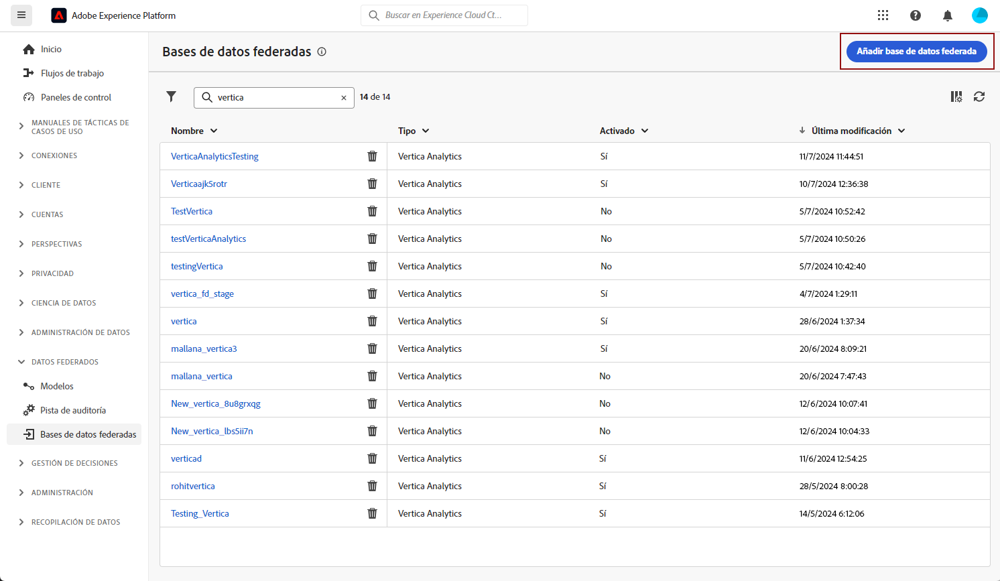
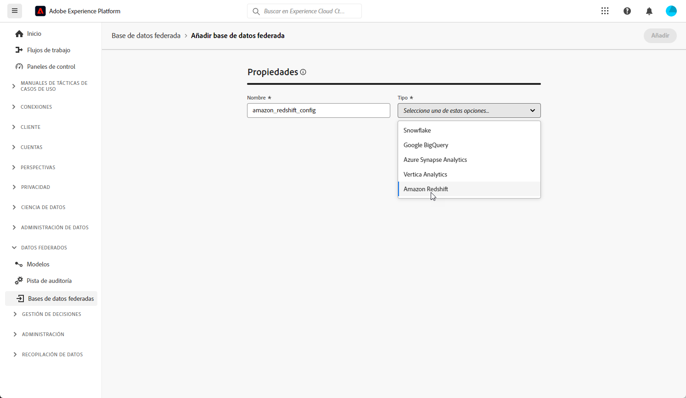
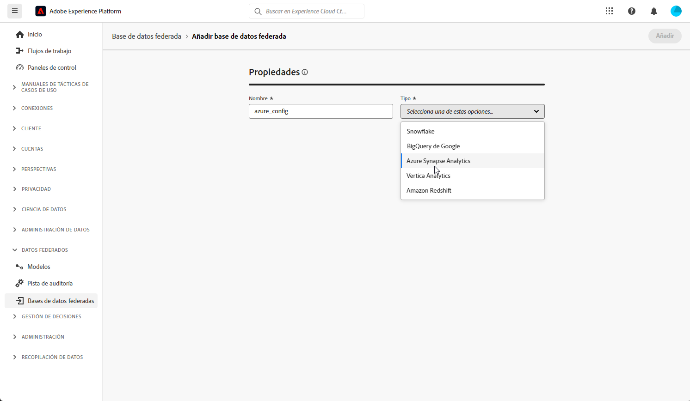
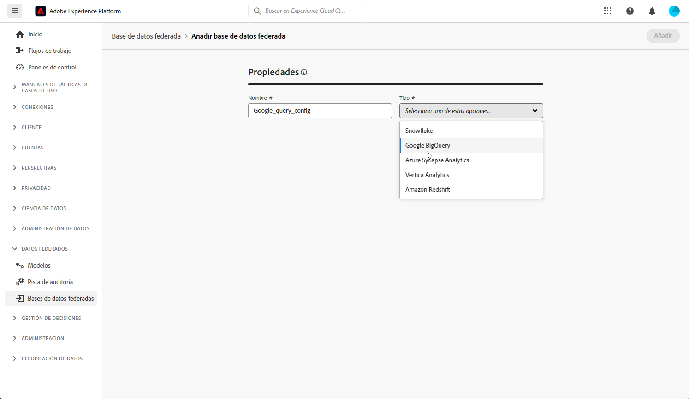
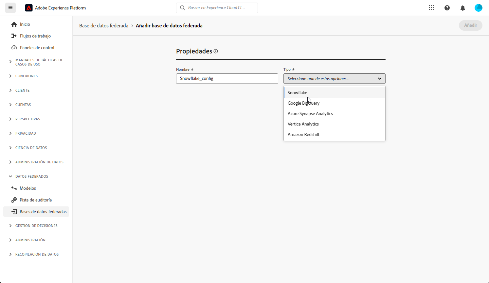
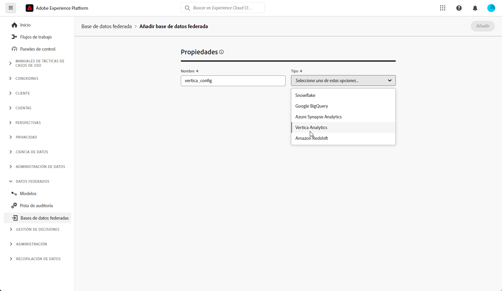

# Configuración de las bases de datos federadas {#federated-db}

>[!CONTEXTUALHELP]
>id="dc_connection_federated_database_menu"
>title="Bases de datos federados"
>abstract="En esta pantalla se muestran las conexiones con las bases de datos federados. Para crear una conexión nueva, haga clic en el botón **[!UICONTROL Añadir base de datos federada]**."

>[!CONTEXTUALHELP]
>id="dc_connection_federated_database_properties"
>title="Propiedades de la base de datos federada"
>abstract="Introduce el nombre de la nueva base de datos federada y selecciona su tipo."

>[!CONTEXTUALHELP]
>id="dc_connection_federated_database_details"
>title="Detalles de la base de datos federada"
>abstract="Introduce la configuración para conectarte a la nueva base de datos federada. Utilice el botón **[!UICONTROL Probar conexión]** para validar la configuración."

La composición de público federado de Experience Platform permite al cliente generar y enriquecer los públicos de los almacenes de datos de terceros e importarlos a Adobe Experience Platform.

En [esta página](connections.md) aprenda a crear, configurar, probar y guardar la conexión a la base de datos externos. A continuación, se muestra la lista de bases de datos compatibles y la configuración detallada de cada una.

## Bases de datos compatibles {#supported-db}

Con la Composición de público federado, puede conectarse a las siguientes bases de datos. A continuación, se detalla la configuración de cada base de datos.

* [Amazon Redshift](#amazon-redshift)
* [Azure Synapse Analytics](#azure-synapse)
* [Google Big Query](#google-big-query)
* [Snowflake](#snowflake)
* [Vertica Analytics](#vertica-analytics)
* [Databricks](#databricks)
* [Microsoft Fabric](#microsoft-fabric)

## Amazon Redshift {#amazon-redshift}

>[!AVAILABILITY]
>
>Solo son compatibles Amazon Redshift AWS, Amazon Redshift Spectrum y Amazon Redshift Serverless.

Utilice bases de datos federadas para procesar la información almacenada en una base de datos externa. Siga los pasos indicados a continuación para configurar el acceso a Amazon Redshift.

1. En el menú **[!UICONTROL Datos federados]**, seleccione **[!UICONTROL Bases de datos federadas]**.

1. Haga clic en **[!UICONTROL Añadir base de datos federada]**.

   

1. Escriba el **[!UICONTROL Nombre]** de su base de datos federada.

1. En el menú desplegable **[!UICONTROL Tipo]**, seleccione Amazon Redshift.

   

1. Configure las opciones de autenticación de Amazon Redshift:

   * **[!UICONTROL Servidor]**: añada el nombre del DNS.

   * **[!UICONTROL Cuenta]**: añada el nombre de usuario.

   * **[!UICONTROL Contraseña]**: añada la contraseña de la cuenta.

   * **[!UICONTROL Base de datos]**: escriba el nombre de la base de datos si no está especificada en el DSN. Se puede dejar vacío si ya está especificada en el DSN

   * **[!UICONTROL Esquema de trabajo]**: nombre del esquema de la base de datos que se utilizará para las tablas de trabajo. Obtenga más información en la [documentación de Amazon](https://docs.aws.amazon.com/es_es/redshift/latest/dg/r_Schemas_and_tables.html){target="_blank"}

     >[!NOTE]
     >
     >Puede utilizar cualquier esquema de la base de datos, incluidos los esquemas utilizados para el procesamiento temporal de datos, siempre que tenga el permiso necesario para conectarse a ese esquema.
     >
     >**Deben usarse esquemas de trabajo diferenciados** al conectar varias zonas protegidas a la misma base de datos.

1. Seleccione la opción **[!UICONTROL Probar la conexión]** para verificar la configuración.

1. Haga clic en el botón **[!UICONTROL Implementar funciones]** para crearlas.

1. Una vez completada la configuración, haga clic en **[!UICONTROL Añadir]** para crear la base de datos federada.

## Azure Synapse Analytics {#azure-synapse}

Utilice bases de datos federadas para procesar la información almacenada en una base de datos externa. Siga los pasos indicados a continuación para configurar el acceso a Azure Synapse Analytics.

1. En el menú **[!UICONTROL Datos federados]**, seleccione **[!UICONTROL Bases de datos federadas]**.

1. Haga clic en **[!UICONTROL Añadir base de datos federada]**.

   

1. Escriba el **[!UICONTROL Nombre]** de su base de datos federada.

1. En el menú desplegable **[!UICONTROL Tipo]**, seleccione Azure Synapse Analytics.

   

1. Configure las opciones de autenticación de Azure Synapse Analytics:

   * **[!UICONTROL Servidor]**: escriba la URL del servidor de Azure Synapse.

   * **[!UICONTROL Cuenta]**: escriba el nombre de usuario.

   * **[!UICONTROL Contraseña]**: escriba la contraseña de la cuenta.

   * **[!UICONTROL Base de datos]** (opcional): escriba el nombre de la base de datos si no está especificada en el DSN.

   * **[!UICONTROL Opciones]**: el conector admite las opciones detalladas en la tabla siguiente.

1. Seleccione la opción **[!UICONTROL Probar la conexión]** para verificar la configuración.

1. Haga clic en el botón **[!UICONTROL Implementar funciones]** para crearlas.

1. Una vez completada la configuración, haga clic en **[!UICONTROL Añadir]** para crear la base de datos federada.

| Opción | Descripción |
|---|---|
| Autenticación | Tipo de autenticación admitida por el conector. Valor actual admitido: ActiveDirectoryMSI. Para obtener más información, consulte la [documentación de Microsoft SQL](https://learn.microsoft.com/es-es/sql/connect/odbc/using-azure-active-directory?view=sql-server-ver15#example-connection-strings){target="_blank"} (Ejemplo de cadenas de conexión n.° 8) |

## Google Big Query {#google-big-query}

Utilice bases de datos federadas para procesar la información almacenada en una base de datos externa. Siga los pasos indicados a continuación para configurar el acceso a Google BigQuery.

1. En el menú **[!UICONTROL Datos federados]**, seleccione **[!UICONTROL Bases de datos federadas]**.

1. Haga clic en **[!UICONTROL Añadir base de datos federada]**.

   

1. Escriba el **[!UICONTROL nombre]** de su base de datos federada.

1. En el menú desplegable **[!UICONTROL Tipo]**, seleccione Google BigQuery.

   

1. Configure las opciones de autenticación de Google BigQuery:

   * **[!UICONTROL Cuenta de servicio]**: escriba el correo electrónico de su **[!UICONTROL cuenta de servicio]**. Para obtener más información, consulte la [documentación de Google Cloud](https://cloud.google.com/iam/docs/service-accounts-create?hl=es-419){target="_blank"}.

   * **[!UICONTROL Proyecto]**: escriba el ID de su **[!UICONTROL Proyecto]**. Para obtener más información, consulte la [documentación de Google Cloud](https://cloud.google.com/resource-manager/docs/creating-managing-projects?hl=es-419){target="_blank"}.

   * **[!UICONTROL Conjunto de datos]**: escriba el nombre de su **[!UICONTROL conjunto de datos]**. Para obtener más información, consulte la [documentación de Google Cloud](https://cloud.google.com/bigquery/docs/datasets-intro){target="_blank"}.

   * **[!UICONTROL Ruta del archivo de clave]**: cargue el archivo de clave en el servidor. Solo se admiten archivos .json.

   * **[!UICONTROL Opciones]**: el conector admite las opciones detalladas en la tabla siguiente.

1. Seleccione la opción **[!UICONTROL Probar la conexión]** para verificar la configuración.

1. Haga clic en el botón **[!UICONTROL Implementar funciones]** para crearlas.

1. Una vez completada la configuración, haga clic en **[!UICONTROL Añadir]** para crear la base de datos federada.

| Opción | Descripción |
|---|---|
| ProxyType | Tipo de proxy utilizado para conectarse a BigQuery mediante conectores ODBC y SDK.  Los HTTP (predeterminados), http_no_tunnel, socks4 y socks5 se admiten actualmente. |
| ProxyHost | Nombre de host o dirección IP para acceder al proxy. |
| ProxyPort | Número de puerto en el que se ejecuta el proxy, p. ej. 8080 |
| ProxyUid | Nombre de usuario utilizado para el proxy autenticado |
| ProxyPwd | Contraseña de ProxyUid |
| bqpath | Tenga en cuenta que esto solo se aplica a la herramienta de carga masiva (SDK de Cloud).   Para evitar usar la variable PATH, o si el directorio google-cloud-sdk debe moverse a otra ubicación, con esta opción puede especificar la ruta exacta en el servidor al directorio bin del SDK de Cloud. |
| GCloudConfigName | Tenga en cuenta que esto solo se aplica a partir de la versión 7.3.4 de la herramienta de carga masiva (SDK de Cloud).  El SDK de Google Cloud utiliza configuraciones para cargar datos en las tablas de BigQuery. La configuración denominada `accfda` almacena los parámetros para cargar los datos. Sin embargo, esta opción permite a los usuarios especificar un nombre diferente para la configuración. |
| GCloudDefaultConfigName | Tenga en cuenta que esto solo se aplica a partir de la versión 7.3.4 de la herramienta de carga masiva (SDK de Cloud).  La configuración activa del SDK de Google Cloud se puede eliminar al transferir la etiqueta activa a una nueva configuración. Esta configuración temporal es necesaria para volver a crear la configuración principal de carga de datos. El nombre predeterminado para la configuración temporal es `default`, que se puede cambiar si fuera necesario. |
| GCloudRecreateConfig | Tenga en cuenta que esto solo se aplica a partir de la versión 7.3.4 de la herramienta de carga masiva (SDK de Cloud).  Cuando se establece en `false`, el mecanismo de carga masiva impide el intento de recrear, eliminar o modificar las configuraciones del SDK de Google Cloud. En su lugar, procede con la carga de datos con la configuración existente del equipo. Esta función es útil cuando otras operaciones dependen de las configuraciones del SDK de Google Cloud.   Si el usuario habilita esta opción de motor sin la configuración adecuada, el mecanismo de carga masiva emite este mensaje de advertencia: `No active configuration found. Please either create it manually or remove the GCloudRecreateConfig option`. Para evitar más errores, volverá a utilizar el mecanismo de carga masiva predeterminado de inserción de matriz ODBC. |

## Snowflake {#snowflake}

>[!NOTE]
>
>Se admite el acceso seguro al almacén de datos externo de Snowflake a través de un vínculo privado. Tenga presente que la cuenta de Snowflake debe estar alojada en Amazon Web Services (AWS) y ubicada en la misma región que el entorno de composición de público federado. Póngase en contacto con su representante de Adobe para obtener ayuda sobre la configuración del acceso seguro a su cuenta de Snowflake.
>

Utilice bases de datos federadas para procesar la información almacenada en una base de datos externa. Siga los pasos indicados a continuación para configurar el acceso a Snowflake.

1. En el menú **[!UICONTROL Datos federados]**, seleccione **[!UICONTROL Bases de datos federadas]**.

1. Haga clic en **[!UICONTROL Añadir base de datos federada]**.

   

1. Escriba el **[!UICONTROL nombre]** de su base de datos federada.

1. En el menú desplegable **[!UICONTROL Tipo]**, seleccione Snowflake.

   

1. Configure las opciones de autenticación de Snowflake:

   * **[!UICONTROL Servidor]**: escriba el nombre del servidor.

   * **[!UICONTROL Usuario]**: escriba su nombre de usuario.

   * **[!UICONTROL Contraseña]**: escriba la contraseña de su cuenta.

   * **[!UICONTROL Base de datos]** (opcional): escriba el nombre de la base de datos si no está especificada en el DSN.

   * **[!UICONTROL Esquema de trabajo]** (opcional): escriba el nombre del esquema de la base de datos que se utilizará para las tablas de trabajo.

     >[!NOTE]
     >
     >Puede utilizar cualquier esquema de la base de datos, incluidos los esquemas utilizados para el procesamiento temporal de datos, siempre que tenga el permiso necesario para conectarse a ese esquema.
     >
     >**Deben usarse esquemas de trabajo diferenciados** al conectar varias zonas protegidas a la misma base de datos.

   * **[!UICONTROL Clave privada]**: haga clic en el campo **[!UICONTROL Clave privada]** para seleccionar los archivos .pem de la carpeta de configuración regional.

   * **[!UICONTROL Opciones]**: el conector admite las opciones detalladas en la tabla siguiente.

1. Seleccione la opción **[!UICONTROL Probar la conexión]** para verificar la configuración.

1. Haga clic en el botón **[!UICONTROL Implementar funciones]** para crearlas.

1. Una vez completada la configuración, haga clic en **[!UICONTROL Añadir]** para crear la base de datos federada.

El conector admite las siguientes opciones:

| Opción | Descripción |
|---|---|
| esquema de trabajo | Esquema de base de datos que se va a utilizar para tablas de trabajo |
| almacén | Nombre del almacén predeterminado que se va a utilizar. Anula el valor predeterminado del usuario. |
| TimeZoneName | Al estar vacío de forma predeterminada, se utiliza la zona horaria del sistema del servidor de aplicaciones. La opción se puede utilizar para forzar el parámetro de sesión TIMEZONE.  Para obtener más información, consulte [esta página](https://docs.snowflake.net/manuals/sql-reference/parameters.html#timezone){target="_blank"}. |
| WeekStart | Parámetro de sesión WEEK_START. De forma predeterminada, se establece en 0.  Para obtener más información, consulte [esta página](https://docs.snowflake.com/en/sql-reference/parameters.html#week-start){target="_blank"}. |
| UseCachedResult | Parámetro de sesión USE_CACHED_RESULTS. De forma predeterminada, se establece en TRUE. Esta opción se puede utilizar para deshabilitar los resultados almacenados en caché de Snowflake.  Para obtener más información, consulte [esta página](https://docs.snowflake.net/manuals/user-guide/querying-persisted-results.html){target="_blank"}. |
| bulkThreads | Número de hilos que se utilizan para el cargador masivo de Snowflake; a mayor número de hilos, mejor es el rendimiento con las cargas masivas más grandes. De forma predeterminada, se establece en 1. El número se puede ajustar en función del número de hilos del equipo. |
| chunkSize | Determina el tamaño de archivo del fragmento del cargador masivo. De forma predeterminada, se establece en 128 MB. Se puede modificar para un rendimiento óptimo cuando se utiliza con bulkThreads. Los hilos más activos simultáneamente ofrecen un mejor rendimiento.  Para obtener más información, consulte la [documentación de Snowflake](https://docs.snowflake.net/manuals/sql-reference/sql/put.html){target="_blank"}. |
| StageName | Nombre de la fase interna de aprovisionamiento previo. Se utiliza en la carga masiva en lugar de crear una nueva fase temporal. |

## Vertica Analytics {#vertica-analytics}

Utilice bases de datos federadas para procesar la información almacenada en una base de datos externa. Siga los pasos indicados a continuación para configurar el acceso a Vertica Analytics.

1. En el menú **[!UICONTROL Datos federados]**, seleccione **[!UICONTROL Bases de datos federadas]**.

1. Haga clic en **[!UICONTROL Añadir base de datos federada]**.

   

1. Escriba el **[!UICONTROL nombre]** de su base de datos federada.

1. En el menú desplegable **[!UICONTROL Tipo]**, seleccione Vertica Analytics.

   

1. Configure las opciones de autenticación de Vertica Analytics:

   * **[!UICONTROL Servidor]**: añada la URL del servidor [!DNL Vertica Analytics].

   * **[!UICONTROL Cuenta]**: añada el nombre de usuario.

   * **[!UICONTROL Contraseña]**: añada la contraseña de la cuenta.

   * **[!UICONTROL Base de datos]** (opcional): escriba el nombre de la base de datos si no está especificada en el DSN.

   * **[!UICONTROL Esquema de trabajo]** (opcional): escriba el nombre del esquema de la base de datos que se utilizará para las tablas de trabajo.

     >[!NOTE]
     >
     >Puede utilizar cualquier esquema de la base de datos, incluidos los esquemas utilizados para el procesamiento temporal de datos, siempre que tenga el permiso necesario para conectarse a ese esquema.
     >
     >**Deben usarse esquemas de trabajo diferenciados** al conectar varias zonas protegidas de la misma base de datos.

   * **[!UICONTROL Opciones]**: el conector admite las opciones detalladas en la tabla siguiente.

1. Seleccione la opción **[!UICONTROL Probar la conexión]** para verificar la configuración.

1. Haga clic en el botón **[!UICONTROL Implementar funciones]** para crearlas.

1. Una vez completada la configuración, haga clic en **[!UICONTROL Añadir]** para crear la base de datos federada.

El conector admite la siguiente opción:

| Opción | Descripción |
|---|---|
| TimeZoneName | Al estar vacío de forma predeterminada, se utiliza la zona horaria del sistema del servidor de aplicaciones. La opción se puede utilizar para forzar el parámetro de sesión TIMEZONE. |

## Databricks {#databricks}

>[!NOTE]
>
>Se admite el acceso seguro al almacén de datos externo de Databricks a través de un vínculo privado. Esto incluye conexiones seguras a bases de datos de Databricks alojadas en Amazon Web Services (AWS) a través de un vínculo privado y bases de datos de Databricks alojadas en Microsoft Azure a través de una VPN. Póngase en contacto con su representante de Adobe para obtener ayuda sobre cómo configurar un acceso seguro.

Utilice bases de datos federadas para procesar la información almacenada en una base de datos externa. Siga los pasos indicados a continuación para configurar el acceso a Databricks.

1. En el menú **[!UICONTROL Datos federados]**, seleccione **[!UICONTROL Bases de datos federadas]**.

1. Haga clic en **[!UICONTROL Añadir base de datos federada]**.

   

1. Escriba el **[!UICONTROL Nombre]** de su base de datos federada.

1. En el menú desplegable **[!UICONTROL Tipo]**, seleccione Databricks.

   

1. Configure las opciones de autenticación de Databricks:

   * **[!UICONTROL Servidor]**: añada el nombre del servidor de Databricks.

   * **[!UICONTROL Ruta HTTP]**: añada la ruta al clúster o a Data Warehouse. [Más información](https://docs.databricks.com/en/integrations/compute-details.html){target="_blank"}

   * **[!UICONTROL Contraseña]**: añada el token de acceso de la cuenta. [Más información](https://docs.databricks.com/en/dev-tools/auth/pat.html){target="_blank"}

   * **[!UICONTROL Catálogo]**: añada el campo para el catálogo de Databricks.

   * **[!UICONTROL Esquema de trabajo]**: nombre del esquema de la base de datos que se utilizará para las tablas de trabajo.

     >[!NOTE]
     >
     >Puede utilizar cualquier esquema de la base de datos, incluidos los esquemas utilizados para el procesamiento temporal de datos, siempre que tenga el permiso necesario para conectarse a ese esquema.
     >
     >**Deben usarse esquemas de trabajo diferenciados** al conectar varias zonas protegidas de la misma base de datos.

   * **[!UICONTROL Opciones]**: el conector admite las opciones detalladas en la tabla siguiente.

1. Seleccione la opción **[!UICONTROL Probar la conexión]** para verificar la configuración.

1. Haga clic en el botón **[!UICONTROL Implementar funciones]** para crearlas.

1. Una vez completada la configuración, haga clic en **[!UICONTROL Añadir]** para crear la base de datos federada.

El conector admite las siguientes opciones:

| Opción | Descripción |
|---|---|
| TimeZoneName | Al estar vacío de forma predeterminada, se utiliza la zona horaria del sistema del servidor de aplicaciones. La opción se puede utilizar para forzar el parámetro de sesión TIMEZONE. |

## Microsoft Fabric {#microsoft-fabric}

Utilice bases de datos federadas para procesar la información almacenada en una base de datos externa. Siga los pasos indicados a continuación para configurar el acceso a Microsoft Fabric.

1. En el menú **[!UICONTROL Datos federados]**, seleccione **[!UICONTROL Bases de datos federadas]**.

1. Haga clic en **[!UICONTROL Añadir base de datos federada]**.

   

1. Escriba el **[!UICONTROL Nombre]** de su base de datos federada.

1. En el menú desplegable **[!UICONTROL Tipo]**, seleccione Microsoft Fabric.

   

1. Configure la configuración de autenticación de Microsoft Fabric:

   * **[!UICONTROL Servidor]**: escriba la URL del servidor de Microsoft Fabric.

   * **[!UICONTROL ID de aplicación]**: escriba su ID de aplicación de Microsoft Fabric.

   * **[!UICONTROL Secreto de cliente]**: escriba el secreto de cliente.

   * **[!UICONTROL Opciones]**: el conector admite las opciones detalladas en la tabla siguiente.

1. Haga clic en **[!UICONTROL IP del servidor]** para seleccionar las IP del servidor que desea autorizar.

1. Seleccione la opción **[!UICONTROL Probar la conexión]** para verificar la configuración.

1. Haga clic en el botón **[!UICONTROL Implementar funciones]** para crearlas.

1. Una vez completada la configuración, haga clic en **[!UICONTROL Añadir]** para crear la base de datos federada.

| Opción | Descripción |
|---|---|
| Autenticación | Tipo de autenticación admitida por el conector. Valor actual admitido: ActiveDirectoryMSI. Para obtener más información, consulte la [documentación de Microsoft SQL](https://learn.microsoft.com/es-es/sql/connect/odbc/using-azure-active-directory?view=sql-server-ver15#example-connection-strings){target="_blank"} (Ejemplo de cadenas de conexión n.° 8) |

