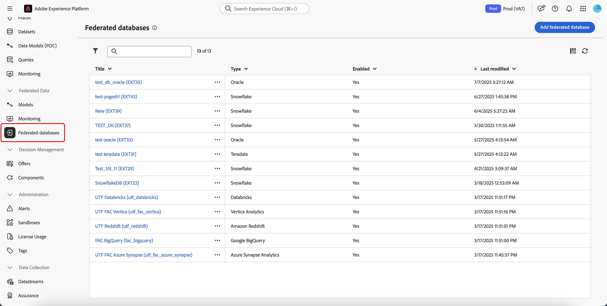
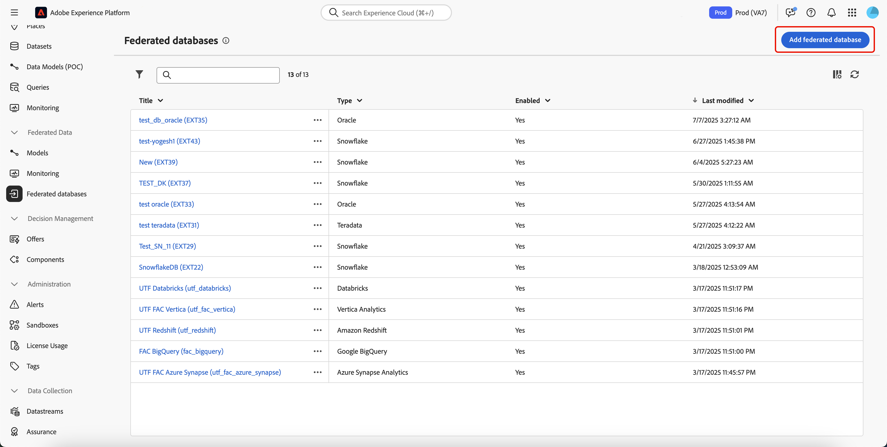

# Creación de conexiones {#connections-fdb}

>[!AVAILABILITY]
>
>Para acceder a las conexiones, necesita uno de los siguientes permisos:
>
>-**Administrar base de datos federada**
>>-**Ver base de datos federada**
>
>Para obtener más información sobre los permisos necesarios, consulte la [guía de control de acceso](/help/governance-privacy-security/access-control.md).

La composición de audiencias federada de Experience Platform le permite crear y enriquecer audiencias de los almacenes de datos de terceros e importarlas a Adobe Experience Platform.

## Bases de datos compatibles {#supported-databases}

Para trabajar con la base de datos federada y Adobe Experience Platform, primero debe establecer una conexión entre los dos orígenes. Con Federated Audience Composition, puede conectarse a las siguientes bases de datos.

* Amazon Redshift
* Azure Synapse Analytics
* Databricks
* Google BigQuery
* Microsoft Fabric
* Oracle
* Snowflake
* Vertica Analytics

## Crear conexión {#create}

Para crear una conexión, seleccione **[!UICONTROL Bases de datos federadas]** en la sección Datos federados.

{zoomable="yes" width="70%" align="center"}

Aparecerá la sección Bases de datos federadas. Seleccione **[!UICONTROL Agregar base de datos federada]** para crear una conexión.

{zoomable="yes" width="70%" align="center"}

Aparecerá la ventana emergente de propiedades de conexión. Puede asignar un nombre a la conexión y seleccionar el tipo de base de datos que desea crear.

{zoomable="yes" width="70%" align="center"}

Después de seleccionar un tipo, aparece la sección **[!UICONTROL Detalles]**. Esta sección difiere según el tipo de base de datos elegido anteriormente.

>[!BEGINTABS]

>[!TAB Amazon Redshift]

>[!AVAILABILITY]
>
>Solo son compatibles Amazon Redshift AWS, Amazon Redshift Spectrum y Amazon Redshift Serverless.

Después de seleccionar Amazon Redshift, puede añadir los siguientes detalles:

| Campo | Descripción |
| ----- | ----------- |
| Servidor | Nombre de la fuente de datos. |
| Cuenta | El nombre de usuario de la cuenta. |
| Contraseña | Contraseña de la cuenta. |
| Base de datos | Nombre de la base de datos. Si se especifica en el nombre del servidor, este campo se puede dejar en blanco. |
| Esquema de trabajo | Nombre del esquema de la base de datos que se va a utilizar para las tablas de trabajo. Encontrará más información sobre esta característica en la [documentación de esquemas de Amazon](https://docs.aws.amazon.com/es_es/redshift/latest/dg/r_Schemas_and_tables.html){target="_blank"}.  **Nota:** Puede utilizar cualquier esquema de la base de datos, incluidos los esquemas utilizados para el procesamiento temporal de datos, siempre y cuando tenga los permisos necesarios para conectarse a este esquema. Sin embargo, **debe** utilizar distintos esquemas de trabajo al conectar varios entornos limitados con la misma base de datos. |

>[!TAB Azure Synapse Analytics]

>[!NOTE]
>
>Si desea crear una conexión segura con Azure Synapse Analytics, póngase en contacto con su representante del Servicio de atención al cliente de Adobe.

Después de seleccionar Azure Synapse Analytics, puede añadir los siguientes detalles:

| Campo | Descripción |
| ----- | ----------- |
| Servidor | La URL del servidor de Azure Synapse. |
| Cuenta | El nombre de usuario de la cuenta de Azure Synapse. |
| Contraseña | Contraseña de la cuenta de Azure Synapse. |
| Base de datos | Nombre de la base de datos. Si se especifica en el nombre del servidor, este campo se puede dejar en blanco. |
| Opciones | Opciones adicionales para la conexión. Para Azure Synapse Analytics, puede especificar el tipo de autenticación admitida por el conector. Actualmente, la Composición de audiencia federada admite `ActiveDirectoryMSI`. Para obtener más información sobre las cadenas de conexión, lea la sección [ejemplo de cadenas de conexión en la documentación de Microsoft](https://learn.microsoft.com/es-es/sql/connect/odbc/using-azure-active-directory?view=sql-server-ver15#example-connection-strings){target="_blank"} . |

>[!TAB Databricks]

>[!NOTE]
>
>Se admite el acceso seguro al almacén de datos externo de Databricks a través de un vínculo privado. Esto incluye conexiones seguras a bases de datos de Databricks alojadas en Amazon Web Services (AWS) a través de un vínculo privado y bases de datos de Databricks alojadas en Microsoft Azure a través de una VPN. Póngase en contacto con su representante de Adobe para obtener ayuda sobre cómo configurar un acceso seguro.

Después de seleccionar Databricks, puede agregar los siguientes detalles:

| Campo | Descripción |
| ----- | ----------- |
| Servidor | Nombre del servidor de Databricks. |
| Ruta HTTP | Ruta de acceso al clúster o al almacén. Para obtener más información sobre la ruta, lea la [documentación de Databricks sobre los detalles de conexión](https://docs.databricks.com/aws/en/integrations/compute-details){target="_blank"}. |
| Contraseña | El token de acceso para el servidor de Databricks. Para obtener más información sobre este valor, lea la [documentación de Databricks sobre tokens de acceso personal](https://docs.databricks.com/aws/en/dev-tools/auth/pat){target="_blank"}. |
| Catálogo | Nombre del catálogo de Databricks. Para obtener más información sobre los catálogos de Databricks, lea la [documentación de Databricks sobre los catálogos](https://docs.databricks.com/aws/en/catalogs/){target="_blank"} |
| Esquema de trabajo | Nombre del esquema de base de datos que se va a utilizar para las tablas de trabajo.   **Nota:** Puede usar **cualquier esquema** de la base de datos, incluidos los esquemas utilizados para el procesamiento temporal de datos, siempre y cuando tenga los permisos necesarios para conectarse a este esquema. Sin embargo, **debe** utilizar distintos esquemas de trabajo al conectar varios entornos limitados con la misma base de datos. |
| Opciones | Opciones adicionales para la conexión. Las opciones disponibles se enumeran en la tabla siguiente. |

Para los bloques de datos, puede establecer las siguientes opciones adicionales:

| Opciones | Descripción |
| ------- | ----------- |
| TimeZoneName | Nombre de la zona horaria que se va a utilizar. Este valor representa el parámetro de sesión `TIMEZONE`. Para obtener más información sobre las zonas horarias, lea la [Documentación de Databricks sobre las zonas horarias](https://docs.databricks.com/aws/en/sql/language-manual/parameters/timezone#:~:text=The%20system%20default%20is%20UTC%20.){target="_blank"}. |

>[!TAB Google BigQuery]

Después de seleccionar Google BigQuery, puede añadir los siguientes detalles:

| Campo | Descripción |
| ----- | ----------- |
| Cuenta de servicio | La dirección de correo electrónico de su cuenta de servicio. Para obtener más información, lea la [documentación de la cuenta de Google Cloud Service](https://cloud.google.com/iam/docs/service-accounts-create){target="_blank"}. |
| Proyecto | El ID del proyecto. Para obtener más información, lea la [documentación del proyecto de Google Cloud](https://cloud.google.com/resource-manager/docs/creating-managing-projects?hl=es-419){target="_blank"}. |
| Conjunto de datos | Nombre del conjunto de datos. Para obtener más información, lea la [documentación del conjunto de datos de Google Cloud](https://cloud.google.com/bigquery/docs/datasets-intro){target="_blank"}. |
| Ruta del archivo de claves | El archivo de clave al servidor. Solo se admiten `json` archivos. |
| Opciones | Opciones adicionales para la conexión. Las opciones disponibles se enumeran en la tabla siguiente. |

Para Google BigQuery, puede definir las siguientes opciones adicionales:

| Opciones | Descripción |
| ------- | ----------- |
| ProxyType | El tipo de proxy utilizado para conectarse a BigQuery. Los valores admitidos son `HTTP`, `http_no_tunnel`, `socks4` y `socks5`. |
| ProxyHost | El nombre de host o la dirección IP donde se puede contactar con el proxy. |
| ProxyUid | Número de puerto en el que se está ejecutando el proxy. |
| ProxyPwd | La contraseña del proxy. |
| bgpath | **Nota:** Esto solo se aplica a la **herramienta de carga masiva** (Cloud SDK).    Ruta de acceso al directorio bin de Cloud SDK en el servidor. Solo debe establecer esta propiedad si ha movido el directorio `google-cloud-sdk` a otra ubicación o si desea evitar utilizar la variable PATH. |
| GCloudConfigName | **Nota:** Esto solo es aplicable a la **herramienta de carga masiva** (Cloud SDK) anterior a la versión 7.3.4.    El nombre de la configuración que almacena los parámetros para cargar los datos. De manera predeterminada, este valor es `accfda`. |
| GCloudDefaultConfigName | **Nota:** Esto solo se aplica a la **herramienta de carga masiva** (Cloud SDK) anterior a la versión 7.3.4.    El nombre de la configuración temporal para volver a crear la configuración principal para cargar datos. De manera predeterminada, este valor es `default`. |
| GCloudRecreateConfig | **Nota:** Esto solo es aplicable a la **herramienta de carga masiva** (Cloud SDK) anterior a la versión 7.3.4.    Un valor booleano que le permite decidir si el mecanismo de carga masiva debe recrear, eliminar o modificar automáticamente las configuraciones de Google Cloud SDK. Si este valor se establece en `false`, el mecanismo de carga masiva carga datos mediante una configuración existente en el equipo. Si este valor se establece en `true`, asegúrese de que la configuración esté configurada correctamente; de lo contrario, aparecerá el error `No active configuration found. Please either create it manually or remove the GCloudRecreateConfig option` y el mecanismo de carga volverá al mecanismo de carga predeterminado. |

>[!TAB Estructura de Microsoft]

Después de seleccionar Microsoft Fabric, puede añadir los siguientes detalles:

| Campo | Descripción |
| ----- | ----------- |
| Servidor | URL del servidor de Microsoft Fabric. |
| ID de aplicación | El ID de aplicación de Microsoft Fabric. Para obtener más información acerca del id. de aplicación, lea la [documentación de Microsoft Fabric sobre la configuración de la aplicación](https://learn.microsoft.com/en-us/fabric/workload-development-kit/create-entra-id-app){target="_blank"}. |
| Secreto del cliente | Secreto de cliente para la aplicación. Para obtener más información sobre el secreto del cliente, lea la [documentación de Microsoft Fabric sobre la configuración de la aplicación](https://learn.microsoft.com/en-us/fabric/workload-development-kit/create-entra-id-app#step-8-generate-a-secret-for-your-application){target="_blank"}. |
| Opciones | Opciones adicionales para la conexión. Las opciones disponibles se enumeran en la tabla siguiente. |

Para Microsoft Fabric, puede establecer las siguientes opciones adicionales:

| Opción | Descripción |
| ------ | ----------- |
| Autenticación | El tipo de autenticación utilizada por el conector. Los valores admitidos son: `ActiveDirectoryMSI`. Para obtener más información, lea la [documentación de Microsoft sobre la conectividad del almacén](https://learn.microsoft.com/en-us/fabric/data-warehouse/connectivity){target="_blank"}. |

>[!TAB Oracle]

>[!IMPORTANT]
>
>Federated Audience Composition admite la configuración de conexiones federadas con bases de datos de Oracle en la versión 11g o superior y alojadas en AWS, Azure, Exadata o una nube privada (siempre que sea accesible desde una red externa). Si tiene cualquier otra pregunta relacionada con la configuración de la base de datos de Oracle o necesita crear una conexión segura con Oracle, póngase en contacto con su representante del Servicio de atención al cliente de Adobe.

Después de seleccionar Oracle, puede añadir los siguientes detalles:

| Campo | Descripción |
| ----- | ----------- |
| Servidor | La URL del servidor de Oracle. |
| Cuenta | El nombre de usuario de la cuenta. |
| Contraseña | La contraseña de la cuenta. |

>[!TAB Snowflake]

>[!NOTE]
>
>Se admite el acceso seguro al almacén de datos externo de Snowflake a través de un vínculo privado. Tenga presente que la cuenta de Snowflake debe estar alojada en Amazon Web Services (AWS) y ubicada en la misma región que el entorno de composición de público federado. Póngase en contacto con su representante de Adobe para obtener ayuda sobre la configuración del acceso seguro a su cuenta de Snowflake.

Después de seleccionar Snowflake, puede añadir los siguientes detalles:

| Campo | Descripción |
| ----- | ----------- |
| Servidor | El nombre del servidor. |
| Usuario | El nombre de usuario de la cuenta. |
| Contraseña | Contraseña de la cuenta. |
| Base de datos | Nombre de la base de datos. Si se especifica en el nombre del servidor, este campo se puede dejar en blanco. |
| Esquema de trabajo | Nombre del esquema de base de datos que se va a utilizar para las tablas de trabajo.   **Nota:** Puede usar **cualquier esquema** de la base de datos, incluidos los esquemas utilizados para el procesamiento temporal de datos, siempre y cuando tenga los permisos necesarios para conectarse a este esquema. Sin embargo, **debe** utilizar distintos esquemas de trabajo al conectar varios entornos limitados con la misma base de datos. |
| Clave privada | La clave privada de la conexión a base de datos. Puede cargar un archivo de `.pem` desde el sistema local. |
| Opciones | Opciones adicionales para la conexión. Las opciones disponibles se enumeran en la tabla siguiente. |

Para Snowflake, puede establecer las siguientes opciones adicionales:

| Opciones | Descripción |
| ------- | ----------- |
| esquema de trabajo | Nombre del esquema de base de datos que se va a utilizar para las tablas de trabajo. |
| TimeZoneName | Nombre de la zona horaria que se va a utilizar. Este valor representa el parámetro de sesión `TIMEZONE`. De forma predeterminada, se utilizará la zona horaria del sistema. Para obtener más información sobre las zonas horarias, lea la [documentación de Snowflake sobre las zonas horarias](https://docs.snowflake.com/en/sql-reference/parameters#timezone){target="_blank"}. |
| WeekStart | El día en el que desea que comience la semana. Este valor representa el parámetro de sesión `WEEK_START`. Para obtener más información sobre el inicio de semana, lea la [documentación de Snowflake sobre el parámetro de inicio de semana](https://docs.snowflake.com/en/sql-reference/parameters#week-start){target="_blank"} |
| UseCachedResult | Un booleano que determina si se utilizarán los resultados en caché de Snowflake. Este valor representa el parámetro de sesión `USE_CACHED_RESULTS`. De forma predeterminada, este valor se establece en true. Para obtener más información sobre este parámetro, lea [Documentación de Snowflake sobre los resultados que persisten](https://docs.snowflake.com/en/user-guide/querying-persisted-results){target="_blank"}. |
| bulkThreads | Número de subprocesos que se van a utilizar para el cargador en bloque de Snowflake. Cuantos más hilos se agreguen, mejor será el rendimiento para cargas masivas más grandes. De forma predeterminada, este valor se establece en 1. |
| chunkSize | El tamaño de archivo del fragmento de cada cargador en bloque. Cuando se utiliza de forma simultánea con más subprocesos, puede mejorar el rendimiento de las cargas masivas. De forma predeterminada, este valor se establece en 128 MB. Para obtener más información sobre los tamaños de fragmento, lea la [documentación de Snowflake sobre la preparación de archivos de datos](https://docs.snowflake.com/en/user-guide/data-load-considerations-prepare){target="_blank"}. |
| StageName | Nombre de un entorno de ensayo interno aprovisionado previamente. Esto se puede utilizar en cargas masivas en lugar de crear una nueva fase temporal. |

>[!TAB Vertica Analytics]

Después de seleccionar Vertica Analytics, puede añadir los siguientes detalles:

| Campo | Descripción |
| ----- | ----------- |
| Servidor | La URL del servidor de Vertica Analytics. |
| Cuenta | El nombre de usuario de la cuenta. |
| Contraseña | La contraseña de la cuenta. |
| Base de datos | Nombre de la base de datos. Si se especifica en el nombre del servidor, este campo se puede dejar en blanco. |
| Esquema de trabajo | Nombre del esquema de base de datos que se va a utilizar para las tablas de trabajo.   **Nota:** Puede usar **cualquier esquema** de la base de datos, incluidos los esquemas utilizados para el procesamiento temporal de datos, siempre y cuando tenga los permisos necesarios para conectarse a este esquema. Sin embargo, **debe** utilizar distintos esquemas de trabajo al conectar varios entornos limitados con la misma base de datos. |
| Opciones | Opciones adicionales para la conexión. Las opciones disponibles se enumeran en la tabla siguiente. |

Para Vertica Analytics, puede establecer las siguientes opciones adicionales:

| Opciones | Descripción |
| ------- | ----------- |
| TimeZoneName | Nombre de la zona horaria que se va a utilizar. Este valor representa el parámetro de sesión `TIMEZONE`. Para obtener más información sobre las zonas horarias, lea la [documentación de Vertica Analytics sobre las zonas horarias](https://docs.vertica.com/24.1.x/en/admin/configuring-db/config-procedure/using-time-zones-with/){target="_blank"} |

>[!ENDTABS]

Después de agregar los detalles de la conexión, tenga en cuenta la siguiente configuración adicional:

>[!NOTE]
>
>Para usar la Composición de audiencias federada en una base de datos determinada, debe realizar la lista de permitidos de **todas** las direcciones IP asociadas con esa base de datos.

| Configuración | Detalles |
| -------- | ------- |
| Habilitar conexión | Alternancia booleana que determina si la conexión se habilitará automáticamente. |
| IP del servidor | Una ventana emergente que muestra qué direcciones IP deben estar incluidas en la lista de permitidos para conectarse a la base de datos. |
| Probar conexión | Le permite comprobar los detalles de configuración. |

Ahora puede seleccionar **[!UICONTROL Implementar funciones]**, seguido de **[!UICONTROL Agregar]** para finalizar la conexión entre la base de datos federada y Experience Platform.
