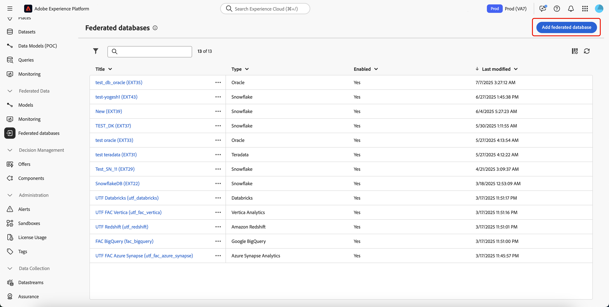
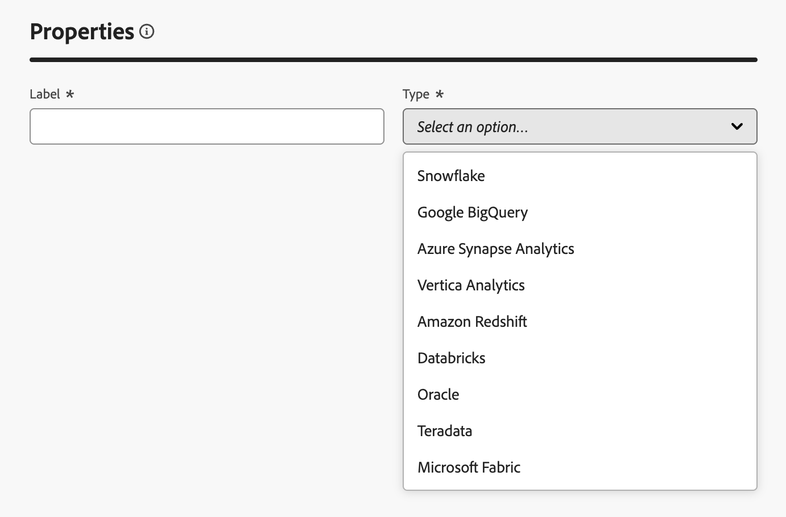

# Creación de conexiones {#connections-fdb}

>[!AVAILABILITY]
>
>Para acceder a las conexiones, necesita uno de los siguientes permisos:
>
>-**Administrar base de datos federada**
>-**Ver base de datos federada**
>
>Para obtener más información sobre los permisos necesarios, consulte la [guía de control de acceso](/help/governance-privacy-security/access-control.md).

La composición de audiencias federada de Experience Platform le permite crear y enriquecer audiencias de los almacenes de datos de terceros e importarlas a Adobe Experience Platform.

## Bases de datos compatibles {#supported-databases}

Para trabajar con la base de datos federada y Adobe Experience Platform, primero debe establecer una conexión entre los dos orígenes. Con Federated Audience Composition, puede conectarse a las siguientes bases de datos.

- Amazon Redshift
- Azure Synapse Analytics
- Databricks
- Google BigQuery
- Microsoft Fabric
- Oracle
- Snowflake
- Teradata
- Vertica Analytics

## Crear conexión {#create}

Para crear una conexión, seleccione **[!UICONTROL Bases de datos federadas]** en la sección Datos federados.

{zoomable="yes" width="70%" align="center"}

Aparecerá la sección Bases de datos federadas. Seleccione **[!UICONTROL Agregar base de datos federada]** para crear una conexión.

{zoomable="yes" width="70%" align="center"}

>[!NOTE]
>
>Para solicitar conectividad segura mediante un vínculo privado o VPN, **debe** tener licencia para Privacy and Security Shield o Healthcare Shield.

Aparecerá la ventana emergente de propiedades de conexión. Puede asignar un nombre a la conexión y seleccionar el tipo de base de datos que desea crear.

{zoomable="yes" width="70%" align="center"}

Después de seleccionar un tipo, aparece la sección **[!UICONTROL Detalles]**. Esta sección difiere según el tipo de base de datos elegido anteriormente.

>[!BEGINTABS]

>[!TAB Amazon Redshift]

>[!AVAILABILITY]
>
>Solo son compatibles Amazon Redshift AWS, Amazon Redshift Spectrum y Amazon Redshift Serverless.
>
>Además, se admite el acceso seguro a su Amazon Redshift Data Warehouse externo a través de un vínculo privado.

Después de seleccionar Amazon Redshift, puede añadir los siguientes detalles:

| Campo | Descripción |
| ----- | ----------- |
| Servidor | Nombre de la fuente de datos. |
| Cuenta | El nombre de usuario de la cuenta. |
| Contraseña | Contraseña de la cuenta. |
| Base de datos | Nombre de la base de datos. Si se especifica en el nombre del servidor, este campo se puede dejar en blanco. |
| Esquema de trabajo | Nombre del esquema de la base de datos que se va a utilizar para las tablas de trabajo. Encontrará más información sobre esta característica en la [documentación de esquemas de Amazon](https://docs.aws.amazon.com/es_es/redshift/latest/dg/r_Schemas_and_tables.html){target="_blank"}.  **Nota:** Puede utilizar cualquier esquema de la base de datos, incluidos los esquemas utilizados para el procesamiento temporal de datos, siempre y cuando tenga los permisos necesarios para conectarse a este esquema. Sin embargo, **debe** utilizar distintos esquemas de trabajo al conectar varios entornos limitados con la misma base de datos. |

>[!TAB Azure Synapse Analytics]

>[!NOTE]
>
>Si desea crear una conexión segura con Azure Synapse Analytics, póngase en contacto con su representante del Servicio de atención al cliente de Adobe.

Después de seleccionar Azure Synapse Analytics, puede añadir los siguientes detalles:

| Campo | Descripción |
| ----- | ----------- |
| Servidor | La URL del servidor de Azure Synapse. |
| Cuenta | El id. de aplicación (**id. de cliente**) del registro de aplicación de Azure. |
| Contraseña | El valor **Secreto de cliente** de la aplicación Azure. |
| Base de datos | Nombre de la base de datos. Si se especifica en el nombre del servidor, este campo se puede dejar en blanco. |
| Opciones | Opciones adicionales para la conexión. Para Azure Synapse Analytics, puede especificar el tipo de autenticación admitida por el conector. Actualmente, la Composición de audiencia federada admite `ActiveDirectoryMSI`. Para obtener más información sobre las cadenas de conexión, lea la sección [ejemplo de cadenas de conexión en la documentación de Microsoft](https://learn.microsoft.com/es-es/sql/connect/odbc/using-azure-active-directory?view=sql-server-ver15#example-connection-strings){target="_blank"} . |

También puede configurar de forma segura su conexión de Azure Synapse Analytics mediante la autenticación de entidad de seguridad de servicio. Debe utilizar la autenticación de entidad de seguridad de servicio para integraciones de nivel de producción, así como escenarios de automatización.

+++ Requisitos previos

Antes de configurar la autenticación de entidad de seguridad de servicio, tenga en cuenta los siguientes requisitos previos:

- Una suscripción de Azure con acceso a Microsoft Entra ID
- Un espacio de trabajo y base de datos de Azure Synapse
- Permiso para crear el registro de aplicación
- Permiso para administrar los roles de base de datos de Azure Synapse
- Permiso para actualizar configuraciones de base de datos federada

+++

En el portal de Azure, primero debe crear un nuevo registro de aplicación. Seleccione **Registrar** después de asignar un nombre único a la aplicación. Aparecerá la página **Información general**. Asegúrese de anotar los valores de **ID de aplicación (cliente)** y **ID de directorio (inquilino)**.

En la aplicación recién registrada, seleccione **Certificados y secretos**. Aquí, seleccione **Nuevo secreto de cliente** dentro de la sección **Secretos de cliente** para crear un nuevo secreto de cliente. Después de proporcionar una descripción y una caducidad, seleccione **Add** para generar el secreto de cliente.

>[!IMPORTANT]
>
>Después de generar el secreto de cliente, copia y almacena de forma segura tu **valor secreto de cliente**. Este valor **no** volverá a ser visible.

Ahora que ha generado el secreto de cliente, debe asegurarse de haber concedido la identidad de **entidad de seguridad del servicio** al recurso.

Para obtener más información sobre la asignación de identidades a los recursos, lea la [Guía de identidades administradas para Azure Synapse Analytics](https://learn.microsoft.com/en-us/azure/synapse-analytics/synapse-service-identity).

Dado que ha finalizado todas las configuraciones del lado de Azure, ahora puede establecer las configuraciones del lado de Federated-Audience-Composition.

En la conexión de Azure Synapse, defina los siguientes detalles de configuración:

| Campo | Descripción |
| ----- | ----------- |
| Servidor | La URL del servidor de Azure Synapse. |
| Cuenta | El id. de aplicación (**id. de cliente**) del registro de aplicación de Azure. |
| Contraseña | El valor **Secreto de cliente** de la aplicación Azure. |
| Base de datos | Nombre de la base de datos. Si se especifica en el nombre del servidor, este campo se puede dejar en blanco. |
| Opciones | Opciones adicionales para la conexión. Para usar la autenticación de entidad de seguridad de servicio, deberá establecer `Authentication="ActiveDirectoryServicePrincipal"`. |

>[!TAB Databricks]

>[!NOTE]
>
>Se admite el acceso seguro al almacén de datos externo de Databricks a través de un vínculo privado. Esto incluye conexiones seguras a bases de datos de Databricks alojadas en Amazon Web Services (AWS) a través de un vínculo privado y bases de datos de Databricks alojadas en Microsoft Azure a través de una VPN. Póngase en contacto con su representante de Adobe para obtener ayuda sobre cómo configurar un acceso seguro.

Después de seleccionar Databricks, puede elegir el método de autenticación que desee utilizar al conectarse con Federated Audience Composition.

Si selecciona **Autenticación de cuenta/contraseña**, puede agregar los siguientes detalles de inicio de sesión:

| Campo | Descripción |
| ----- | ----------- |
| Servidor | Nombre del servidor de Databricks. |
| Contraseña | El token de acceso para el servidor de Databricks. Para obtener más información sobre este valor, lea la [documentación de Databricks sobre tokens de acceso personal](https://docs.databricks.com/aws/en/dev-tools/auth/pat){target="_blank"}. |

Si selecciona **Autenticación de entidad de seguridad de servicio**, puede agregar los siguientes detalles:

| Campo | Descripción |
| ----- | ----------- |
| Servidor | Nombre del servidor de Databricks. |
| ID de cliente | El ID de cliente del servidor de Databricks. Este campo actúa como un nombre de usuario para el proyecto. |
| Secreto del cliente | El secreto de cliente del servidor Databricks. Este campo actúa como una contraseña para el proyecto. |

Si selecciona **OAuth 2.0**, puede agregar los siguientes detalles:

| Campo | Descripción |
| ----- | ----------- |
| Servidor | Nombre del servidor de Databricks. |
| ID de cliente | El ID de cliente del servidor de Databricks. Este campo se utiliza para identificar la aplicación durante la autenticación OAuth 2.0 y actúa como un nombre de usuario para el proyecto. |
| Secreto del cliente | El secreto de cliente del servidor Databricks. Esta credencial confidencial se emite con el ID de cliente y actúa como una contraseña para el proyecto. |
| Ámbito del acceso | Información previamente rellenada que enumera los ámbitos para los que está autorizado el token de OAuth en el servidor de Databricks. |

Después de introducir los detalles de inicio de sesión, puede añadir la siguiente información:

| Campo | Descripción |
| ----- | ----------- |
| Ruta HTTP | Ruta de acceso al clúster o al almacén. Para obtener más información sobre la ruta, lea la [documentación de Databricks sobre los detalles de conexión](https://docs.databricks.com/aws/en/integrations/compute-details){target="_blank"}. |
| Catálogo | Nombre del catálogo de Databricks. Para obtener más información sobre los catálogos de Databricks, lea la [documentación de Databricks sobre los catálogos](https://docs.databricks.com/aws/en/catalogs/){target="_blank"} |
| Esquema de trabajo | Nombre del esquema de base de datos que se va a utilizar para las tablas de trabajo.   **Nota:** Puede usar **cualquier esquema** de la base de datos, incluidos los esquemas utilizados para el procesamiento temporal de datos, siempre y cuando tenga los permisos necesarios para conectarse a este esquema. Sin embargo, **debe** utilizar distintos esquemas de trabajo al conectar varios entornos limitados con la misma base de datos. |
| Opciones | Opciones adicionales para la conexión. Las opciones disponibles se enumeran en la tabla siguiente. |

Para los bloques de datos, puede establecer las siguientes opciones adicionales:

| Opciones | Descripción |
| ------- | ----------- |
| TimeZoneName | Nombre de la zona horaria que se va a utilizar. Este valor representa el parámetro de sesión `TIMEZONE`. Para obtener más información sobre las zonas horarias, lea la [Documentación de Databricks sobre las zonas horarias](https://docs.databricks.com/aws/en/sql/language-manual/parameters/timezone#:~:text=The%20system%20default%20is%20UTC%20.){target="_blank"}. |

>[!TAB Google BigQuery]

>[!NOTE]
>
>Se admite el acceso seguro a su almacén de datos externo de Google BigQuery a través de VPN.

Después de seleccionar Google BigQuery, puede elegir qué método de autenticación desea utilizar al conectarse con Federated Audience Composition.

Si selecciona **[!UICONTROL Autenticación de cuenta/contraseña]**, puede agregar la siguiente información de inicio de sesión:

| Campo | Descripción |
| ----- | ----------- |
| Cuenta de servicio | La dirección de correo electrónico de su cuenta de servicio. Para obtener más información, lea la [documentación de la cuenta de Google Cloud Service](https://cloud.google.com/iam/docs/service-accounts-create){target="_blank"}. |

Si selecciona **[!UICONTROL OAuth 2.0]**, puede agregar la siguiente información de inicio de sesión:

>[!NOTE]
>
>Antes de conectarse a Google BigQuery mediante OAuth 2.0, deberá configurar la dirección URL de redireccionamiento en el proyecto de Google Cloud. Agregue la URL de redireccionamiento `https://fac-oauth.adobe.io/oauth` a su proyecto de Google Cloud en la configuración de ID de cliente de OAuth 2.0.

| Campo | Descripción |
| ----- | ----------- |
| ID de cliente | El ID de cliente del proyecto de Google BigQuery. Este campo actúa como un nombre de usuario para el proyecto. |
| Secreto del cliente | El secreto de cliente del proyecto de Google BigQuery. Este campo actúa como una contraseña para el proyecto. |
| Ámbito del acceso | Información previamente rellenada que enumera los ámbitos para los que está autorizado el token de OAuth dentro de los recursos de Google Cloud. |

Seleccione **[!UICONTROL Iniciar sesión]** para finalizar su autenticación.

Si selecciona **[!UICONTROL WIF]**, **no** necesita proporcionar información de inicio de sesión. Sin embargo, **debe** agregar la configuración de la biblioteca de cliente como la **[!UICONTROL ruta del archivo de clave]**. Para obtener más información sobre la configuración de la biblioteca de cliente, lea la [sección de configuración de Google BigQuery (Workload Identity Federation)](#wif-configuration).

Después de introducir los detalles de inicio de sesión, puede añadir los siguientes detalles:

| Campo | Descripción |
| ----- | ----------- |
| Proyecto | El ID del proyecto. Para obtener más información, lea la [documentación del proyecto de Google Cloud](https://cloud.google.com/resource-manager/docs/creating-managing-projects?hl=es-419){target="_blank"}. |
| Conjunto de datos | Nombre del conjunto de datos. Para obtener más información, lea la [documentación del conjunto de datos de Google Cloud](https://cloud.google.com/bigquery/docs/datasets-intro){target="_blank"}. |
| Ubicación del Google Bucket | La ubicación de su Google Bucket. Solo es necesario que agregue este campo si está utilizando la actividad **Cambiar dimensión** en su composición. Para obtener más información, lea la [documentación de ubicaciones de compartimentos de Google Cloud](https://docs.cloud.google.com/storage/docs/locations){target="_blank"}. |
| Ruta del archivo de claves | El archivo de clave al servidor. Solo se admiten `json` archivos. |
| Opciones | Opciones adicionales para la conexión. Las opciones disponibles se enumeran en la tabla siguiente. |

Para Google BigQuery, puede definir las siguientes opciones adicionales:

| Opciones | Descripción |
| ------- | ----------- |
| ProxyType | El tipo de proxy utilizado para conectarse a BigQuery. Los valores admitidos son `HTTP`, `http_no_tunnel`, `socks4` y `socks5`. |
| ProxyHost | El nombre de host o la dirección IP donde se puede contactar con el proxy. |
| ProxyUid | Número de puerto en el que se está ejecutando el proxy. |
| ProxyPwd | La contraseña del proxy. |
| bgpath | **Nota:** Esto solo es aplicable a la **herramienta de carga masiva** (Cloud SDK).    La ruta al directorio bin de Cloud SDK en el servidor. Solo debe establecer esta propiedad si ha movido el directorio `google-cloud-sdk` a otra ubicación o si desea evitar utilizar la variable PATH. |
| GCloudConfigName | **Nota:** Esto solo es aplicable a la **herramienta de carga masiva** (Cloud SDK) anterior a la versión 7.3.4.    Nombre de la configuración que almacena los parámetros para cargar los datos. De manera predeterminada, este valor es `accfda`. |
| GCloudDefaultConfigName | **Nota:** Esto solo es aplicable a la **herramienta de carga masiva** (Cloud SDK) anterior a la versión 7.3.4.    Nombre de la configuración temporal para volver a crear la configuración principal y cargar los datos. De manera predeterminada, este valor es `default`. |
| GCloudRecreateConfig | **Nota:** Esto solo es aplicable a la **herramienta de carga masiva** (Cloud SDK) anterior a la versión 7.3.4.    Un valor booleano que le permite decidir si el mecanismo de carga masiva debe recrear, eliminar o modificar automáticamente las configuraciones de Google Cloud SDK. Si este valor se establece en `false`, el mecanismo de carga masiva carga datos mediante una configuración existente en el equipo. Si este valor se establece en `true`, asegúrese de que la configuración esté configurada correctamente; de lo contrario, aparecerá el error `No active configuration found. Please either create it manually or remove the GCloudRecreateConfig option` y el mecanismo de carga volverá al mecanismo de carga predeterminado. |
| **restEndpoint** | El punto final del proxy de Apigee. Solo debe utilizarlo si utiliza el conector REST-API con el proxy de Apigee. Si está usando el proxy de Apigee, habilite la opción **Usar conector de API REST**. Para obtener más información sobre la configuración, lea la [sección de soporte técnico de Google BigQuery Apigee Gateway](#apigee). |

>[!TAB Estructura de Microsoft]

Después de seleccionar Microsoft Fabric, puede añadir los siguientes detalles:

| Campo | Descripción |
| ----- | ----------- |
| Servidor | URL del servidor de Microsoft Fabric. |
| ID de aplicación | El ID de aplicación de Microsoft Fabric. Para obtener más información acerca del id. de aplicación, lea la [documentación de Microsoft Fabric sobre la configuración de la aplicación](https://learn.microsoft.com/en-us/fabric/workload-development-kit/create-entra-id-app){target="_blank"}. |
| Secreto del cliente | Secreto de cliente para la aplicación. Para obtener más información sobre el secreto del cliente, lea la [documentación de Microsoft Fabric sobre la configuración de la aplicación](https://learn.microsoft.com/en-us/fabric/workload-development-kit/create-entra-id-app#step-8-generate-a-secret-for-your-application){target="_blank"}. |
| Opciones | Opciones adicionales para la conexión. Las opciones disponibles se enumeran en la tabla siguiente. |

Para Microsoft Fabric, puede establecer las siguientes opciones adicionales:

| Opción | Descripción |
| ------ | ----------- |
| Autenticación | El tipo de autenticación utilizada por el conector. Los valores admitidos son: `ActiveDirectoryMSI`. Para obtener más información, lea la [documentación de Microsoft sobre la conectividad del almacén](https://learn.microsoft.com/en-us/fabric/data-warehouse/connectivity){target="_blank"}. |

>[!TAB Oracle]

>[!NOTE]
>
>Federated Audience Composition admite la configuración de conexiones federadas con bases de datos de Oracle en la versión 11g o superior y alojadas en AWS, Azure, Exadata o una nube privada (siempre que sea accesible desde una red externa). Si tiene cualquier otra pregunta relacionada con la configuración de la base de datos de Oracle o necesita crear una conexión segura con Oracle, póngase en contacto con su representante del Servicio de atención al cliente de Adobe.

Después de seleccionar Oracle, puede añadir los siguientes detalles:

| Campo | Descripción |
| ----- | ----------- |
| Servidor | La URL del servidor de Oracle. |
| Cuenta | El nombre de usuario de la cuenta. |
| Contraseña | La contraseña de la cuenta. |

>[!TAB Snowflake]

>[!NOTE]
>
>Se admite el acceso seguro al almacén de datos externo de Snowflake a través de un vínculo privado. Tenga presente que la cuenta de Snowflake debe estar alojada en Amazon Web Services (AWS) y ubicada en la misma región que el entorno de composición de público federado. Póngase en contacto con su representante de Adobe para obtener ayuda sobre la configuración del acceso seguro a su cuenta de Snowflake.

Después de seleccionar Snowflake, puede elegir qué método de autenticación desea utilizar al conectarse con Federated Audience Composition.

Si selecciona **[!UICONTROL Autenticación de cuenta/contraseña]**, puede agregar la siguiente información de inicio de sesión:

| Campo | Descripción |
| ----- | ----------- |
| Servidor | El nombre del servidor. |
| Usuario | El nombre de usuario de la cuenta. |
| Contraseña | Contraseña de la cuenta. |

También puede proporcionar una clave privada en lugar de proporcionar una contraseña. Si agrega una clave privada, debe proporcionar la siguiente información:

| Campo | Descripción |
| ----- | ----------- |
| Servidor | El nombre del servidor. |
| Usuario | El nombre de usuario de la cuenta. |
| Clave privada | La clave privada de la cuenta. Solo se admiten `.pem` archivos. |
| Contraseña | (Opcional) Contraseña de la cuenta. |

Si selecciona **[!UICONTROL OAuth 2.0]**, puede agregar la siguiente información de inicio de sesión:

>[!NOTE]
>
>Antes de conectarse a Snowflake mediante OAuth 2.0, debe configurar la dirección URL de redireccionamiento en el objeto de integración OAuth de Snowflake. Agregue la URL de redireccionamiento `https://fac-oauth.adobe.io/oauth` a la configuración de la integración de Snowflake OAuth.

| Campo | Descripción |
| ----- | ----------- |
| Servidor | El nombre del servidor. |
| ID de cliente | El ID del cliente del proyecto de Snowflake. Este campo actúa como un nombre de usuario para el proyecto. |
| Secreto del cliente | Secreto de cliente del proyecto de Snowflake. Este campo actúa como una contraseña para el proyecto. |

Seleccione **[!UICONTROL Iniciar sesión]** para finalizar su autenticación.

Después de introducir los detalles de inicio de sesión, puede añadir los siguientes detalles:

| Campo | Descripción |
| ----- | ----------- |
| Base de datos | Nombre de la base de datos. Si se especifica en el nombre del servidor, este campo se puede dejar en blanco. |
| Esquema de trabajo | Nombre del esquema de base de datos que se va a utilizar para las tablas de trabajo.   **Nota:** Puede usar **cualquier esquema** de la base de datos, incluidos los esquemas utilizados para el procesamiento temporal de datos, siempre y cuando tenga los permisos necesarios para conectarse a este esquema. Sin embargo, **debe** utilizar distintos esquemas de trabajo al conectar varios entornos limitados con la misma base de datos. |
| Clave privada | La clave privada de la conexión a base de datos. Puede cargar un archivo de `.pem` desde el sistema local. |
| Opciones | Opciones adicionales para la conexión. Las opciones disponibles se enumeran en la tabla siguiente. |

Para Snowflake, puede establecer las siguientes opciones adicionales:

| Opciones | Descripción |
| ------- | ----------- |
| esquema de trabajo | Nombre del esquema de base de datos que se va a utilizar para las tablas de trabajo. |
| TimeZoneName | Nombre de la zona horaria que se va a utilizar. Este valor representa el parámetro de sesión `TIMEZONE`. De forma predeterminada, se utilizará la zona horaria del sistema. Para obtener más información sobre las zonas horarias, lea la [documentación de Snowflake sobre las zonas horarias](https://docs.snowflake.com/en/sql-reference/parameters#timezone){target="_blank"}. |
| WeekStart | El día en el que desea que comience la semana. Este valor representa el parámetro de sesión `WEEK_START`. Para obtener más información sobre el inicio de semana, lea la [documentación de Snowflake sobre el parámetro de inicio de semana](https://docs.snowflake.com/en/sql-reference/parameters#week-start){target="_blank"} |
| UseCachedResult | Un booleano que determina si se utilizarán los resultados en caché de Snowflake. Este valor representa el parámetro de sesión `USE_CACHED_RESULTS`. De forma predeterminada, este valor se establece en true. Para obtener más información sobre este parámetro, lea [Documentación de Snowflake sobre los resultados que persisten](https://docs.snowflake.com/en/user-guide/querying-persisted-results){target="_blank"}. |
| bulkThreads | Número de subprocesos que se van a utilizar para el cargador en bloque de Snowflake. Cuantos más hilos se agreguen, mejor será el rendimiento para cargas masivas más grandes. De forma predeterminada, este valor se establece en 1. |
| chunkSize | El tamaño de archivo del fragmento de cada cargador en bloque. Cuando se utiliza de forma simultánea con más subprocesos, puede mejorar el rendimiento de las cargas masivas. De forma predeterminada, este valor se establece en 128 MB. Para obtener más información sobre los tamaños de fragmento, lea la [documentación de Snowflake sobre la preparación de archivos de datos](https://docs.snowflake.com/en/user-guide/data-load-considerations-prepare){target="_blank"}. |
| StageName | Nombre de un entorno de ensayo interno aprovisionado previamente. Esto se puede utilizar en cargas masivas en lugar de crear una nueva fase temporal. |

>[!TAB Teradata]

>[!NOTE]
>
>Para conectarse con Teradata, **debe** completar varios requisitos previos, incluida la instalación de controladores de base de datos. Póngase en contacto con el representante del Servicio de atención al cliente de Adobe para obtener más información.

Después de seleccionar Teradata, puede añadir los siguientes detalles:

| Campo | Descripción |
| ----- | ----------- |
| Servidor | La URL del servidor de Teradata. |
| Cuenta | El nombre de usuario que utiliza la base de datos para la sesión de Conectividad abierta de bases de datos (ODBC). |
| Contraseña | Contraseña que se utiliza para conectarse a la sesión ODBC. |
| Base de datos | Nombre de la base de datos. |
| Opciones | Opciones adicionales para la conexión. Para Teradata, ambas opciones enumeradas son **obligatorias** para agregar. Las opciones disponibles se enumeran en la tabla siguiente. |

Para Teradata, puede establecer las siguientes opciones adicionales:

| Opciones | Descripción |
| ------- | ----------- |
| `workTableSchema` | Nombre del esquema para las tablas de trabajo. |
| `ODBCLib` | La ubicación de la biblioteca ODBC del sistema, que puede utilizar si combina Teradata con otra ODBC. |

>[!TAB Vertica Analytics]

Después de seleccionar Vertica Analytics, puede añadir los siguientes detalles:

| Campo | Descripción |
| ----- | ----------- |
| Servidor | La URL del servidor de Vertica Analytics. |
| Cuenta | El nombre de usuario de la cuenta. |
| Contraseña | La contraseña de la cuenta. |
| Base de datos | Nombre de la base de datos. Si se especifica en el nombre del servidor, este campo se puede dejar en blanco. |
| Esquema de trabajo | Nombre del esquema de base de datos que se va a utilizar para las tablas de trabajo.   **Nota:** Puede usar **cualquier esquema** de la base de datos, incluidos los esquemas utilizados para el procesamiento temporal de datos, siempre y cuando tenga los permisos necesarios para conectarse a este esquema. Sin embargo, **debe** utilizar distintos esquemas de trabajo al conectar varios entornos limitados con la misma base de datos. |
| Opciones | Opciones adicionales para la conexión. Las opciones disponibles se enumeran en la tabla siguiente. |

Para Vertica Analytics, puede establecer las siguientes opciones adicionales:

| Opciones | Descripción |
| ------- | ----------- |
| TimeZoneName | Nombre de la zona horaria que se va a utilizar. Este valor representa el parámetro de sesión `TIMEZONE`. Para obtener más información sobre las zonas horarias, lea la [documentación de Vertica Analytics sobre las zonas horarias](https://docs.vertica.com/24.1.x/en/admin/configuring-db/config-procedure/using-time-zones-with/){target="_blank"} |

>[!ENDTABS]

Después de agregar los detalles de la conexión, tenga en cuenta la siguiente configuración adicional:

>[!NOTE]
>
>Para usar la Composición de audiencias federada en una base de datos determinada, debe realizar la lista de permitidos de **todas** las direcciones IP asociadas con esa base de datos.

| Configuración | Detalles |
| -------- | ------- |
| Habilitar conexión | Alternancia booleana que determina si la conexión se habilitará automáticamente. |
| IP del servidor | Una ventana emergente que muestra qué direcciones IP deben estar incluidas en la lista de permitidos para conectarse a la base de datos. |
| Probar conexión | Le permite comprobar los detalles de configuración. |

Ahora puede seleccionar **[!UICONTROL Implementar funciones]**, seguido de **[!UICONTROL Agregar]** para finalizar la conexión entre la base de datos federada y Experience Platform.

## Apéndice {#appendix}

En el siguiente apéndice se describe cómo configurar las conexiones del lado de la cuenta externa.

### Configuración de Google BigQuery (Workload Identity Federation) {#wif-configuration}

Antes de configurar Google Cloud Platform, necesitará los siguientes valores:

- ID de cuenta de AWS
   - Póngase en contacto con su representante de Adobe para obtener este valor.
- Nombre de función de AWS IAM
   - El nombre de rol de AWS IAM sigue el formato siguiente: `arn:aws:iam::<ADOBE_AWS_ACCOUNT_ID>:role/fac-<CUSTOMER_IMS_ORG_ID>`

En Google Cloud Console, cree un **Grupo de identidad de carga de trabajo** en la **sección IAM y administración**. Esto permite organizar y administrar las identidades externas.

Seleccione **Agregar proveedor** para crear un proveedor de identidad. Esto configura una confianza unidireccional entre el proveedor de identidad en Google Cloud y el grupo de identidad del trabajador al proporcionar los metadatos relevantes sobre el proveedor.

Al crear un proveedor, deberá proporcionar la siguiente información:

| Campo | Descripción |
| ----- | ----------- |
| Nombre | Nombre del proveedor del grupo de identidad de carga de trabajo. |
| ID | El ID del proveedor se genera automáticamente. |
| ID de cuenta de AWS | El ID de cuenta de AWS proporcionado anteriormente. |
| Proveedor habilitado | Un booleano que determina si el proveedor está habilitado o deshabilitado. |
| Asignación de atributos | Las asignaciones que deben coincidir con los roles. Esta información ya está presente. |

Después de crear el proveedor, debe crear una directiva IAM para permitir que las identidades del grupo de identidad de carga de trabajo suplanten a la cuenta de servicio. Seleccione **Conceder acceso** para abrir el cuadro de diálogo Conceder acceso a la cuenta de servicio.

En el cuadro de diálogo, seleccione **Conceder acceso mediante la suplantación de cuenta de servicio**. En la sección **Seleccionar principales**, tendrá que crear sus asignaciones de atributos.

Seleccione **aws_role** y agregue `arn:aws:sts::AWSAccountID:assumed-role/AWSRoleName` como valor, sustituyendo `AWSAccountID` y `AWSRoleName` por los valores proporcionados anteriormente.

Después de conceder acceso a la cuenta de servicio, descargue la configuración de la biblioteca de cliente.

Después de descargar la configuración de la biblioteca del cliente, ahora puede establecer una conexión WIF con la Configuración de audiencias federadas.

### Compatibilidad con puerta de enlace [!DNL Apigee] de Google BigQuery {#apigee}

Puede usar [!DNL Apigee], la plataforma nativa de administración de API de Google Cloud, para proxy sus llamadas de API a Google BigQuery.

Primero tendrá que crear un proxy dentro de la interfaz de usuario de [!DNL Apigee]. En Google Cloud, ve a **Apigee** seguido de **desarrollo de proxy**, **proxies de API** y **Create** para que aparezca el panel **Crear un proxy**. En el panel, puede rellenar los siguientes detalles:

| Detalles | Descripción |
| ------- | ----------- |
| Plantilla de proxy | El tipo de proxy que desea crear. Para este caso de uso, debe seleccionar **proxy inverso (el más común)**. |
| Nombre de proxy | El nombre de su proxy. Este valor puede **solamente** incluir caracteres alfanuméricos, guiones (`-`) o guiones bajos (`_`). |
| Ruta básica | Fragmento de URI que muestra la dirección de host del proxy de la API. Esta ruta de acceso base se basa en el nombre de proxy y **debe** ser única. |
| Descripción | Una descripción opcional del proxy de la API. |
| Target | La dirección URL (que incluye HTTP o HTTPS) del servicio back-end que invoca el proxy API. |

Para Federated Audience Composition, cree una regla de extremo proxy para **cada** extremo que use el conector Google BigQuery, como se indica a continuación:

| Ruta básica | Extremo de destino | Descripción |
| --------- | --------------- | ----------- |
| `/bigquery` | `https://bigquery.googleapis.com/bigquery` | El punto final principal de Google BigQuery. Este extremo se utiliza para obtener datos como consultas y tablas de lista. |
| `/token` | `https://oauth2.googleapis.com/token` | Este extremo se utiliza para la autenticación de cuentas de servicio. |
| `/storage` | `https://storage.googleapis.com/storage` | Este extremo de almacenamiento se utiliza para eliminar archivos de carga masiva temporales. |
| `/upload` | `https://storage.googleapis.com/upload` | Este extremo de almacenamiento se utiliza para la carga masiva de archivos. |
| `/v1/token` | `https://sts.googleapis.com/v1/token` | Este extremo se utiliza para el flujo de federación de identidades de carga de trabajo (WIF) para obtener el token. |
| `/v1/projects` | `https://iamcredentials.googleapis.com/v1/projects` | Este extremo se utiliza para suplantar una cuenta de servicio en el flujo de federación de identidades de carga de trabajo (WIF). |

Una vez que haya creado el proxy, ya puede utilizarlo para conectarse con Federated Audience Composition. Una vez que implemente el proxy, encontrará la URL completa del proxy en **Nombres de host** al seleccionar **Entornos** seguidos de **Grupos** en la sección **Administración**.
