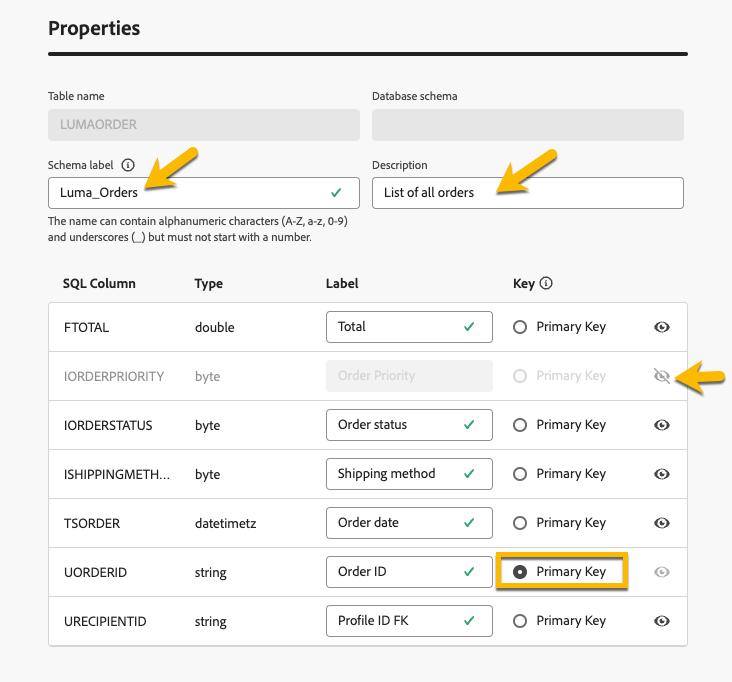

# Introducción a los esquemas {#schemas}

>[!CONTEXTUALHELP]
>id="dc_schema_create_select_tables"
>title="Seleccionar tablas"
>abstract="Seleccione las tablas que desea añadir al modelo de datos."

>[!CONTEXTUALHELP]
>id="dc_schema_create_key"
>title="Clave"
>abstract="Seleccione una clave para la reconciliación de datos."

>[!CONTEXTUALHELP]
>id="dc_schema_create_schema_name"
>title="Nombre del esquema"
>abstract="Introduzca el nombre del esquema."

>[!CONTEXTUALHELP]
>id="dc_schema_edit_description"
>title="Descripción del esquema"
>abstract="La descripción del esquema enumera columnas, tipos y etiquetas. También puede comprobar la clave de reconciliación para el esquema. Para actualizar la definición del esquema, haga clic en el icono de lápiz."

>[!CONTEXTUALHELP]
>id="dc_schema_filter_sources"
>title="Seleccione la base de datos fuente que desea filtrar"
>abstract="Puede filtrar los esquemas en función de su fuente. Seleccione una o varias bases de datos federadas para mostrar sus esquemas."

## ¿Qué es un esquema? {#schema-start}

Un esquema es una representación de una tabla de la base de datos. Es un objeto dentro de la aplicación que define cómo se asocian los datos a las tablas de la base de datos.

Al crear un esquema, puede definir una representación de la tabla en la composición de audiencia federada de Experience Platform:

* Asigne un nombre descriptivo para simplificar la comprensión del usuario
* Decidir la visibilidad de cada campo, según su uso real
* Seleccione su clave principal para vincular esquemas entre ellos según sea necesario en el [modelo de datos](../data-management/gs-models.md#data-model-start)

## Creación de un esquema {#schema-create}

Para crear esquemas en Composición de audiencia federada, siga los pasos a continuación:

1. En la sección **[!UICONTROL DATOS FEDERADOS]**, vaya al vínculo **[!UICONTROL Modelos]**. Vaya a la pestaña **[!UICONTROL Esquema]** y haga clic en el botón **[!UICONTROL Crear esquema]**.

   {zoomable="yes"}

   Este paso le permite acceder a una nueva pantalla con una lista desplegable en la que puede encontrar las bases de datos conectadas a su entorno. Obtenga más información acerca de la conexión a la base de datos en [esta sección](../connections/connections.md#connections-fdb).

1. Seleccione la base de datos de origen en la lista y haga clic en la ficha **[!UICONTROL Agregar tablas]**.

   {zoomable="yes"}

   Puede ver la lista de todas las tablas de la base de datos.

1. Al agregar las tablas para las que desea crear el esquema, tiene acceso a sus campos como se muestra a continuación:

   {zoomable="yes"}

   Para cada tabla, puede:

   * cambiar la etiqueta del esquema
   * añadir una descripción
   * cambie el nombre de todos los campos y establezca su visibilidad
   * seleccione la clave principal del esquema

   Por ejemplo, para la siguiente tabla importada:

   {zoomable="yes"}

   El esquema se puede definir de esta manera:

   {zoomable="yes"}

## Edición de un esquema {#schema-edit}

Para editar un esquema:

1. Haga clic en el nombre del esquema en la carpeta de esquemas.

1. Haz clic en el botón **[!UICONTROL Editar]**.

   {zoomable="yes"}

   Puede acceder a las mismas opciones que al [crear un esquema](#schema-create).

   {zoomable="yes"}

## Vista previa de datos en un esquema {#schema-preview}

Para obtener una vista previa de los datos de la tabla representada por su esquema, vaya a la pestaña **[!UICONTROL Data]** como se muestra a continuación.

Haga clic en el vínculo **[!UICONTROL Calcular]** para obtener una vista previa del número total de grabaciones.

{zoomable="yes"}

Haga clic en el botón **[!UICONTROL Configurar columnas]** para cambiar la visualización de datos.

{zoomable="yes"}

## Eliminar un esquema {#schema-delete}

Para eliminar un esquema, haga clic en el botón **[!UICONTROL Más]** y, a continuación, elija **[!UICONTROL Eliminar]**.

{zoomable="yes"}
