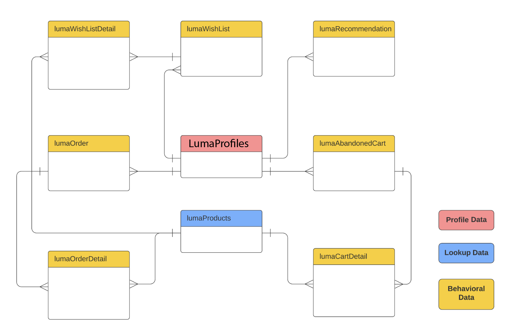
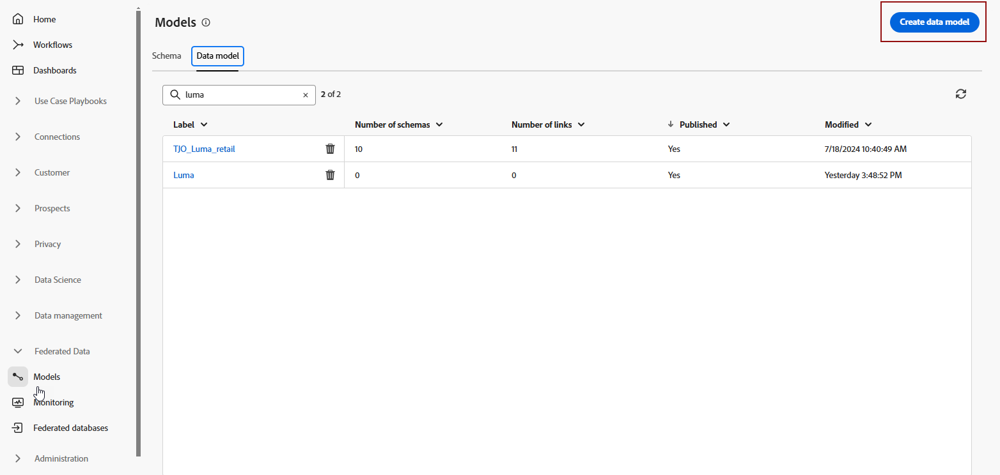
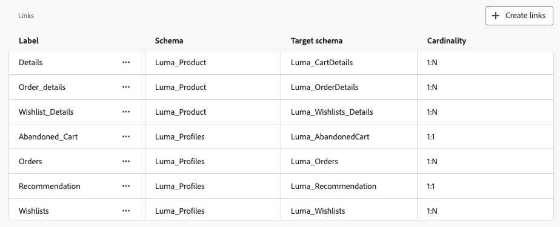

# Introducción a los modelos de datos {#data-model}

>[!CONTEXTUALHELP]
>id="dc_model_menu"
>title="Trabajar con modelos"
>abstract="Los esquemas y los modelos de datos se muestran en esta pantalla. Puede crear esquemas y modelos de datos mediante el botón **Crear**."

>[!CONTEXTUALHELP]
>id="dc_datamodel_add_schema"
>title="Seleccionar esquemas"
>abstract="Seleccione los esquemas para el modelo de datos."

>[!CONTEXTUALHELP]
>id="dc_datamodel_add_audience"
>title="Selección de un público"
>abstract="Seleccione el público del modelo de datos."

>[!CONTEXTUALHELP]
>id="dc_datamodel_properties"
>title="Propiedades del modelo de datos"
>abstract="Introduzca la etiqueta del modelo de datos."

## ¿Qué es un modelo de datos? {#data-model-start}

Un modelo de datos es un conjunto de esquemas, audiencias y los vínculos entre ellos. Se utiliza para federar audiencias con datos de bases de datos.

Más información sobre [esquemas](../customer/schemas.md#schema-start).

Más información sobre [audiencias](../start/audiences.md).

Por ejemplo, puede ver debajo una representación de un modelo de datos: las tablas con su nombre y los vínculos entre ellas.

{zoomable="yes"}

En la Composición de audiencias federada, es posible crear muchos modelos de datos.

Su creación se basará en el caso de uso: elige las tablas necesarias y las vincula según sus necesidades.

## Creación de un modelo de datos {#data-model-create}

Para crear un modelo de datos, siga estos pasos:

1. En la sección **[!UICONTROL DATOS FEDERADOS]**, vaya al vínculo **[!UICONTROL Modelos]** y vaya a la pestaña **[!UICONTROL Modelo de datos]**.

   {zoomable="yes"}

1. Haga clic en el botón **[!UICONTROL Crear modelo de datos]** para definir el nombre del modelo de datos y haga clic en el botón **[!UICONTROL Crear]**.

   {zoomable="yes"}

1. A continuación, añada los esquemas, las audiencias y los vínculos del modelo de datos.

   {zoomable="yes"}

### Crear vínculos {#data-model-links}

Para crear vínculos entre tablas del modelo de datos, siga estos pasos:

1. Haga clic en el menú **[!UICONTROL Crear vínculo]** de una de las tablas o haga clic en el botón **[!UICONTROL Crear vínculos]** y elija las dos tablas:

   {zoomable="yes"}

1. Rellene el formulario proporcionado para definir el vínculo.

   {zoomable="yes"}

   **Cardinalidad**

   * 1-N: una incidencia de la tabla de origen puede tener varias incidencias correspondientes de la tabla de destino, pero una incidencia de la tabla de destino puede tener como máximo una incidencia correspondiente de la tabla de origen.

   * N-1: una incidencia de la tabla de destino puede tener varias incidencias correspondientes de la tabla de origen, pero una incidencia de la tabla de origen puede tener como máximo una incidencia correspondiente de la tabla de destino.

   * 1-1: una incidencia de la tabla de origen puede tener como máximo una incidencia correspondiente de la tabla de destino.

Todos los vínculos definidos para el modelo de datos se enumeran a continuación:

{zoomable="yes"}

## Cómo realizar el vídeo {#data-model-video}

Aprenda a crear un modelo de datos en este vídeo:

>[!VIDEO](https://video.tv.adobe.com/v/3432020)
