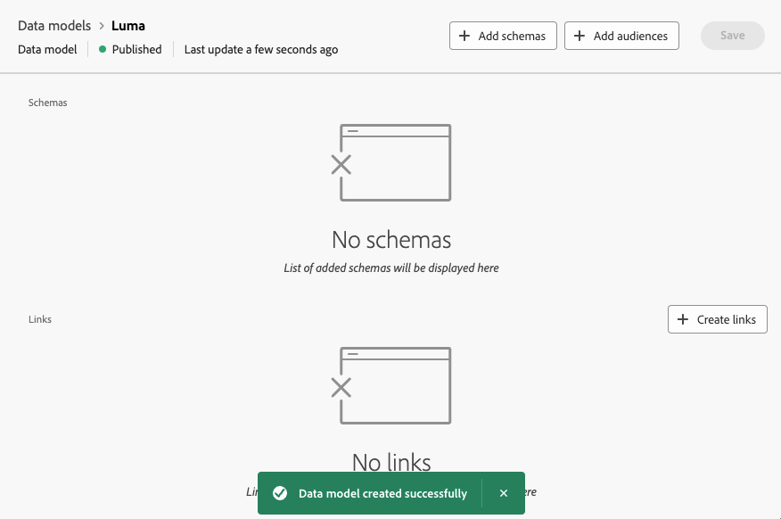

# Introducción a los modelos de datos {#data-model}

>[!CONTEXTUALHELP]
>id="dc_model_menu"
>title="Trabajar con modelos"
>abstract="Los esquemas y los modelos de datos se muestran en esta pantalla. Puede crear esquemas y modelos de datos mediante el botón **Crear**."

>[!CONTEXTUALHELP]
>id="dc_datamodel_add_schema"
>title="Seleccionar esquemas"
>abstract="Seleccione los esquemas para el modelo de datos."

>[!CONTEXTUALHELP]
>id="dc_datamodel_add_audience"
>title="Selección de un público"
>abstract="Seleccione el público del modelo de datos."

>[!CONTEXTUALHELP]
>id="dc_datamodel_properties"
>title="Propiedades del modelo de datos"
>abstract="Introduzca la etiqueta del modelo de datos."

## ¿Qué es un modelo de datos? {#data-model-start}

Un modelo de datos es un conjunto de esquemas, audiencias y los vínculos entre ellos.

Más información sobre [esquemas](../customer/schemas.md).

Más información sobre [audiencias](../customer/audiences.md).

## Cómo crear un modelo de datos {#data-model-create}

En la sección **[!UICONTROL DATOS FEDERADOS]**, vaya al vínculo **[!UICONTROL Modelos]**. Ahí encontrará la ficha **[!UICONTROL Modelo de datos]**.

{zoomable="yes"}

Al hacer clic en el botón **[!UICONTROL Crear modelo de datos]**, tendrá la posibilidad de asignar un nombre al modelo de datos y hacer clic en el botón **[!UICONTROL Crear]**.

{zoomable="yes"}

Accederá a la ventana donde puede añadir los esquemas, las audiencias y los vínculos del modelo de datos.

{zoomable="yes"}

{zoomable="yes"}

