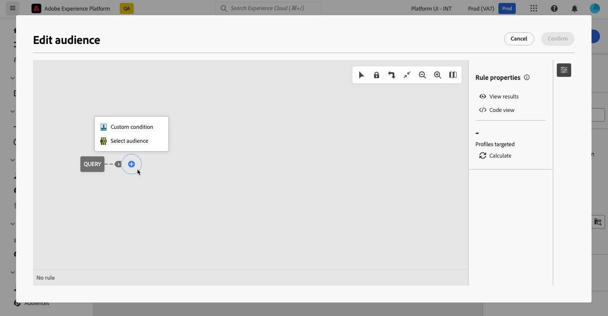

# Genere su primera consulta {#build-query}

Para empezar a crear una consulta, acceda al modelador de consultas desde la ubicación que elija, según la acción que desee realizar. El modelador de consultas se abre con un lienzo en blanco. Seleccione el botón **+** para configurar el primer nodo de la consulta.

Se pueden añadir dos tipos de elementos:

* **Los componentes de filtrado** (condición personalizada, Seleccionar audiencia) le permiten crear sus propias reglas o seleccionar una audiencia para restringir la consulta. Se añaden al principio de la consulta y en transiciones punteadas. [Aprenda a trabajar con los componentes de filtrado](#filtering)

  Ejemplo: *Destinatarios que se suscribieron al boletín &#39;Deportes&#39;*. *Destinatarios que viven en Nueva York*, *Destinatarios que viven en San Francisco*

  {zoomable="yes"}

* **Los operadores de grupo** (AND, OR, EXCEPT) le permiten agrupar los componentes de filtrado en el diagrama. Se añaden a las transiciones existentes antes de un componente de filtrado. [Aprenda a trabajar con operadores](#filtering)

  Ejemplo: *Destinatarios que se suscribieron al boletín &quot;Deportes&quot;**Y**&#x200B;que viven en Nueva York **O**&#x200B;San Francisco*.

  {zoomable="yes"}

## Adición de componentes de filtrado {#filtering}

Los componentes de filtrado le permiten refinar la consulta utilizando:

* **[Condiciones personalizadas](#custom-condition)**: filtre la consulta creando su propia condición con atributos de la base de datos y expresiones avanzadas.
* **[Audiencias](#audiences)**: filtre la consulta usando una audiencia existente.

### Configuración de una condición personalizada {#custom-condition}

>[!CONTEXTUALHELP]
>id="dc_orchestration_querymodeler_customcondition"
>title="Condición personalizada"
>abstract="Las condiciones personalizadas son componentes de filtrado que le permiten filtrar la consulta creando su propia condición con atributos de la base de datos y expresiones avanzadas."

Para filtrar la consulta mediante una condición personalizada, siga estos pasos:

1. Seleccione el botón **+** en el nodo deseado, seguido de **[!UICONTROL Condición personalizada]**. El panel de propiedades de condición personalizada se abre en el lado derecho.

2. En el campo **[!UICONTROL Atributo]**, seleccione el atributo de la base de datos que desee aprovechar para crear su condición. La lista de atributos incluye todos los atributos de la base de datos, incluidos los atributos de las tablas vinculadas.

   {zoomable="yes"}

   >[!NOTE]
   >
   >El botón **[!UICONTROL Editar expresión]** le permite aprovechar el editor de expresiones para definir manualmente una expresión con campos de la base de datos y funciones de ayuda. [Más información sobre cómo editar expresiones](expression-editor.md)

3. Seleccione el operador que desee aplicar en la lista desplegable. Hay varios operadores disponibles que se pueden utilizar. Tenga en cuenta que los operadores disponibles en la lista desplegable dependen del tipo de datos del atributo.

   +++Lista de operadores disponibles

   | Operador | Objetivo | Ejemplo |
   |  ---  |  ---  |  ---  |
   | Igual a | Devuelve un resultado idéntico a los datos introducidos en la segunda columna Valor. | Apellido (@lastName) igual a &quot;Jones&quot;, solo devuelve como resultado los destinatarios cuyo apellido sea Jones. |
   | No igual a | Devuelve todos los valores que no son idénticos al valor entrado. | Idioma (@language) igual a &quot;inglés&quot; |
   | Mayor que | Devuelve un valor mayor que el valor entrado. | Edad (@age) mayor que 50</strong>, devolverá todos los valores mayores que 50, es decir 51, 52, etc. |
   | Menor que | Devuelve un valor menor que el valor entrado. | Fecha de creación (@created) antes de &quot;DaysAgo(100)&quot;</strong>, devuelve como resultado todos los destinatarios creados hace menos de 100 días. |
   | Mayor o igual que | Devuelve todos los valores iguales o mayores que el valor entrado. | Edad (@age) mayor o igual que &quot;30&quot;</strong>, devuelve como resultado todos los destinatarios de 30 años o más. |
   | Menor o igual que | Devuelve todos los valores iguales o inferiores al valor entrado. | Edad (@age) menor o igual que &quot;60&quot;</strong>, devuelve como resultado todos los destinatarios de 60 años o menos. |
   | Incluido en | Devuelve los resultados incluidos entre los valores indicados. Estos valores deben separarse con una coma. | Fecha de nacimiento (@birthDate) incluida en &quot;12/10/1979,12/10/1984&quot;, devuelve como resultado los destinatarios que nacieran entre esas fechas. |
   | No en | Funciona como el operador Incluido en. Aquí queremos excluir los destinatarios según los valores ingresados. | La fecha de nacimiento (@birthDate) no está incluida en “10/12/1979,10/12/1984”. A diferencia del ejemplo anterior, no se recuperan los destinatarios nacidos entre esas fechas. |
   | Está vacío | En este caso, el resultado que estamos buscando coincide con un valor vacío en la segunda columna Valor. | El móvil (@mobilePhone) está vacío y devuelve todos los destinatarios que no tienen un número de móvil. |
   | No está vacío | Funciona de forma inversa al operador Está vacío. No es necesario introducir datos en la segunda columna Valor. | El correo electrónico (@email) no está vacío. |
   | Comienza por | Devuelve los resultados que comienzan con el valor ingresado. | El n.º cuenta (@account) comienza con “32010”. |
   | No empieza por | Devuelve los resultados que no comienzan con el valor ingresado | N.º cuenta (@account) no comienza con &quot;20&quot; |
   | Contiene | Devuelve los resultados que contienen al menos el valor introducido. | Dominio de correo electrónico (@domain) contiene &quot;mail&quot;</strong>, devolverá todos los nombres de dominio que contengan &quot;mail&quot;. Por lo tanto, también se devuelve el dominio &quot;gmail.com&quot;. |
   | No contiene | Devuelve los resultados que no contienen el valor entrado. | Dominio de correo electrónico (@domain) no contiene &quot;vo&quot;</strong>. En este caso, no devuelve como resultado los nombres de dominio que contengan “vo”. El nombre de dominio &quot;voila.fr&quot; no aparece en los resultados. |
   | Como | Like es muy similar al operador Contains. Permite insertar % wild card character in the value. | Apellido (@lastName) como “Jon%s”. En este caso, el carácter comodín se utiliza para encontrar el nombre &quot;Jones&quot;, en el caso de que el operador haya olvidado la letra que falta entre la &quot;n&quot; y la &quot;s&quot;. |
   | No igual | Like es muy similar al operador Contains. Permite insertar % wild card character in the value. | Apellido (@lastName) no igual a “Smi%h”. Aquí, no devuelve los destinatarios cuyo apellido sea &quot;Smi%h&quot;. |

   +++

4. En el campo **[!UICONTROL Valor]**, defina el valor previsto. También puede aprovechar el editor de expresiones para definir manualmente una expresión mediante los campos de la base de datos y las funciones de ayuda. Para ello, seleccione el botón **[!UICONTROL Editar expresión]**. [Más información sobre cómo editar expresiones](expression-editor.md)

   *Ejemplo de consulta que devuelve todos los perfiles de 21 años o más:*

   {zoomable="yes"}

#### Condiciones personalizadas en las tablas vinculadas (vínculos 1-1 y 1-N){#links}

Las condiciones personalizadas permiten consultar tablas vinculadas a la tabla que utiliza actualmente la regla. Esto incluye tablas con un vínculo de cardinalidad 1-1 o tablas de colección (vínculo 1-N).

Para un **vínculo 1-1**, vaya a la tabla vinculada, seleccione el atributo deseado y defina el valor previsto.

También puede seleccionar directamente un vínculo de tabla en el selector **[!UICONTROL Valor]** y confirmar. En ese caso, los valores disponibles para la tabla seleccionada deben seleccionarse mediante un selector específico, como se muestra en el ejemplo siguiente.

+++Ejemplo de consulta

En este caso, la consulta está segmentada a marcas cuya etiqueta es “en ejecución”.

1. Vaya dentro de la tabla **[!UICONTROL Marca]** y seleccione el atributo **[!UICONTROL Etiqueta]**.

   {zoomable="yes"}{width="85%" align="center"}

1. Defina el valor previsto para el atributo.

   {zoomable="yes"}{width="85%" align="center"}

Este es un ejemplo de consulta en el que se ha seleccionado directamente un vínculo de tabla. Los valores disponibles para esta tabla deben seleccionarse en un selector específico.

{zoomable="yes"}{width="85%" align="center"}

+++ 

Para un **vínculo 1-N**, puede definir subcondiciones para restringir la consulta, como se muestra en el ejemplo siguiente.

+++Ejemplo de consulta

En este caso, la consulta está dirigida a destinatarios que han realizado compras relacionadas con el producto BrewMaster, por un importe total de al menos 100 $.

1. Seleccione la tabla **[!UICONTROL Compras]** y confirme.

   {zoomable="yes"}{width="50%" align="center"}

1. Se añade una transición saliente, que le permite crear subcondiciones.

   {zoomable="yes"}{width="85%" align="center"}

1. Seleccione el atributo **[!UICONTROL Price]** y el destino de compras de 1000$ o más

   {zoomable="yes"}{width="85%" align="center"}

1. Añada subcondiciones para adaptarlas a sus necesidades. Aquí hemos agregado una condición a los perfiles de destino que compraron un producto BrewMaster.

   {zoomable="yes"}{width="85%" align="center"}

+++ 

#### Trabajo con datos agregados {#aggregate}

Las condiciones personalizadas le permiten realizar operaciones de agregado. Para ello, debe seleccionar directamente un atributo de una tabla de colección:

1. Desplácese por la tabla de colección deseada y seleccione el atributo en el que desea realizar una operación de agregado.

   {zoomable="yes"}{width="85%" align="center"}

1. En el panel de propiedades, active la opción **[!UICONTROL Agregar datos]** y seleccione la función de agregado que desee.

   {zoomable="yes"}{width="85%" align="center"}

### Selección de un público {#audiences}

>[!CONTEXTUALHELP]
>id="dc_orchestration_querymodeler_selectaudience"
>title="Seleccionar el público"
>abstract="Mediante la opción **[!UICONTROL Seleccionar público]**, puede elegir el público que desea utilizar para filtrar la consulta."

Para filtrar la consulta utilizando una audiencia existente, siga estos pasos:

1. Seleccione el botón **+** en el nodo deseado y elija **[!UICONTROL Seleccionar audiencia]**.

1. El panel de propiedades **[!UICONTROL Seleccionar audiencia]** se abre en el lado derecho. Elija la audiencia que desee utilizar para filtrar la consulta.

   *Ejemplo de consulta que devuelve todos los perfiles pertenecientes a la audiencia &quot;Visitantes del festival&quot;:*

   {zoomable="yes"}

### Uso de un filtro predefinido {#predefined-filters}

>[!CONTEXTUALHELP]
>id="dc_orchestration_querymodeler_predefinedfilter"
>title="Filtro predefinido"
>abstract="Mediante la opción **[!UICONTROL Filtro predefinido]**, puede seleccionar un filtro predefinido de la lista de filtros personalizados o de favoritos."

Para filtrar la consulta utilizando un filtro predefinido, siga estos pasos:

1. Seleccione el botón **+** en el nodo deseado, seguido de **[!UICONTROL Filtro predefinido]**.

1. El panel de propiedades **[!UICONTROL Filtro predefinido]** se abre en el lado derecho. Seleccione un filtro predefinido de la lista de filtros personalizados o de favoritos.

   *Ejemplo de consulta que devuelve todos los perfiles correspondientes al filtro predefinido &quot;Clientes inactivos&quot;:*

   {zoomable="yes"}

### Copiar y pegar componentes {#copy}

El modelador de consultas permite copiar uno o varios componentes de filtrado y pegarlos al final de una transición. Esta operación se puede ejecutar dentro del lienzo de consulta actual o en cualquier lienzo de la instancia.

>[!NOTE]
>
>La selección copiada se conserva mientras esté trabajando en la instancia. Si cierra la sesión y vuelve a iniciarla, la selección ya no estará disponible para pegar.

Para copiar y pegar componentes de filtrado, siga estos pasos:

1. Seleccione el componente de filtrado que desea copiar seleccionándolo en el lienzo de consulta. Para seleccionar varios componentes, utilice la herramienta de selección múltiple disponible en la barra de herramientas situada en la esquina superior derecha del lienzo.

1. Seleccione el botón **[!UICONTROL Copiar]** en el panel de propiedades del componente o en la cinta azul de la parte inferior de la pantalla si ha seleccionado varios componentes.

   | Copiar un solo componente | Copiar varios componentes |
   |  ---  |  ---  |
   | {zoomable="yes"}{width="200" align="center" zoomable="yes"} | {zoomable="yes"}{width="200" align="center" zoomable="yes"} |

1. Para pegar los componentes, seleccione el botón + al final de la transición deseada, seguido de **[!UICONTROL Pegar n elementos]**.

   {zoomable="yes"}

## Combinación de componentes de filtrado con operadores {#operators}

>[!CONTEXTUALHELP]
>id="dc_orchestration_querymodeler_group"
>title="Grupo"
>abstract="En este panel, puede cambiar el operador que se utiliza para vincular las condiciones de filtrado."

Cada vez que agrega un nuevo componente de filtrado a la consulta, un operador **AND** lo vincula automáticamente al otro componente. Esto significa que los resultados de los dos componentes de filtrado se combinan.

En este ejemplo, se han añadido nuevos componentes de filtrado de tipo audiencia en la segunda transición. El componente está vinculado a la condición de filtro predefinida con un operador **AND**, lo que significa que los resultados de la consulta incluyen destinatarios dirigidos por el filtro predefinido &quot;Madridians&quot; Y que pertenecen a la audiencia &quot;Discount hunters&quot;.

{zoomable="yes"}

Para cambiar el operador usado para vincular las condiciones de filtrado, selecciónelo junto con el operador deseado en el panel **[!UICONTROL Group]** que se abre en el lado derecho.

Los operadores disponibles son los siguientes:

* **AND (intersección)**: combina los resultados que coinciden con todos los componentes de filtrado en las transiciones de salida.
* **OR (unión)**: incluye resultados que coinciden con al menos uno de los componentes de filtrado en las transiciones de salida.
* **EXCEPT (Exclusion)**: Excluye los resultados que coinciden con todos los componentes de filtrado de la transición saliente.

{zoomable="yes"}

Además, puede crear grupos intermedios de componentes seleccionando el botón **+** en una transición. Esto le permite agregar un operador en esta ubicación específica para agrupar varios componentes y refinar la consulta.

En el ejemplo siguiente, hemos creado un grupo intermedio para incluir los resultados de las audiencias &quot;VIP to recompensa&quot; o &quot;Super VIP&quot;.

{zoomable="yes"}

## Compruebe y valide la consulta

>[!CONTEXTUALHELP]
>id="dc_orchestration_querymodeler_ruleproperties"
>title="Propiedades de la regla"
>abstract="Una vez que haya creado la consulta en el lienzo, puede comprobarla con el panel **[!UICONTROL Propiedades de regla]** situado en el lado derecho. Este panel permite mostrar los datos resultantes, recuperar una versión de código SQL de la consulta y comprobar el número de registros de destino. Utilice el botón **[!UICONTROL Seleccionar o guardar filtro]** para guardar la consulta como un filtro predefinido o reemplazar el contenido del lienzo con un filtro existente."

Una vez que haya creado la consulta en el lienzo, puede comprobarla con el panel **[!UICONTROL Propiedades de regla]** ubicado a la derecha. Este panel se muestra al armar una consulta para crear un público. Las operaciones disponibles son las siguientes:

* **[!UICONTROL Ver resultados]:** Muestra los datos resultantes de la consulta.
* **[!UICONTROL Vista de código]**: muestra una versión basada en código de la consulta en SQL.
* **[!UICONTROL Calcular]**: actualiza y muestra el número de registros dirigidos por la consulta.
* **[!UICONTROL Seleccionar o guardar filtro]**: elija un filtro predefinido existente para utilizarlo en el lienzo o guarde la consulta como un filtro predefinido para reutilizarlo en el futuro.

  >[!IMPORTANT]
  >
  >Seleccione un filtro predefinido en el panel de propiedades de la regla para reemplazar la consulta que se ha creado en el lienzo por el filtro seleccionado.

Cuando la consulta esté lista, selecciona el botón **[!UICONTROL Confirmar]** en la esquina superior derecha para guardarlo.

Puede modificar la consulta en cualquier momento abriéndola. Tenga en cuenta que al abrir una consulta existente, se muestra en una vista simplificada sin la visibilidad de **+** botones. Para agregar nuevos elementos a la consulta, seleccione un componente u operador en el lienzo para mostrar los botones **+**.

{zoomable="yes"}
