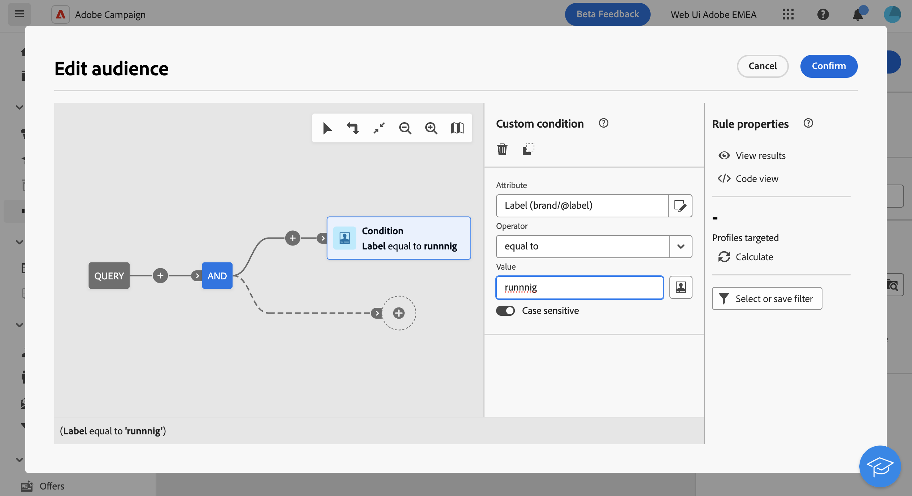

# Genere su primera consulta {#build-query}

Para empezar a crear una consulta, acceda al modelador de consultas desde la ubicación que elija, según la acción que desee realizar. El modelador de consultas se abre con un lienzo en blanco. Haga clic en **+** para configurar el primer nodo de la consulta.

Se pueden añadir dos tipos de elementos:

* **Filtrado de componentes** (Condición personalizada, Seleccionar audiencia) le permiten crear sus propias reglas o seleccionar una audiencia para restringir la consulta. Se añaden al principio de la consulta y en transiciones punteadas. [Aprenda a trabajar con los componentes de filtrado](#filtering)

  Ejemplo: *Destinatarios que se han suscrito al boletín &quot;Deportes&quot;*. *Destinatarios que viven en Nueva York*, *Destinatarios que viven en San Francisco*

  {zoomable="yes"}

* **Operadores de grupo** (AND, OR, EXCEPT) permiten agrupar los componentes de filtrado en el diagrama. Se añaden a las transiciones existentes antes de un componente de filtrado. [Aprenda a trabajar con operadores](#filtering)

  Ejemplo: *Destinatarios que se suscribieron al boletín &quot;Deportes&quot;**Y**que viven en Nueva York **O**San Francisco*.

  {zoomable="yes"}

## Adición de componentes de filtrado {#filtering}

Los componentes de filtrado le permiten refinar la consulta utilizando:

* **[Condiciones personalizadas](#custom-condition)**: filtre la consulta creando su propia condición con atributos de la base de datos y expresiones avanzadas.
* **[Audiencias](#audiences)**: filtre la consulta utilizando una audiencia existente.

### Configuración de una condición personalizada {#custom-condition}

>[!CONTEXTUALHELP]
>id="dc_orchestration_querymodeler_customcondition"
>title="Condición personalizada"
>abstract="Las condiciones personalizadas son componentes de filtrado que le permiten filtrar la consulta creando su propia condición con atributos de la base de datos y expresiones avanzadas."

Para filtrar la consulta mediante una condición personalizada, siga estos pasos:

1. Haga clic en **+** en el nodo deseado y seleccione **[!UICONTROL Condición personalizada]**. El panel de propiedades de condición personalizada se abre en el lado derecho.

1. En el **Atributo** , seleccione el atributo de la base de datos que desee aprovechar para crear la condición. La lista de atributos incluye todos los atributos de la base de datos, incluidos los atributos de las tablas vinculadas.

   {zoomable="yes"}

   >[!NOTE]
   >
   >El **Editar expresión** Este botón permite aprovechar el editor de expresiones para definir manualmente una expresión mediante los campos de la base de datos y las funciones de ayuda. [Obtenga información sobre cómo editar expresiones](expression-editor.md)

1. Seleccione el operador que desee aplicar en la lista desplegable. Hay varios operadores disponibles. Tenga en cuenta que los operadores disponibles en la lista desplegable dependen del tipo de datos del atributo.

   +++Lista de operadores disponibles

   | Operador | Objetivo | Ejemplo |
   |  ---  |  ---  |  ---  |
   | Igual a | Devuelve un resultado idéntico a los datos introducidos en la segunda columna Valor. | Apellido (@lastName) igual a &quot;Jones&quot;, solo devuelve como resultado los destinatarios cuyo apellido sea Jones. |
   | No igual a | El resultado son todos los valores que no son idénticos al valor introducido. | Idioma (@language) igual a &quot;inglés&quot; |
   | Mayor que | El resultado es un valor mayor que el valor introducido. | Edad (@age) mayor de 50 años</strong>, devolverá todos los valores mayores que &quot;50&quot;, es decir, &quot;51&quot;, &quot;52&quot;, etc. |
   | Menor que | El resultado es un valor menor que el valor introducido. | Fecha de creación (@created) antes de &quot;DaysAgo(100)&quot;</strong>, devuelve todos los destinatarios creados hace menos de 100 días. |
   | Mayor o igual que | El resultado son todos los valores iguales o mayores que el valor introducido. | Edad (@age) mayor o igual que &quot;30&quot;</strong>, devuelve como resultado todos los destinatarios de 30 años o más. |
   | Menor o igual que | El resultado son todos los valores iguales o inferiores al valor introducido. | Edad (@age) inferior o igual a &quot;60&quot;</strong>, devuelve como resultado todos los destinatarios de 60 años o menos. |
   | Incluido en | Devuelve los resultados incluidos entre los valores indicados. Estos valores deben separarse con una coma. | Fecha de nacimiento (@birthDate) incluida en &quot;12/10/1979,12/10/1984&quot;, devuelve como resultado los destinatarios que nacieran entre esas fechas. |
   | No en | Funciona como el operador Is included in. Aquí queremos excluir los destinatarios según los valores ingresados. | Fecha de nacimiento (@birthDate) no incluida en &quot;12/10/1979,12/10/1984&quot;. A diferencia del ejemplo anterior, no se recuperan los destinatarios nacidos entre esas fechas. |
   | Is empty | En este caso, el resultado que estamos buscando coincide con un valor vacío en la segunda columna Valor. | Móvil (@mobilePhone) está vacío devuelve todos los destinatarios que no tienen número de móvil. |
   | Is not empty | Funciona de forma inversa al operador Is empty. No es necesario introducir datos en la segunda columna Valor. | Correo electrónico (@email) no está vacío. |
   | Comienza con | Devuelve los resultados que comienzan con el valor ingresado. | N.º cuenta (@account) comienza con &quot;32010&quot;. |
   | No empieza por | Devuelve los resultados que no comienzan con el valor ingresado | N.º cuenta (@account) no comienza con &quot;20&quot; |
   | Contains | Devuelve los resultados que contienen al menos el valor introducido. | Email domain (@domain) contains &#39;mail&#39;</strong>, devolverá todos los nombres de dominio que contengan &quot;mail&quot;. Por lo tanto, también se devuelve el dominio &quot;gmail.com&quot;. |
   | No contiene | Devuelve los resultados que no contienen el valor introducido. | Dominio de correo electrónico (@domain) no contiene &quot;vo&quot;</strong>. En este caso, no devuelve como resultado los nombres de dominio que contengan “vo”. El nombre de dominio &quot;voila.fr&quot; no aparece en los resultados. |
   | Me gusta | Like es muy similar al operador Contains. Permite insertar % wild card character in the value. | Apellido (@lastName) como &quot;Jon%s&quot;. En este caso, el carácter comodín se utiliza para encontrar el nombre &quot;Jones&quot;, en el caso de que el operador haya olvidado la letra que falta entre la &quot;n&quot; y la &quot;s&quot;. |
   | Not like | Like es muy similar al operador Contains. Permite insertar % wild card character in the value. | Apellido (@lastName) como &quot;Smi%h&quot;. Aquí, no devuelve los destinatarios cuyo apellido sea &quot;Smi%h&quot;. |

+++

1. En el **Valor** , defina el valor esperado. También puede aprovechar el editor de expresiones para definir manualmente una expresión mediante los campos de la base de datos y las funciones de ayuda. Para ello, haga clic en el **Editar expresión** botón. [Obtenga información sobre cómo editar expresiones](expression-editor.md)

   *Ejemplo de consulta que devuelve todos los perfiles de 21 años o más:*

   {zoomable="yes"}

#### Condiciones personalizadas en las tablas vinculadas (vínculos 1-1 y 1-N){#links}

Las condiciones personalizadas permiten consultar tablas vinculadas a la tabla que utiliza actualmente la regla. Esto incluye tablas con un vínculo de cardinalidad 1-1 o tablas de recopilación (vínculo 1-N).

Para un **Vínculo 1-1**, vaya a la tabla vinculada, seleccione el atributo deseado y defina el valor esperado.

También puede seleccionar directamente un vínculo de tabla en la **Valor** selector y confirmar. En ese caso, los valores disponibles para la tabla seleccionada deben seleccionarse mediante un selector dedicado, como se muestra en el ejemplo siguiente.

+++Ejemplo de consulta

En este caso, la consulta está dirigida a marcas cuya etiqueta está &quot;en ejecución&quot;.

1. Navegue dentro de **Marca** y seleccione la **Etiqueta** atributo.

   {zoomable="yes"}{width="85%" align="center"}

1. Defina el valor esperado para el atributo.

   {zoomable="yes"}{width="85%" align="center"}

Este es un ejemplo de consulta en el que se ha seleccionado directamente un vínculo de tabla. Los valores disponibles para esta tabla deben seleccionarse de un selector específico.

{zoomable="yes"}{width="85%" align="center"}

+++

Para un **Vínculo 1-N**, puede definir subcondiciones para restringir la consulta, como se muestra en el ejemplo siguiente.

+++Ejemplo de consulta

En este caso, la consulta está dirigida a destinatarios que han realizado compras relacionadas con el producto BrewMaster, por un importe total de al menos 100 $.

1. Seleccione el **Compras** y confirme.

   {zoomable="yes"}{width="50%" align="center"}

1. Se añade una transición saliente, que le permite crear subcondiciones.

   {zoomable="yes"}{width="85%" align="center"}

1. Seleccione el **Precio** compras de atributo y destino de 1000 $ o más

   {zoomable="yes"}{width="85%" align="center"}

1. Añada subcondiciones para adaptarlas a sus necesidades. Aquí hemos agregado una condición a los perfiles de destino que compraron un producto BrewMaster.

   {zoomable="yes"}{width="85%" align="center"}

+++

#### Trabajo con datos agregados {#aggregate}

Las condiciones personalizadas le permiten realizar operaciones acumuladas. Para ello, debe seleccionar directamente un atributo de una tabla de recopilación:

1. Desplácese dentro de la tabla de recopilación deseada y seleccione el atributo en el que desea realizar una operación de acumulado.

   {zoomable="yes"}{width="85%" align="center"}

1. En el panel de propiedades, active la opción **Datos agregados** y seleccione la función de acumulado que desee.

   {zoomable="yes"}{width="85%" align="center"}

### Selección de un público {#audiences}

>[!CONTEXTUALHELP]
>id="dc_orchestration_querymodeler_selectaudience"
>title="Seleccionar el público"
>abstract="Mediante la opción **Seleccionar público**, puede elegir el público que desea utilizar para filtrar la consulta."

Para filtrar la consulta utilizando una audiencia existente, siga estos pasos:

1. Haga clic en **+** en el nodo deseado y elija **[!UICONTROL Seleccionar audiencia]**.

1. El **Seleccionar audiencia** el panel de propiedades se abre en el lado derecho. Elija la audiencia que desee utilizar para filtrar la consulta.

   *Ejemplo de consulta que devuelve todos los perfiles pertenecientes a la audiencia &quot;Asistentes al festival&quot;:*

   {zoomable="yes"}

### Uso de un filtro predefinido {#predefined-filters}

>[!CONTEXTUALHELP]
>id="dc_orchestration_querymodeler_predefinedfilter"
>title="Filtro predefinido"
>abstract="Mediante la opción **Filtro predefinido**, puede seleccionar un filtro predefinido de la lista de filtros personalizados o de favoritos."

Para filtrar la consulta utilizando un filtro predefinido, siga estos pasos:

1. Haga clic en **+** en el nodo deseado y seleccione **[!UICONTROL Filtro predefinido]**.

1. El **Filtro predefinido** el panel de propiedades se abre en el lado derecho. Seleccione un filtro predefinido de la lista de filtros personalizados o de favoritos.

   *Ejemplo de consulta que devuelve todos los perfiles correspondientes al filtro predefinido &quot;Clientes inactivos&quot;:*

   {zoomable="yes"}

### Copiar y pegar componentes {#copy}

El modelador de consultas permite copiar uno o varios componentes de filtrado y pegarlos al final de una transición. Esta operación se puede ejecutar dentro del lienzo de consulta actual o en cualquier lienzo de la instancia.

>[!NOTE]
>
>La selección copiada se conserva mientras esté trabajando en la instancia. Si cierra la sesión y vuelve a iniciarla, la selección ya no estará disponible para pegar.

Para copiar y pegar componentes de filtrado, siga estos pasos:

1. Seleccione el componente de filtrado que desea copiar haciendo clic en él en el lienzo de la consulta. Para seleccionar varios componentes, utilice la herramienta de selección múltiple disponible en la barra de herramientas situada en la esquina superior derecha del lienzo.

1. Haga clic en **[!UICONTROL Copiar]** en el panel de propiedades del componente o en la cinta azul de la parte inferior de la pantalla si ha seleccionado varios componentes.

   | Copiar un solo componente | Copiar varios componentes |
   |  ---  |  ---  |
   | {zoomable="yes"}{width="200" align="center" zoomable="yes"} | {zoomable="yes"}{width="200" align="center" zoomable="yes"} |

1. Para pegar los componentes, haga clic en el botón + al final de la transición deseada y seleccione **Pegar elementos n**.

   {zoomable="yes"}

## Combinación de componentes de filtrado con operadores {#operators}

>[!CONTEXTUALHELP]
>id="dc_orchestration_querymodeler_group"
>title="Grupo"
>abstract="En este panel, puede cambiar el operador que se utiliza para vincular las condiciones de filtrado."

Cada vez que se añade un nuevo componente de filtrado a la consulta, se vincula automáticamente al otro componente mediante una variable **Y** operador. Esto significa que los resultados de los dos componentes de filtrado se combinan.

En este ejemplo, se han añadido nuevos componentes de filtrado de tipo audiencia en la segunda transición. El componente está vinculado a la condición de filtro predefinida con un **Y** operador, lo que significa que los resultados de la consulta incluyen destinatarios dirigidos por el filtro predefinido &quot;Madridians&quot; Y que pertenecen a la audiencia &quot;Discount hunters&quot;.

{zoomable="yes"}

Para cambiar el operador utilizado para vincular las condiciones de filtrado, haga clic en él y seleccione el operador deseado en la **Grupo** panel que se abre en el lado derecho.

Los operadores disponibles son:

* **Y (intersección)**: combina los resultados que coinciden con todos los componentes de filtrado en las transiciones salientes.
* **O (Unión)**: incluye resultados que coinciden con al menos uno de los componentes de filtrado en las transiciones salientes.
* **EXCEPT (Exclusión)**: excluye los resultados que coinciden con todos los componentes de filtrado de la transición saliente.

{zoomable="yes"}

Además, puede crear grupos intermedios de componentes haciendo clic en el **+** en una transición. Esto le permite agregar un operador en esta ubicación específica para agrupar varios componentes y refinar la consulta.

VIP VIP En el ejemplo siguiente, hemos creado un grupo intermedio para incluir los resultados de las audiencias &quot;recompensar con un&quot; o &quot;&quot;.

{zoomable="yes"}

## Compruebe y valide la consulta

>[!CONTEXTUALHELP]
>id="dc_orchestration_querymodeler_ruleproperties"
>title="Propiedades de las reglas"
>abstract="Una vez que haya creado la consulta en el lienzo, puede comprobarla con el panel **Propiedades de las reglas** situado en el lado derecho. Este panel permite mostrar los datos resultantes, recuperar una versión de código SQL de la consulta y comprobar el número de registros de destino. Utilice el botón **Seleccionar o guardar filtro** para guardar la consulta como un filtro predefinido o reemplazar el contenido del lienzo con un filtro existente."

Una vez que haya creado la consulta en el lienzo, puede comprobarla con el **Propiedades de regla** situado en el lado derecho. Este panel se muestra al crear una consulta para crear una audiencia. Las operaciones disponibles son:

* **Ver resultados:** Muestra los datos resultantes de la consulta.
* **Vista de código**: Muestra una versión basada en código de la consulta en SQL.
* **Calcular**: actualiza y muestra el número de registros dirigidos por la consulta.
* **Seleccionar o guardar filtro**: elija un filtro predefinido existente para utilizarlo en el lienzo o guarde la consulta como un filtro predefinido para su reutilización futura.

  >[!IMPORTANT]
  >
  >Seleccione un filtro predefinido en el panel de propiedades de la regla para reemplazar la consulta que se ha creado en el lienzo por el filtro seleccionado.

Cuando la consulta esté lista, haga clic en **[!UICONTROL Confirmar]** en la esquina superior derecha para guardarlo.

Puede modificar la consulta en cualquier momento abriéndola. Tenga en cuenta que al abrir una consulta existente, se muestra en una vista simplificada sin la visibilidad de  **+** botones. Para añadir nuevos elementos a la consulta, seleccione un componente u operador en el lienzo para mostrar el **+** botones.

{zoomable="yes"}
