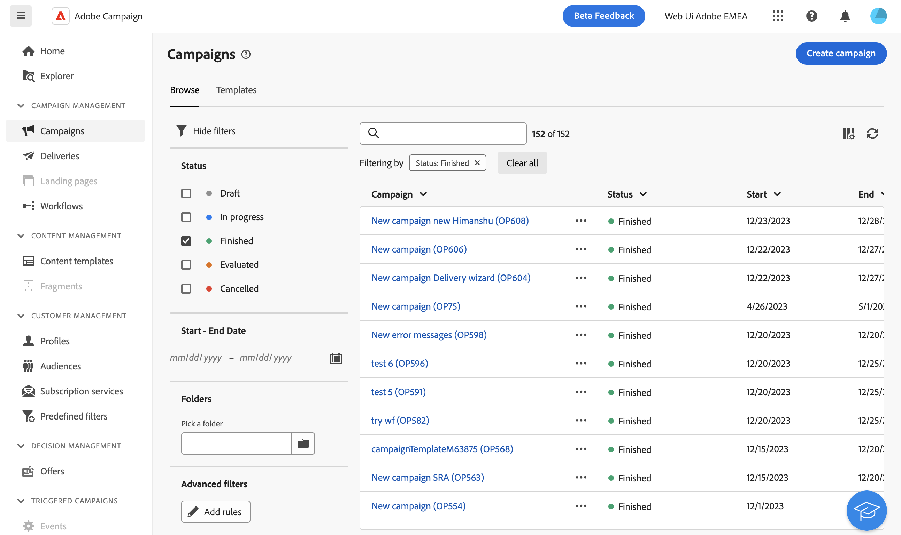

# Filtrar listas {#filter-lists}

Puede filtrar la lista de objetos, lo que permite filtrar la información en función de criterios contextuales específicos.

## Aplicar filtros {#apply}

Para aplicar filtros a una lista, haga clic en **[!UICONTROL Mostrar filtros]** situado en la esquina superior izquierda de la lista, junto a la barra de búsqueda.

Se abre el panel Filtros, que muestra los filtros disponibles para la lista seleccionada.

{zoomable="yes"}{width="70%" align="left" zoomable="yes"}

Para filtrar una lista según sus propios criterios, cree un filtro personalizado. Para ello, vaya a la parte inferior del panel de filtros y haga clic en **Agregar reglas** botón. [Obtenga información sobre cómo crear filtros personalizados](#custom)

Una vez aplicados a una lista, los filtros son visibles debajo de la barra de búsqueda. Puede quitar un filtro individual en cualquier momento o quitar todos los filtros haciendo clic en el icono **Borrar todo** botón.

## Creación de filtros personalizados {#custom}

Los filtros personalizados le permiten refinar las listas según sus propios criterios específicos. Se diseñan utilizando el modelador de consultas. Para crear un filtro personalizado, siga estos pasos:

1. Abra el panel de filtros y haga clic en **Agregar reglas** situado en la parte inferior del panel.

1. Se abrirá el modelador de consultas. Defina y combine los criterios de filtro para adaptarlos a sus necesidades. Encontrará información detallada sobre cómo utilizar el modelador de consultas en [esta sección](../query/query-modeler-overview.md).

1. Una vez configurado el filtro personalizado, haga clic en **[!UICONTROL Confirmar]** para aplicarlo a la lista.
