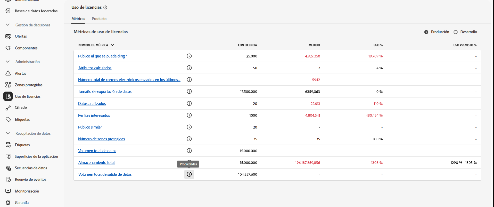
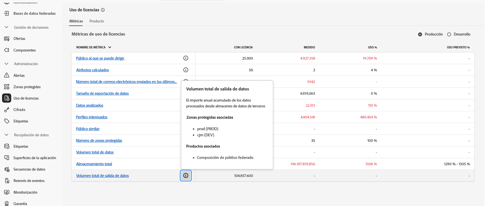

# Requisitos previos y protecciones {#fac-access}

La composición de público federado requiere los paquetes de Adobe Real-Time Customer Data Platform o Adobe Journey Optimizer **Prime**, o **Ultimate**. Para acceder a esta función es preciso haber adquirido el complemento Composición de público federado.

>[!AVAILABILITY]
>
>Una vez recibido el correo electrónico de bienvenida de Adobe, la interfaz se actualiza y las funciones estarán disponibles para el usuario luego de unas horas.

## Sistemas compatibles {#supported-systems}

La composición de público federado admite los siguientes almacenes en la nube:

* Amazon Redshift
* Azure Synapse
* Databricks
* Google BigQuery
* Snowflake
* Vertica Analytics
* Microsoft Fabric

Aprenda a crear una conexión con estos sistemas en [esta página](../connections/connections.md).

## Zonas protegidas

Al adquirir la Composición de público federado, tiene derecho a dos zonas protegidas. Para cualquier solicitud de aprovisionamiento de zona protegida adicional, póngase en contacto con su representante de Adobe.

Para ver la lista de las zonas protegidas de composición de público federado activas, siga los pasos que se indican a continuación:

1. Desde la composición de público federado, acceda al menú **[!UICONTROL Uso de licencias]** en **[!UICONTROL Administración]**.

1. Haga clic en el icono  de **[!UICONTROL Volumen total de salida de datos]** para acceder a las propiedades de la zona protegida.

   

1. La información sobre la zona protegida se muestra en la ventana emergente Propiedades.

   

## Permisos {#permissions}

Para acceder a la Composición de público federado, los usuarios deben añadirse al perfil de producto específico de la zona protegida creado tras la compra y se les debe asignar el permiso **[!UICONTROL Administrar datos federados]**. [Más información](feature-access.md)

## Lista de IP permitidas {#ip}

Para permitir de forma segura que composición de público federado acceda a sus bases de datos, póngase en contacto con su representante de Adobe para obtener las direcciones IP de los servidores de composición de público federado que accederán a ellas. Estas direcciones IP se muestran al añadir una base de datos federada en la interfaz de usuario de Adobe Experience Platform. [Más información](../connections/connections.md)

Añada estas direcciones IP a la lista de permitidos para conceder acceso a composición de público federado.

## Mecanismos de protección y limitaciones {#fac-guardrails}

* La composición de público federado no está disponible actualmente para los clientes [que están ingiriendo datos de mantenimiento](https://experienceleague.adobe.com/es/docs/events/customer-data-management-voices-recordings/governance/healthcare-shield){target="_blank"}. [Más información](https://experienceleague.adobe.com/es/docs/journey-optimizer/using/audiences-profiles-identities/audiences/about-audiences){target="_blank"}

<!--
* Federated Audience Composition is compatible with Privacy & Security Shield and can be used in all verticals except for healthcare industries. Currently, Federated Audience Composition cannot be licensed to customers looking to ingest health data. [Learn more](https://experienceleague.adobe.com/es/docs/events/customer-data-management-voices-recordings/governance/healthcare-shield){target="_blank"}-->

* Los derechos, limitaciones de productos y protecciones de rendimiento enumerados en la [documentación de Adobe Real-Time Customer Data Platform](https://experienceleague.adobe.com/es/docs/experience-platform/profile/guardrails){target="_blank"} se aplican a la Composición de público federado.

* La composición de público federado admite la exportación de públicos grandes, con tamaños de archivo superiores a 1 GB. Para obtener un rendimiento óptimo, el tamaño máximo de archivo recomendado es de hasta 20 GB.

