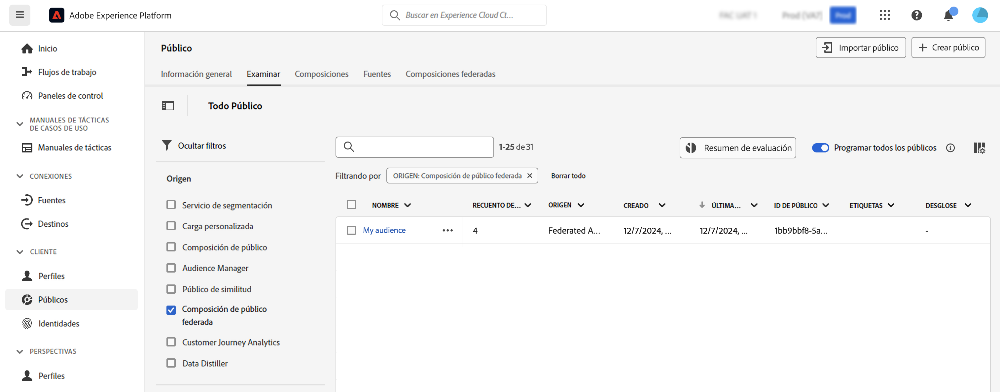

# Trabajar con públicos {#gs-audiences}

La composición de audiencias federada de Experience Platform le permite [crear composiciones](../compositions/gs-compositions.md), donde puede aprovechar diversas actividades en un lienzo visual para crear audiencias y almacenarlas en el portal de audiencias de Adobe Experience Platform.

A continuación, puede segmentar estas audiencias en Journey Optimizer o activarlas en cualquier destino admitido por Adobe Experience Platform.

## Creación de audiencias mediante composiciones {#creation}

Para crear audiencias utilizando la composición de audiencia federada, debe crear una composición que incluya una actividad **[!UICONTROL Guardar audiencia]**. Esta actividad le permite guardar la audiencia en Audience Portal y seleccionar campos de las bases de datos externas para incluirlos en la audiencia. [Aprenda a configurar una actividad Guardar audiencia](../compositions/activities/save-audience.md)

Las audiencias creadas con Composición de datos federada de Adobe incluyen todos los campos seleccionados en la actividad **[!UICONTROL Guardar audiencia]** y se almacenan en Audience Portal junto con todas las audiencias de Adobe Experience Platform.

Después de ejecutar la maquetación, la audiencia resultante se guarda en Adobe Experience Platform como audiencia externa y está disponible en Adobe Real-Time Customer Data Platform o Adobe Journey Optimizer.

Puede activar estas audiencias en cualquier destino admitido por Adobe Experience Platform. Aprenda a trabajar con destinos en [Adobe Experience Platform](https://experienceleague.adobe.com/en/docs/experience-platform/destinations/home){target="_blank"}

>[!NOTE]
>
>Los públicos creados con la composición de público federado de Adobe no se pueden editar. Para realizar modificaciones en uno de estos públicos, debe crear un público nuevo con una composición.

## Acceso a la audiencia en Adobe Experience Platform {#access-audience}

Se puede acceder a las audiencias creadas con Composición de audiencia federada desde el Portal de audiencias, desde el menú **Audiencias**.

La pestaña **[!UICONTROL Examinar]** lista todos los públicos existentes almacenados en Adobe Experience Platform. Puede identificar los públicos de la composición de público federado en la lista mediante la columna **[!UICONTROL Origen]** o los filtros disponibles en el panel izquierdo.

Para obtener más información sobre cómo trabajar con audiencias en Adobe Experience Platform, consulte [Documentación del portal de audiencias](https://experienceleague.adobe.com/es/docs/experience-platform/segmentation/ui/audience-portal){target="_blank"}

<!-- add link to this donc once published: https://jira.corp.adobe.com/browse/PLAT-198674-->