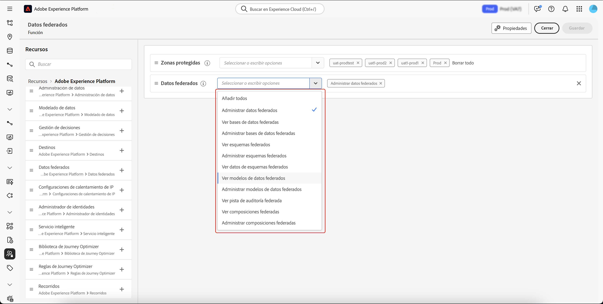

# Acceso a la Composición de público federado {#feature-access}

## Administración del acceso a zonas protegidas {#access-sandboxes}

Al adquirir la Composición de público federado de Adobe Experience Platform, se crea un perfil de producto para cada zona protegida activa en ese momento. Este perfil de producto se crea en Admin Console, en la tarjeta de producto **Adobe Experience Platform** y sigue la convención de nomenclatura siguiente: `ACP_FAC - <<SandboxName>> - admin.` para acceder a la Composición de público federado para una zona protegida específica, los usuarios deben agregarse al perfil de producto creado para esa zona protegida.

Por ejemplo, si se activa una nueva zona protegida denominada «fac-test», se crea un perfil «ACP_FAC - fac-test - admin» de producto correspondiente. Para acceder a la composición de público federado con esta zona protegida, los usuarios deben añadirse a este perfil de producto.

## Administración del acceso a la Composición de público federado

Para acceder a una **Composición de público federado**, primero debe asegurarse de asignar los permisos necesarios para acceder a diferentes aspectos de la Composición de público federado. Estas funciones deben asignarse a los usuarios que necesiten acceder a la **Composición de público federado**.

Tenga en cuenta que solo los administradores tienen la capacidad de asignar permisos.

1. Vaya al menú **[!UICONTROL Permisos]**.

1. En el menú **[!UICONTROL Funciones]**, seleccione la **[!UICONTROL Función]** que desee actualizar.

   

1. Seleccione **[!UICONTROL Editar]** para modificar los permisos de su función.

   

1. Añada los permisos necesarios para el usuario. Puede añadir los siguientes permisos para acceder a la composición de público federado:

   | Permiso | Descripción |
   | ---------- | ----------- |
   | Administrar datos federados | Utilice este permiso para administrar todos los aspectos de la composición de público federado. Este permiso incluye Administrar base de datos federada, Administrar esquema federado, Administrar modelo de datos federado y Administrar composiciones federadas. |
   | Administrar base de datos federada | Utilice este permiso para añadir, ver, actualizar y eliminar sus conexiones a bases de datos federadas. |
   | Ver base de datos federada | Utilice este permiso para ver sus conexiones a bases de datos federadas. |
   | Administrar esquema federado | Utilice este permiso para crear, ver, actualizar, eliminar y actualizar esquemas. |
   | Ver datos de esquema federado | Utilice este permiso para ver la pestaña de datos dentro de la sección del esquema. |
   | Ver esquema federado | Utilice este permiso para ver las tablas del esquema. |
   | Administrar modelo de datos federado | Utilice este permiso para crear, ver, actualizar y eliminar modelos de datos. |
   | Ver modelo de datos federado | Utilice este permiso para ver los modelos de datos. |
   | Ver seguimiento de auditoría de federación | Utilice este permiso para ver el seguimiento de auditoría de la composición de público federado. |
   | Administrar composiciones federadas | Use este permiso para crear, ver, actualizar y eliminar composiciones federadas. |
   | Ver composiciones federadas | Utilice este permiso para ver composiciones federadas. |

   

1. Cuando haya realizado los cambios necesarios, haga clic en **[!UICONTROL Guardar]**.

Los permisos de los usuarios que ya se hayan asignado a esta función se actualizarán automáticamente y tendrán acceso a la Composición de público federado.

Para asignar esta función a nuevos usuarios:

1. Vaya a la pestaña **[!UICONTROL Usuarios]** en el panel de control Función y seleccione **[!UICONTROL Añadir usuarios]**.

   

1. Introduzca el nombre o la dirección de correo electrónico del usuario o selecciónelo en la lista disponible. Cuando haya terminado, seleccione **[!UICONTROL Guardar]**.

<!-- Alternatively, you can assign one of the pre-existing roles to the users, depending on what permissions they need. For more information on assigning pre-existing roles to a user, please read the [guide on managing users for a product profile](https://experienceleague.adobe.com/en/docs/experience-platform/access-control/ui/users).

| Role name | Permissions |
| --------- | ----------- |
| FAC Data Managers | <ul><li>Manage Federated Compositions</li><li>View Federated Databases</li><li>View Federated Schemas</li><li>View Federated Schema Data</li><li>View Federated Data Models</li></ul> |
| FAC Composition Managers | <ul><li>Manage Federated Compositions</li></ul> |
| FAC Administrators | <ul><li>Manage Federated Data</li></ul> | -->

El usuario recibirá un correo electrónico con instrucciones para acceder a su instancia. Si el usuario no se ha creado previamente, consulte [esta documentación](https://experienceleague.adobe.com/es/docs/experience-platform/access-control/abac/permissions-ui/users).
