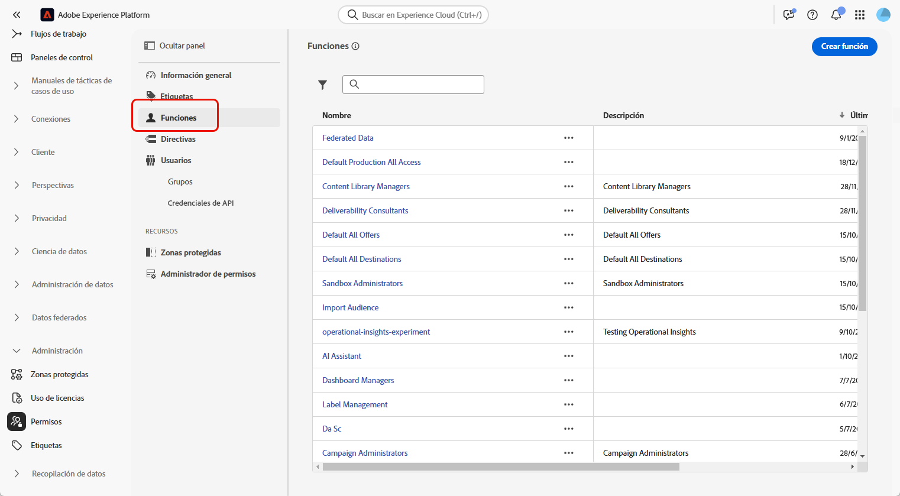
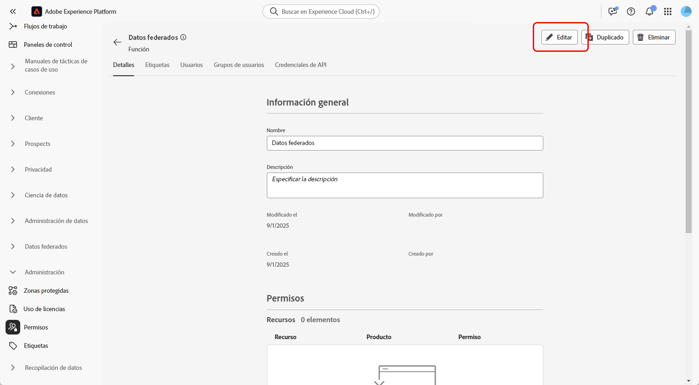
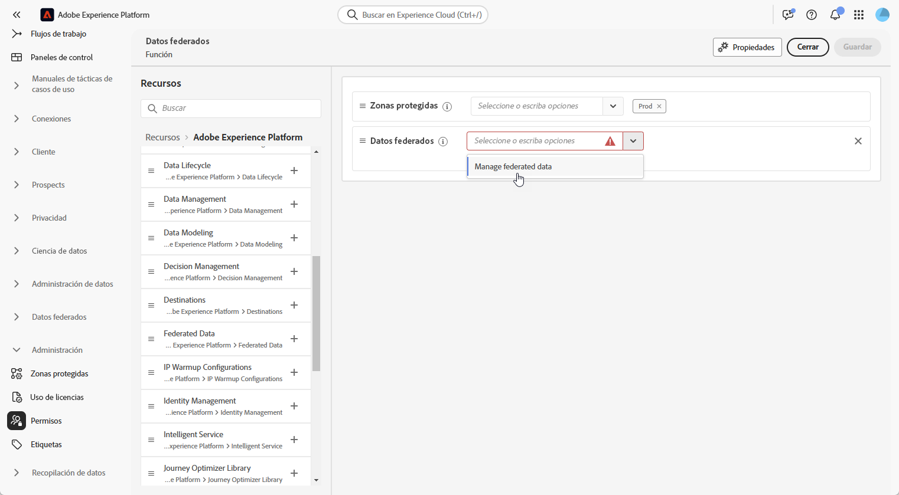
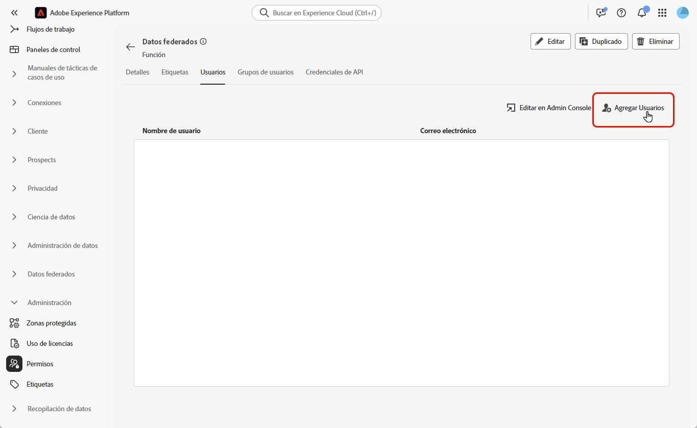

# Acceder a composición de audiencia federada {#feature-access}

## Administración del acceso a las zonas protegidas {#access-sandboxes}

Al adquirir el complemento Composición de público federado, se crea un perfil de producto para cada zona protegida activa en ese momento. Este perfil de producto se crea en Admin Console, en la tarjeta de producto **Adobe Experience Platform** y sigue la convención de nomenclatura siguiente: `ACP_FAC - <<SandboxName>> - admin.` para acceder a la Composición de público federado para una zona protegida específica, los usuarios deben agregarse al perfil de producto creado para esa zona protegida.

Por ejemplo, si se activa una nueva zona protegida denominada «fac-test», se crea un perfil «ACP_FAC - fac-test - admin» de producto correspondiente. Para acceder a la composición de público federado con esta zona protegida, los usuarios deben añadirse a este perfil de producto.

## Administrar el acceso a la composición de audiencias federada

>[!AVAILABILITY]
>
>Los permisos están disponibles como parte de la versión de marzo.

Para obtener acceso a **Federated Audience Composition**, primero debe asegurarse de que el permiso **Administrar datos federados** esté asignado a las funciones correspondientes. Estas funciones deben asignarse a los usuarios que necesiten acceso a **Federated Audience Composition**.

Tenga en cuenta que solo los administradores tienen la capacidad de asignar permisos.

1. Vaya al menú **[!UICONTROL Permisos]**.

1. En el menú **[!UICONTROL Roles]**, seleccione el **[!UICONTROL Rol]** que desee actualizar.

   

1. Haga clic en **[!UICONTROL Editar]** para modificar los permisos de la función.

   

1. Agregue el recurso **Datos federados** y, a continuación, seleccione **[!UICONTROL Administrar datos federados]** en el menú desplegable.

   

1. Una vez que hayas hecho los cambios necesarios, haz clic en **[!UICONTROL Guardar]**.

Los permisos de los usuarios que ya estén asignados a esta función se actualizarán automáticamente y tendrán acceso a Federated Audience Composition.

Para asignar esta función a nuevos usuarios:

1. Vaya a la ficha **[!UICONTROL Usuarios]** del panel de funciones y haga clic en **[!UICONTROL Agregar usuarios]**.

   

1. Introduzca el nombre o la dirección de correo electrónico del usuario o seleccione en la lista disponible. Una vez finalizado, haga clic en **[!UICONTROL Guardar]**.

El usuario recibirá un correo electrónico con instrucciones para acceder a su instancia. Si el usuario no estaba ya creado, consulte [esta documentación](https://experienceleague.adobe.com/es/docs/experience-platform/access-control/abac/permissions-ui/users).
