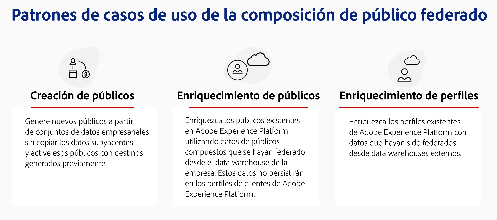
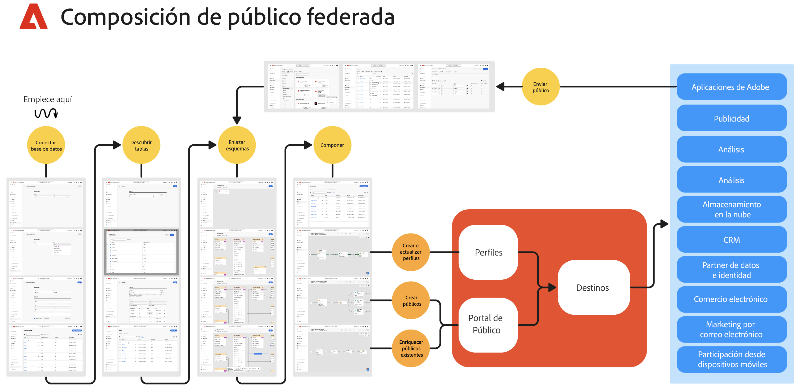

# Introducción a la composición de público federado {#gs-fac}

La Composición de audiencias federadas es un complemento para [Adobe Real-time Customer Data Platform](https://experienceleague.adobe.com/es/docs/experience-platform/segmentation/home){target="_blank"} y [Adobe Journey Optimizer](https://experienceleague.adobe.com/es/docs/journey-optimizer/using/ajo-home){target="_blank"} que le permite generar y enriquecer audiencias de almacenes de datos de terceros e importarlas a Adobe Experience Platform. La composición de público federado ofrece una solución fácil y potente para conectar su almacén de datos empresariales directamente con Adobe Real-Time Customer Data Platform o Adobe Journey Optimizer y para realizar consultas en las tablas de su almacén de datos.

La composición de público federado de Adobe ayuda a los usuarios de las aplicaciones de Adobe Experience Platform a acceder a sus datos de clientes almacenados en sus almacenes de datos y plataformas de almacenamiento en la nube como Amazon Redshift, Azure Synapse Analytics y más. Los datos de clientes pueden almacenarse en varios almacenes de datos y ahora se puede acceder a ellos instantáneamente, sin necesidad de replicación. Las plataformas admitidas se enumeran en [esta página](../connections/federated-db.md#supported-db).

## Competencias {#rn-capabilities}

La Composición de audiencias federada amplía el valor de Real-Time CDP y Journey Optimizer con un enfoque completo de la depuración y activación de audiencias:

* Amplíe el acceso a conjuntos de datos críticos basados en almacenes para crear audiencias de alto valor: Utilice los almacenes de datos existentes como sistema principal de registro, al tiempo que aprovecha las mejores aplicaciones de su clase para potenciar las buenas experiencias de los clientes.

* Compatibilidad completa para impulsar los casos de uso de participación: Composición de audiencias federada, emparejada con Real-Time CDP o Journey Optimizer, admite experiencias personalizadas iniciadas por la marca con audiencias federadas y ofrece experiencias en el momento activadas por eventos en tiempo real, combinadas con atributos de persona para satisfacer los requisitos de casos de uso entre equipos.

* Minimizar el movimiento y la duplicación de datos: cree audiencias a partir de conjuntos de datos que residen en un almacén de datos empresarial sin copiar los datos subyacentes para administrar perfiles y audiencias de marketing procesables.

* Utilice un solo sistema para flujos de trabajo impulsados por experiencias: Depure audiencias ingeridas y federadas en Adobe Experience Platform y coordine las experiencias salientes en todos los canales.

## Casos de uso {#rn-uc}

A través de una interfaz de usuario para expertos en marketing fácil de usar, puede crear reglas de segmentos que consulten su almacén de datos para obtener una lista de usuarios que cumplan los requisitos de un segmento específico necesario para campañas de marketing, acceder a públicos existentes en el almacén para su activación o enriquecer públicos de Adobe Experience Platform con puntos de datos adicionales que existan en el almacén.

En esta versión, hay dos casos de uso disponibles:

1. Creación de audiencias: cree nuevas audiencias a partir de conjuntos de datos empresariales sin copiar los datos subyacentes y actívelas con destinos creados previamente&#x200B;

1. Enriquecimiento de audiencias: enriquece las audiencias existentes en Adobe Experience Platform utilizando datos de audiencia compuestos que se han federado desde Enterprise Data Warehouse. Estos datos no se mantendrán en los perfiles de cliente de Adobe Experience Platform.

{zoomable="yes"}{width="75%" align="center"}

## Pasos clave {#gs-steps}

La composición de público federado de Adobe le permite crear y actualizar los públicos de Adobe Experience Platform directamente desde la base de datos, sin ningún proceso de ingesta.

<!--{zoomable="yes"}{width="85%" align="center"}-->

Pasos clave:

1. **Integración de datos**: reúna datos de varias fuentes y combínelos en un conjunto de datos unificado. Obtenga más información acerca de cómo conectar las aplicaciones de Adobe Experience Platform y el almacén de datos empresariales; las bases de datos admitidas y cómo configurarlas se especifican en [esta sección](../connections/federated-db.md).

2. **Modelado de datos**: diseñe y cree modelos de datos y esquemas que definan la estructura, las relaciones y las restricciones de los datos. Obtenga más información acerca de los esquemas en [esta página](../customer/schemas.md). Obtenga más información acerca de la creación de vínculos para su modelo de datos en [esta página](../data-management/gs-models.md).

3. **Transformación de datos**: aplique técnicas de manipulación de datos para modificar el formato, la estructura o los valores de los elementos de datos y hacerlos compatibles o adecuados para aplicaciones o análisis específicos.

4. **Uso de datos**: cree, organice y genere públicos. Obtenga más información acerca de cómo componer públicos en [esta página](../compositions/gs-compositions.md). También puede actualizar o reutilizar los públicos existentes a través de Audience Portal y Destinations de Adobe Experience Platform. Obtenga más información en [esta página](../connections/destinations.md)

>[!NOTE]
>
>Después de ejecutar la maquetación, la audiencia resultante se guarda en Adobe Experience Platform como audiencia externa y está disponible en Adobe Real-Time Customer Data Platform o Adobe Journey Optimizer. Es accesible desde el menú **Audiencias**. [Más información](https://experienceleague.adobe.com/es/docs/experience-platform/segmentation/ui/audience-portal){target="_blank"}

## Más información {#learn}

<!-- Workflow + Workflow activities-->

Obtenga información sobre cómo acceder a la composición de audiencias federadas, las protecciones y las limitaciones en [esta página](access-prerequisites.md).

Vea también las preguntas más frecuentes en [esta página](faq.md).

>[!CONTEXTUALHELP]
>id="dc_workflow_settings_execution"
>title="Configuración de ejecución"
>abstract="En esta sección, puede configurar las opciones relacionadas con la ejecución del flujo de trabajo, como el número de días que se mantiene el historial de la composición."

>[!CONTEXTUALHELP]
>id="dc_orchestration_query_enrichment_noneditable"
>title="Actividad no editable"
>abstract="Cuando una actividad de **Consulta** o **Enriquecimiento** se configura con datos adicionales en la consola, los datos de enriquecimiento se tienen en cuenta y pasan a la transición de salida, pero no se pueden editar."

<!-- Create a link -->

>[!CONTEXTUALHELP]
>id="dc_federated_database_create_link"
>title="Crear un vínculo"
>abstract="Defina la configuración del vínculo."
